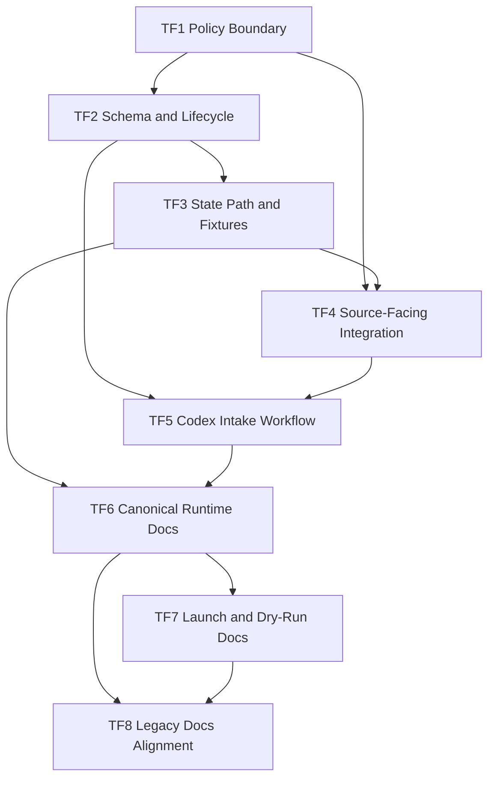

# Follow-Up Execution Plan

## Status

`proposed`

Этот план не заменяет [`PLANS.md`](./PLANS.md) и не открывает заново `M0-M19`.
Это отдельный follow-up execution plan для следующего этапа, если он будет признан актуальным.

## Summary

После завершения основного refactor-плана остаются два связанных направления:

1. Внешний агент, который реально запускается в другом рантайме, не должен самовольно менять свои prompts/config/adapters/contracts, даже если он нашёл workaround.
2. Репозиторию нужна актуальная документация по обновлённой архитектуре, способам запуска и режимам работы.

Главный принцип:

- master source of truth для любых runtime-изменений остаётся в этом git-репозитории;
- внешний агент может применять только временный in-run workaround, если это явно разрешено policy и не приводит к persistent file mutation;
- любые постоянные изменения должны приходить обратно в этот репозиторий через structured `change_request` и далее через Codex + git.

## Requirements

| ID | Requirement |
| --- | --- |
| `F1` | Этот репозиторий остаётся единственным master source of truth для prompts, config, adapters, contracts и policy changes. |
| `F2` | Внешний агент не должен менять собственные runtime-файлы при scrape/fetch/source failures, blocked cases или найденных workaround'ах. |
| `F3` | Внешний агент должен создавать structured `change_request` artifact с достаточной диагностикой для последующей реализации fix'а через Codex. |
| `F4` | Должен быть описан Codex-side intake workflow: как `change_request` triage'ится, превращается в план и доходит до commit. |
| `F5` | Должна появиться актуальная документация по обновлённой архитектуре проекта. |
| `F6` | Должна появиться актуальная документация по способам запуска и режимам работы `Claude Cowork`-агента. |
| `F7` | Legacy docs должны быть либо выровнены с новой архитектурой, либо явно помечены как legacy/archived. |
| `F8` | Каждый `change_request` должен быть привязан к конкретному run/failure context как минимум через `run_id`, `mode`, `stage`, `url` и evidence refs. |
| `F9` | У `change_request` должен быть lifecycle/status model с ownership transitions для triage, planning и implementation. |
| `F10` | Должно быть явно определено, когда временный in-run workaround допустим, а когда агент обязан остановиться и выпустить только `change_request`. |

## Program-Level Acceptance Criteria

- В репозитории есть зафиксированная policy, что внешний агент не self-mutate runtime files.
- Есть canonical `change_request` artifact со schema, storage path, lifecycle fields и fixture coverage.
- Есть описанный intake workflow: `change_request -> triage -> planning -> implementation -> validation -> commit`.
- Для source-facing режимов есть guardrails, которые разрешают escalation artifact и запрещают silent self-mutation.
- `README.md` и operator docs больше не выглядят как документация к старому monolithic runner path без caveats.
- Документация по архитектуре, режимам, запуску и rerun flows согласована с [`config/runtime/runtime_manifest.yaml`](./config/runtime/runtime_manifest.yaml) и [`cowork/`](./cowork).

## Global Non-Goals

- Не менять уже закрытый milestone-plan `M0-M19`.
- Не выполнять production cutover автоматически.
- Не разрешать внешнему агенту persistent self-healing через правку runtime-файлов в обход git-managed master repo.
- Не внедрять внешний ticketing system, issue tracker integration или automation platform в рамках этого follow-up.

## Review Protocol

Каждый follow-up milestone считается independently reviewable только если в review package есть:

1. Явный deliverable.
2. Acceptance criteria в проверяемой форме.
3. Fixture/checklist-based verification.
4. Явно зафиксированные non-goals.

## Milestone Progress

| Milestone | Status |
| --- | --- |
| `TF1` | completed |
| `TF2` | completed |
| `TF3` | completed |
| `TF4` | pending |
| `TF5` | pending |
| `TF6` | pending |
| `TF7` | pending |
| `TF8` | pending |

## Milestone Overview

| ID | Est. | Depends On | Main Output |
| --- | --- | --- | --- |
| `TF1` | `1h` | — | Policy boundary for external agent behavior |
| `TF2` | `1h` | `TF1` | `change_request` schema and lifecycle |
| `TF3` | `1.5h` | `TF2` | State path, collection layout, and sample request fixtures |
| `TF4` | `1.5h` | `TF1`, `TF3` | Source-facing mode integration and no-self-mutation guards |
| `TF5` | `1h` | `TF2`, `TF4` | Codex intake and planning workflow |
| `TF6` | `1.5h` | `TF3`, `TF5` | Canonical runtime architecture docs and mode catalog |
| `TF7` | `1.5h` | `TF6` | Launch, rerun, and dry-run docs |
| `TF8` | `1.5h` | `TF6`, `TF7` | Legacy docs alignment or archival markers |

## Detailed Milestones

### TF1. Policy Boundary for External Agent Behavior

- Estimate: `1h`
- Depends on: `—`
- Deliverable:
  - policy doc for the external runner
  - explicit ownership boundary between external runner and Codex-managed repo
- Acceptance criteria:
  - policy явно запрещает persistent self-patching of prompts/config/adapters/contracts;
  - policy перечисляет minimum trigger classes for `change_request` creation:
    - scrape failure
    - blocked/manual source
    - adapter gap
    - discovered workaround requiring persistent repo change
  - policy явно определяет allowed vs forbidden temporary in-run workaround behavior;
  - policy фиксирует, что master source of truth остаётся в этом репозитории.
- Tests:
  - checklist review that all four trigger classes are covered;
  - wording review that there is no ambiguous permission for self-modification;
  - ownership review that external runner and Codex responsibilities are separated.
- Non-goals:
  - не вводить schema-level state artifact;
  - не менять mode contracts beyond policy references.

### TF2. `change_request` Schema and Lifecycle

- Estimate: `1h`
- Depends on: `TF1`
- Deliverable:
  - canonical `change_request` artifact definition
  - lifecycle/status model
- Acceptance criteria:
  - schema содержит обязательные fields:
    - `request_id`
    - `created_at`
    - `run_id`
    - `mode`
    - `stage`
    - `source_id`
    - `url`
    - `failure_type`
    - `symptoms`
    - `suspected_cause`
    - `workaround_found`
    - `proposed_change_scope`
    - `suggested_target_files`
    - `tests_to_add`
    - `evidence_refs`
    - `severity`
    - `status`
    - `owner`
  - lifecycle/status model задан явно, минимум:
    - `new`
    - `triaged`
    - `planned`
    - `implemented`
    - `rejected`
  - ownership transitions between external runner and Codex-side triage описаны явно;
  - schema ссылается на policy из `TF1`.
- Tests:
  - schema coverage review on all required fields;
  - lifecycle review that each status has a clear owner;
  - sample artifact review for one complete request object.
- Non-goals:
  - не задавать storage path в state layout;
  - не интегрировать `change_request` в mode contracts.

### TF3. State Path and Sample Request Fixtures

- Estimate: `1.5h`
- Depends on: `TF2`
- Deliverable:
  - canonical storage path for `change_request`
  - state layout integration
  - sample fixtures and state-fixture coverage
- Acceptance criteria:
  - определён canonical path: `./.state/change-requests/{request_date}/{request_id}.json` или эквивалент;
  - `change_request` collection добавлен в state layout и shared contracts;
  - есть минимум два sample fixtures:
    - scrape failure with workaround suggestion
    - blocked/manual source case
  - fixtures покрывают required schema fields, включая `run_id`, `status`, `owner`, `tests_to_add`.
- Tests:
  - path-resolution check for the change-request collection;
  - fixture validation against schema;
  - valid-artifacts review that required fields are fully covered.
- Non-goals:
  - не интегрировать `change_request` во все mode contracts;
  - не проектировать Codex intake workflow.

### TF4. Source-Facing Runtime Integration

- Estimate: `1.5h`
- Depends on: `TF1`, `TF3`
- Deliverable:
  - mode-contract support for sanctioned `change_request` escalation
  - no-self-mutation guards in source-facing modes
- Acceptance criteria:
  - following modes explicitly support `change_request` escalation:
    - `monitor_sources`
    - `scrape_and_enrich`
    - `breaking_alert`
  - those same modes explicitly forbid silent local mutation of prompt/config/adapter files;
  - there is at least one fixture for:
    - adapter gap
    - scrape failure with workaround suggestion
    - blocked/manual source escalation
  - contract linkage between mode outputs and `change_request` schema is explicit.
- Tests:
  - fixture validation for all declared source-facing failure scenarios;
  - guard review that no covered mode claims write access to runtime source files;
  - contract linkage review against state schema and policy.
- Non-goals:
  - не интегрировать `change_request` в non-source-facing modes;
  - не реализовывать auto-fix execution.

### TF5. Codex Intake and Planning Workflow

- Estimate: `1h`
- Depends on: `TF2`, `TF4`
- Deliverable:
  - Codex-side intake workflow for incoming `change_request`
  - planning and review path from request to commit
- Acceptance criteria:
  - workflow явно покрывает stages:
    - intake
    - triage
    - plan update
    - implementation
    - validation
    - commit
  - описано, кто решает, какие файлы менять;
  - описано, как `tests_to_add` превращается в verification scope;
  - workflow явно заканчивается reviewable commit'ом в этом repo.
- Tests:
  - dry-run walkthrough on one synthetic `change_request`;
  - checklist review that all six stages are present;
  - guard review that external runner and Codex responsibilities не смешиваются.
- Non-goals:
  - не внедрять automation platform;
  - не создавать issue tracker integration.

### TF6. Canonical Runtime Docs and Mode Catalog

- Estimate: `1.5h`
- Depends on: `TF3`, `TF5`
- Deliverable:
  - canonical docs for updated runtime architecture
  - mode catalog for the current `Claude Cowork` design
  - corrected `README.md`
- Acceptance criteria:
  - есть актуальное описание updated runtime architecture;
  - есть отдельное canonical описание всех режимов:
    - `monitor_sources`
    - `scrape_and_enrich`
    - `build_daily_digest`
    - `review_digest`
    - `build_weekly_digest`
    - `breaking_alert`
    - `stakeholder_fanout`
  - `README.md` явно указывает на [`config/runtime/runtime_manifest.yaml`](./config/runtime/runtime_manifest.yaml) и [`cowork/`](./cowork) как canonical runtime layer;
  - `README.md` больше не подаёт legacy monolithic runner path как основной current-state путь.
- Tests:
  - docs consistency review against runtime manifest and mode prompts;
  - link check for all canonical doc references;
  - manual sanity review that mode descriptions match current contracts.
- Non-goals:
  - не переписывать benchmark datasets;
  - не делать product/marketing rewrite.

### TF7. Launch, Rerun, and Dry-Run Docs

- Estimate: `1.5h`
- Depends on: `TF6`
- Deliverable:
  - актуальная документация по способам запуска
  - rerun and dry-run reference
- Acceptance criteria:
  - есть актуальное описание способов запуска:
    - regular schedules
    - manual reruns
    - downstream-only modes
    - regression/parity dry-runs
  - launch/rerun docs согласованы с [`config/runtime/schedule_bindings.yaml`](./config/runtime/schedule_bindings.yaml);
  - docs явно отражают, что repo является source-of-truth слоем, а не обязательно местом фактического запуска runner'а.
- Tests:
  - docs consistency review against schedule bindings and runtime manifest;
  - grep/checklist review for stale unqualified launch instructions;
  - link check for launch/rerun references.
- Non-goals:
  - не выполнять реальный cutover;
  - не переписывать legacy docs beyond references needed for launch clarity.

### TF8. Legacy Docs Alignment or Archival

- Estimate: `1.5h`
- Depends on: `TF6`, `TF7`
- Deliverable:
  - legacy docs alignment or archival markers
  - conflict-free documentation surface
- Acceptance criteria:
  - `README`, `runbook`, `agent-spec`, `rss-api-audit` больше не создают конфликт между canonical runtime layer и legacy bridge files;
  - каждый legacy-sensitive doc либо:
    - переписан под current architecture,
    - либо явно помечен как `legacy` / `archived`;
  - не остаётся unqualified `runner --config config/monitoring.yaml` style instructions, выглядящих как canonical path.
- Tests:
  - grep/checklist review for stale legacy-first launch commands;
  - docs consistency review across canonical and legacy-marked files;
  - manual sanity review that a new reader can distinguish current vs legacy path.
- Non-goals:
  - не скрывать legacy behavior там, где оно ещё нужно как compatibility reference;
  - не выполнять реальный cutover.

## Requirement-to-Milestone Coverage Matrix

| Requirement | Covered By |
| --- | --- |
| `F1` | `TF1`, `TF5`, `TF6`, `TF8` |
| `F2` | `TF1`, `TF4` |
| `F3` | `TF2`, `TF3`, `TF4` |
| `F4` | `TF5` |
| `F5` | `TF6`, `TF8` |
| `F6` | `TF6`, `TF7` |
| `F7` | `TF8` |
| `F8` | `TF2`, `TF3` |
| `F9` | `TF2`, `TF5` |
| `F10` | `TF1`, `TF4` |

## Dependency Graph

## Suggested Next Step

Если этот follow-up признаётся актуальным, первый implementation milestone должен быть `TF1`.

Причина:

- без policy boundary нельзя безопасно вводить lifecycle и storage schema;
- без этого docs refresh рискует описать процесс, который ещё не закреплён контрактно.
