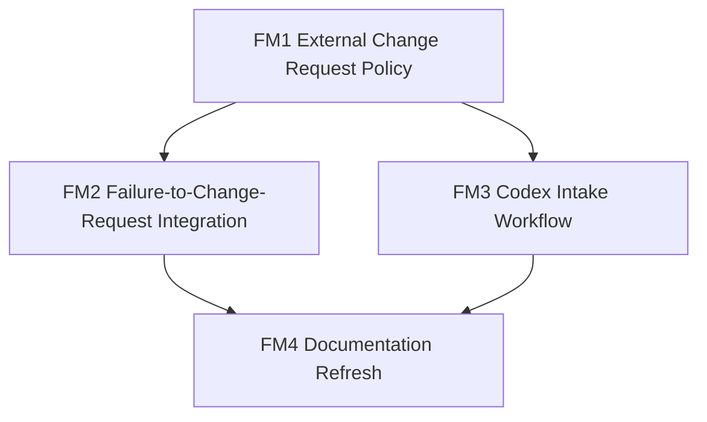

# Follow-Up Mini Plan

## Status

`proposed`

Этот mini-plan не заменяет [`PLANS.md`](./PLANS.md) и не является новым milestone-пакетом внутри `M0-M19`.
Это отдельный post-plan follow-up для следующего этапа, если он будет признан актуальным.

## Purpose

После завершения основного refactor-плана остаются два связанных направления:

1. Внешний агент, который реально запускается в другом рантайме, не должен самовольно менять свои prompts/config/adapters, даже если он нашёл workaround.
2. Репозиторию нужна актуальная документация по обновлённой архитектуре, способам запуска и режимам работы.

Главная идея:

- master source of truth для любых runtime-изменений остаётся в этом репозитории;
- внешний агент только наблюдает, фиксирует проблему и формирует structured `change_request`;
- реальные изменения проектируются, реализуются и коммитятся здесь, через Codex и git.

## Requirements

| ID | Requirement |
| --- | --- |
| `F1` | Этот репозиторий остаётся единственным master source of truth для prompts, config, adapters, contracts и policy changes. |
| `F2` | Внешний агент не должен менять собственные runtime-файлы при scrape/fetch/source failures, blocked cases или найденных workaround'ах. |
| `F3` | Внешний агент должен создавать structured `change_request` artifact с достаточной диагностикой для последующей реализации fix'а через Codex. |
| `F4` | Должен быть описан Codex-side intake workflow: как `change_request` triage'ится, превращается в план и доходит до commit. |
| `F5` | Должна появиться актуальная документация по обновлённой архитектуре проекта. |
| `F6` | Должна появиться актуальная документация по способам запуска и режимам работы `Claude Cowork`-агента. |
| `F7` | Legacy docs должны быть либо выровнены с новой архитектурой, либо явно помечены как legacy/archived. |

## Proposed Deliverables

- `change_request` policy for the external runner
- `change_request` schema and storage path
- fixtures for failure-to-change-request behavior
- Codex-side triage workflow doc
- updated project docs:
  - high-level architecture
  - mode catalog
  - launch/rerun patterns
  - legacy docs status and migration notes

## Mini Milestones

### FM1. External Change Request Policy

- Goal:
  - зафиксировать правило, что внешний агент не мутирует собственные runtime-файлы и вместо этого формирует `change_request`
- Scope:
  - policy doc
  - required fields
  - ownership boundaries between external runner and Codex-managed repo
- Likely files:
  - `cowork/shared/change_request_policy.md`
  - `config/runtime/state_layout.yaml`
  - `config/runtime/state_schemas.yaml`
  - `cowork/shared/contracts.md`
- Acceptance criteria:
  - явно сказано, что runtime agent does not self-patch prompts/config/adapters/contracts;
  - определён artifact `change_request`;
  - перечислены обязательные поля, включая:
    - `request_id`
    - `created_at`
    - `mode`
    - `stage`
    - `source_id`
    - `url`
    - `failure_type`
    - `symptoms`
    - `suspected_cause`
    - `workaround_found`
    - `proposed_change_scope`
    - `suggested_target_files`
    - `tests_to_add`
    - `evidence_refs`
    - `severity`
    - `status`
- Tests:
  - schema/field coverage review;
  - storage path review for `./.state/change-requests/{request_date}/{request_id}.json`;
  - guard review that policy forbids self-modification by the external runner.
- Non-goals:
  - не реализовывать auto-fix логику;
  - не менять существующие mode contracts beyond what is needed for change-request support.

### FM2. Failure-to-Change-Request Runtime Integration

- Goal:
  - встроить `change_request` в runtime-contract layer как штатный outcome для operational failures
- Scope:
  - state contract
  - fixtures for scrape/fetch/adapter failures
  - mode-level guardrails
- Likely files:
  - `config/runtime/state_layout.yaml`
  - `config/runtime/state_schemas.yaml`
  - `config/runtime/state-fixtures/valid_artifacts.yaml`
  - `config/runtime/mode-contracts/*.yaml`
  - `config/runtime/mode-fixtures/*change_request*.yaml`
- Acceptance criteria:
  - change request имеет canonical storage path и schema;
  - есть fixture минимум для:
    - blocked source/manual access case
    - scrape failure with workaround suggestion
    - adapter gap with suggested target files and tests
  - mode contracts явно допускают `change_request` как sanctioned escalation artifact;
  - mode contracts не допускают silent local mutation of runtime files.
- Tests:
  - fixture validation for all new `change_request` cases;
  - path-resolution check;
  - guard check that no mode claims write access to prompt/config/adapter files.
- Non-goals:
  - не реализовывать внешний ticketing system;
  - не менять benchmark harness.

### FM3. Codex Intake and Planning Workflow

- Goal:
  - описать, как Codex принимает `change_request`, планирует fix и вносит изменения в master repo
- Scope:
  - triage flow
  - planning steps
  - review/commit expectations
- Likely files:
  - `docs/change-request-workflow.md`
  - `AGENTS.md`
  - `COMPLETION_AUDIT.md`
- Acceptance criteria:
  - описано, как `change_request` становится milestone-scoped task;
  - описано, кто решает, какие файлы менять;
  - описано, как из `tests_to_add` формируется verification scope;
  - workflow явно заканчивается reviewable commit'ом в этом repo.
- Tests:
  - dry-run workflow review on one synthetic change request;
  - checklist review that every request has intake, planning, implementation, validation, commit stages.
- Non-goals:
  - не внедрять automation platform;
  - не создавать отдельную issue tracker integration.

### FM4. Documentation Refresh for the Updated Project

- Goal:
  - привести документацию в соответствие с новой mode-based architecture
- Scope:
  - project overview
  - launch instructions
  - mode descriptions
  - legacy docs status
- Likely files:
  - `README.md`
  - `docs/runbook.md`
  - `docs/agent-spec.md`
  - `docs/rss-api-audit.md`
  - new docs if needed, for example:
    - `docs/runtime-architecture.md`
    - `docs/mode-catalog.md`
    - `docs/launch-and-rerun.md`
- Acceptance criteria:
  - есть актуальное описание updated architecture;
  - есть актуальное описание способов запуска:
    - regular schedules
    - manual reruns
    - downstream-only modes
    - regression/parity dry-runs
  - есть отдельное описание режимов работы:
    - `monitor_sources`
    - `scrape_and_enrich`
    - `build_daily_digest`
    - `review_digest`
    - `build_weekly_digest`
    - `breaking_alert`
    - `stakeholder_fanout`
  - legacy docs либо переписаны, либо явно помечены как legacy/archived;
  - `README.md` больше не выглядит как инструкция к старому monolithic runner path.
- Tests:
  - docs consistency review against `config/runtime/runtime_manifest.yaml` and `cowork/`;
  - link check for updated docs references;
  - manual sanity review that launch instructions no longer conflict with canonical runtime layer.
- Non-goals:
  - не переписывать benchmark datasets;
  - не делать product/marketing rewrite beyond technical/operator docs.

## Dependencies

## Coverage Matrix

| Requirement | Covered By |
| --- | --- |
| `F1` | FM1, FM3 |
| `F2` | FM1, FM2 |
| `F3` | FM1, FM2 |
| `F4` | FM3 |
| `F5` | FM4 |
| `F6` | FM4 |
| `F7` | FM4 |

## Explicit Non-Goals

- Не менять уже закрытый milestone-plan `M0-M19`.
- Не считать этот mini-plan обязательным к немедленной реализации.
- Не выполнять production cutover автоматически.
- Не разрешать внешнему агенту self-healing через правку runtime-файлов в обход git-managed master repo.

## Suggested Next Step

Если этот follow-up признаётся актуальным, разумный первый шаг:

1. утвердить сам принцип `change_request instead of self-mutation`;
2. после этого начать с `FM1`, потому что без policy и schema нельзя безопасно проектировать downstream docs и intake workflow.
