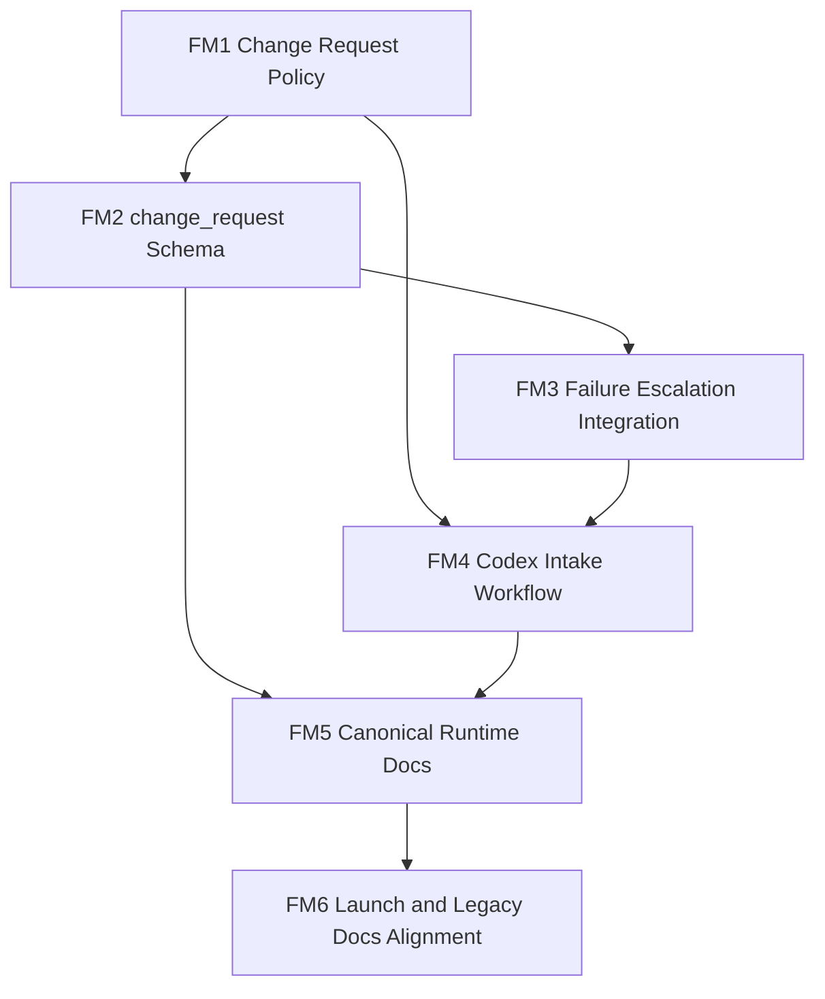

# Follow-Up Execution Plan

## Status

`proposed`

Этот план не заменяет [`PLANS.md`](./PLANS.md) и не открывает заново `M0-M19`.
Это отдельный follow-up execution plan для следующего этапа, если он будет признан актуальным.

## Summary

После завершения основного refactor-плана остаются два связанных направления:

1. Внешний агент, который реально запускается в другом рантайме, не должен самовольно менять свои prompts/config/adapters/contracts, даже если нашёл workaround.
2. Репозиторию нужна актуальная документация по обновлённой архитектуре, способам запуска и режимам работы.

Главный принцип:

- master source of truth для любых runtime-изменений остаётся в этом git-репозитории;
- внешний агент только наблюдает, фиксирует проблему и формирует structured `change_request`;
- реальные изменения проектируются, планируются, реализуются и коммитятся здесь, через Codex.

## Requirements

| ID | Requirement |
| --- | --- |
| `F1` | Этот репозиторий остаётся единственным master source of truth для prompts, config, adapters, contracts и policy changes. |
| `F2` | Внешний агент не должен менять собственные runtime-файлы при scrape/fetch/source failures, blocked cases или найденных workaround'ах. |
| `F3` | Внешний агент должен создавать structured `change_request` artifact с достаточной диагностикой для последующей реализации fix'а через Codex. |
| `F4` | Должен быть описан Codex-side intake workflow: как `change_request` triage'ится, превращается в план и доходит до commit. |
| `F5` | Должна появиться актуальная документация по обновлённой архитектуре проекта. |
| `F6` | Должна появиться актуальная документация по способам запуска и режимам работы `Claude Cowork`-агента. |
| `F7` | Legacy docs должны быть либо выровнены с новой архитектурой, либо явно помечены как legacy/archived. |

## Program-Level Acceptance Criteria

- В репозитории есть зафиксированная policy, что внешний агент не self-mutate runtime files.
- Есть canonical `change_request` artifact со schema, storage path и fixture coverage.
- Есть описанный intake workflow: `change_request -> planning -> implementation -> validation -> commit`.
- `README.md` и operator docs больше не выглядят как документация к старому monolithic runner path без caveats.
- Документация по режимам, запуску и rerun flows согласована с [`config/runtime/runtime_manifest.yaml`](./config/runtime/runtime_manifest.yaml) и [`cowork/`](./cowork).

## Global Non-Goals

- Не менять уже закрытый milestone-plan `M0-M19`.
- Не выполнять production cutover автоматически.
- Не разрешать внешнему агенту self-healing через правку runtime-файлов в обход git-managed master repo.
- Не внедрять внешний ticketing system, issue tracker integration или automation platform в рамках этого follow-up.

## Review Protocol

Каждый follow-up milestone считается independently reviewable только если в review package есть:

1. Явный deliverable.
2. Acceptance criteria в проверяемой форме.
3. Fixture/checklist-based verification.
4. Явно зафиксированные non-goals.

## Milestone Progress

| Milestone | Status |
| --- | --- |
| `FM1` | pending |
| `FM2` | pending |
| `FM3` | pending |
| `FM4` | pending |
| `FM5` | pending |
| `FM6` | pending |

## Milestone Overview

| ID | Est. | Depends On | Main Output |
| --- | --- | --- | --- |
| `FM1` | `1h` | — | External change request policy and ownership boundary |
| `FM2` | `1.5h` | `FM1` | `change_request` schema, state path, sample artifact |
| `FM3` | `2h` | `FM2` | Runtime integration for failure escalation and no-self-mutation guards |
| `FM4` | `1.5h` | `FM1`, `FM3` | Codex intake and planning workflow |
| `FM5` | `2h` | `FM2`, `FM4` | Canonical docs for updated runtime architecture and mode catalog |
| `FM6` | `2h` | `FM5` | Launch/rerun docs and legacy docs alignment |

## Detailed Milestones

### FM1. External Change Request Policy

- Estimate: `1h`
- Depends on: `—`
- Deliverable:
  - `change_request` policy for the external runner
  - explicit ownership boundary between external runner and Codex-managed repo
- Acceptance criteria:
  - явно сказано, что внешний runtime agent не self-patch'ит prompts/config/adapters/contracts;
  - policy определяет trigger conditions, когда вместо local workaround persistence создаётся `change_request`;
  - policy фиксирует, что master source of truth остаётся в этом репозитории.
- Tests:
  - checklist review: policy covers scrape failure, blocked/manual source, adapter gap, discovered workaround;
  - wording review: нет двусмысленного разрешения на self-modification;
  - file reference review: policy указывает canonical ownership boundary.
- Non-goals:
  - не вводить schema-level state artifact;
  - не менять mode contracts beyond policy references.

### FM2. `change_request` Schema and State Path

- Estimate: `1.5h`
- Depends on: `FM1`
- Deliverable:
  - canonical `change_request` artifact definition
  - storage path and schema
  - sample artifact fixture
- Acceptance criteria:
  - определён canonical path: `./.state/change-requests/{request_date}/{request_id}.json` или эквивалент;
  - schema содержит обязательные поля:
    - `request_id`
    - `created_at`
    - `mode`
    - `stage`
    - `source_id`
    - `url`
    - `failure_type`
    - `symptoms`
    - `suspected_cause`
    - `workaround_found`
    - `proposed_change_scope`
    - `suggested_target_files`
    - `tests_to_add`
    - `evidence_refs`
    - `severity`
    - `status`
  - `change_request` вписан в state layout и shared contracts.
- Tests:
  - schema coverage review on all required fields;
  - path-resolution check for the change-request collection;
  - sample artifact validation in state fixtures.
- Non-goals:
  - не интегрировать `change_request` в mode contracts;
  - не проектировать Codex triage workflow.

### FM3. Failure Escalation Runtime Integration

- Estimate: `2h`
- Depends on: `FM2`
- Deliverable:
  - mode-contract support for sanctioned `change_request` escalation
  - fixtures for operational failure cases
  - no-self-mutation guards
- Acceptance criteria:
  - relevant mode contracts допускают `change_request` как sanctioned outcome;
  - есть fixtures минимум для:
    - blocked/manual source case
    - scrape failure with workaround suggestion
    - adapter gap with suggested target files and tests
  - mode contracts явно запрещают silent local mutation of prompt/config/adapter files.
- Tests:
  - fixture validation for all new failure-to-change-request scenarios;
  - guard review that no mode claims write access to runtime source files;
  - contract linkage review against state schema and shared policy.
- Non-goals:
  - не реализовывать auto-fix execution;
  - не менять benchmark harness.

### FM4. Codex Intake and Planning Workflow

- Estimate: `1.5h`
- Depends on: `FM1`, `FM3`
- Deliverable:
  - Codex-side intake workflow for incoming `change_request`
  - planning and review path from request to commit
- Acceptance criteria:
  - описано, как `change_request` превращается в milestone-scoped task;
  - описано, кто и как решает, какие файлы менять;
  - описано, как `tests_to_add` превращается в verification scope;
  - workflow явно заканчивается reviewable commit'ом в этом repo.
- Tests:
  - dry-run walkthrough on one synthetic `change_request`;
  - checklist review that workflow covers intake, triage, planning, implementation, validation, commit;
  - guard review that external agent and Codex responsibilities не смешиваются.
- Non-goals:
  - не внедрять automation platform;
  - не создавать issue tracker integration.

### FM5. Canonical Docs for Updated Runtime

- Estimate: `2h`
- Depends on: `FM2`, `FM4`
- Deliverable:
  - updated canonical docs for runtime architecture
  - mode catalog for the current `Claude Cowork` design
  - corrected `README.md`
- Acceptance criteria:
  - есть актуальное описание updated runtime architecture;
  - есть отдельное описание всех режимов работы:
    - `monitor_sources`
    - `scrape_and_enrich`
    - `build_daily_digest`
    - `review_digest`
    - `build_weekly_digest`
    - `breaking_alert`
    - `stakeholder_fanout`
  - `README.md` больше не выглядит как инструкция к старому monolithic runner path;
  - canonical docs ссылаются на [`config/runtime/runtime_manifest.yaml`](./config/runtime/runtime_manifest.yaml) и [`cowork/`](./cowork) как на основной runtime layer.
- Tests:
  - docs consistency review against runtime manifest and mode prompts;
  - link check for all new canonical doc references;
  - manual sanity review that mode descriptions match current contracts.
- Non-goals:
  - не переписывать benchmark datasets;
  - не делать product/marketing rewrite.

### FM6. Launch, Rerun, and Legacy Docs Alignment

- Estimate: `2h`
- Depends on: `FM5`
- Deliverable:
  - актуальная документация по способам запуска и rerun flows
  - legacy docs alignment or archival markers
- Acceptance criteria:
  - есть актуальное описание способов запуска:
    - regular schedules
    - manual reruns
    - downstream-only modes
    - regression/parity dry-runs
  - legacy docs либо переписаны, либо явно помечены как `legacy` / `archived`;
  - документы не создают конфликт между canonical runtime layer и legacy bridge files;
  - явно отражено, что этот repo является source-of-truth слоем, а не обязательно местом фактического запуска runner'а.
- Tests:
  - docs consistency review against [`config/runtime/schedule_bindings.yaml`](./config/runtime/schedule_bindings.yaml);
  - grep/checklist review for stale unqualified `runner --config config/monitoring.yaml` style instructions;
  - link check for updated runbook/launch docs.
- Non-goals:
  - не выполнять реальный cutover;
  - не скрывать legacy behavior там, где оно ещё нужно как compatibility reference.

## Requirement-to-Milestone Coverage Matrix

| Requirement | Covered By |
| --- | --- |
| `F1` | `FM1`, `FM4`, `FM6` |
| `F2` | `FM1`, `FM3` |
| `F3` | `FM2`, `FM3` |
| `F4` | `FM4` |
| `F5` | `FM5`, `FM6` |
| `F6` | `FM5`, `FM6` |
| `F7` | `FM6` |

## Dependency Graph

## Suggested Next Step

Если этот follow-up признаётся актуальным, первый implementation milestone должен быть `FM1`.

Причина:

- без policy и ownership boundary нельзя безопасно вводить `change_request` schema;
- без этого docs refresh рискует описать процесс, который ещё не закреплён контрактно.
