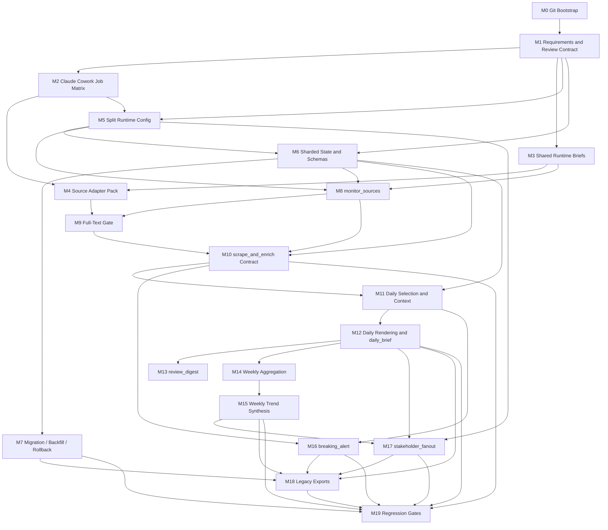

# Execution Plan: Claude Cowork Agent Refactor

## Summary

Этот план переводит архитектурный рефакторинг агента в исполнимую программу работ для `Claude Cowork`.

Цели плана:

- включить git как обязательный механизм milestone-scoped изменений, review и rollback;
- сократить runtime-context каждого запуска;
- разделить агент на узкие режимы с явными handoff-артефактами;
- изолировать работу с полными текстами статей в одном режиме;
- убрать монолитные `.state/dedupe.json` и `.state/delivery-log.json` из критического пути;
- сохранить проверяемость каждого этапа и снизить риск частично внедрённого состояния.

Принцип разбиения: каждый milestone рассчитан на `1-3 часа`, имеет отдельный review scope, явные acceptance criteria, тесты и non-goals.

## Requirements

| ID | Requirement |
| --- | --- |
| R1 | У каждого runtime-режима должен быть минимальный и явный набор входов; `README`, `docs/*`, `benchmark/*` не должны быть частью runtime-контекста. |
| R2 | Агент должен быть разложен на отдельные `Claude Cowork` jobs/режимы с явными входами, выходами и расписаниями. |
| R3 | Общее runtime-знание должно быть вынесено в компактные shared briefs, а не размазано по большим промптам и документации. |
| R4 | Полные тексты статей должны читаться и сохраняться только в `scrape_and_enrich`. |
| R5 | Рабочее состояние должно быть шардировано по run/date/type; монолиты должны быть убраны из критического пути. |
| R6 | Между режимами должны использоваться явные handoff-контракты: `raw_candidate`, `shortlisted_item`, `enriched_item`, `story_brief`, `daily_brief`, `weekly_brief`, `run_manifest`. |
| R7 | Source-specific knowledge для нестандартных источников должно жить в небольших adapter-файлах и подмешиваться только по необходимости. |
| R8 | `monitor_sources` должен делать discovery, первичный triage и shortlist без full text. |
| R9 | `build_daily_digest` должен работать только по compact artifacts: enriched items, story briefs, recent daily briefs. |
| R10 | `build_weekly_digest` должен работать по daily/weekly briefs, без чтения полного архива и без full text. |
| R11 | Должен существовать отдельный `review_digest` QA-режим после daily/weekly. |
| R12 | `breaking_alert` должен быть отдельным режимом и поддерживать high-signal items из `weekly_context`. |
| R13 | Персонализация должна быть вынесена в downstream `stakeholder_fanout`, а не оставаться в критическом пути базового daily/weekly. |
| R14 | Должен существовать безопасный migration/backfill/rollback path из текущего состояния в новое. |
| R15 | Должны быть заданы regression gates и benchmark/smoke checks до cutover. |
| R16 | Проект должен использовать git для milestone-scoped изменений, review, rollback и безопасного cutover; в репозитории должны быть базовые git hygiene rules. |

## Program-Level Acceptance Criteria

- Каждый runtime-режим запускается без чтения `README`, `docs/*` и `benchmark/*`.
- `scrape_and_enrich` является единственным режимом, которому разрешено читать или сохранять full article body.
- `build_daily_digest`, `build_weekly_digest`, `review_digest`, `breaking_alert` и `stakeholder_fanout` работают только по compact artifacts.
- `dedupe.json` и `delivery-log.json` больше не являются обязательными входами для базовых режимов.
- Проект инициализирован как git-репозиторий; локальные секреты и runtime state исключены из version control базовой настройкой.
- Есть документированный migration/backfill/rollback path.
- Есть regression gates для JTBD-06, JTBD-07, JTBD-08, JTBD-09 и smoke parity window на реальных данных проекта.

## Global Non-Goals

- Не менять бизнес-линзы Авито, веса скоринга и editorial policy без отдельного решения.
- Не добавлять новые источники и не изобретать новые fetch strategies в рамках этого рефакторинга.
- Не переделывать Telegram delivery UX.
- Не решать внешние ограничения среды: blocked domains, sandbox/network restrictions, login walls.
- Не включать stakeholder personalization в базовый daily/weekly critical path.

## Review Protocol

Каждый milestone считается independently reviewable только если в PR или review package есть все четыре артефакта:

1. Явный deliverable.
2. Acceptance criteria в проверяемой форме.
3. Тест или fixture-based verification.
4. Явно зафиксированные non-goals, чтобы не оценивать milestone по лишним ожиданиям.

## Milestone Progress

| Milestone | Status |
| --- | --- |
| M0 | completed |
| M1 | completed |
| M2 | completed |
| M3 | completed |
| M4 | completed |
| M5 | completed |
| M6 | completed |
| M7 | completed |
| M8 | completed |
| M9 | completed |
| M10 | completed |
| M11-M19 | pending |

## Shared Milestone Review Template

Каждый implementation step начиная с `M2` должен использовать один и тот же шаблон review package или milestone report:

- Milestone ID
- Goal
- Scope
- Likely files or artifacts to change
- Dependencies
- Risks
- Deliverable
- Acceptance criteria
- Tests or verification steps
- Explicit non-goals
- Progress status: `pending` / `in_progress` / `blocked` / `completed`

## Definition of Done for an Independently Reviewable Milestone

Milestone считается independently reviewable только если выполнены все условия ниже:

- diff ограничен текущим milestone или явно объяснено отклонение;
- deliverable текущего milestone создан или обновлён;
- по каждому acceptance criterion есть явный статус;
- выполнены заявленные tests или явно объяснено, почему они не запускались;
- non-goals соблюдены или отклонение явно задокументировано;
- при скрытом расширении scope обновлён `PLANS.md`;
- reviewer может оценить milestone без необходимости сначала реализовать следующий milestone.

## Git Usage Rules

- Все substantial changes выполняются в git-репозитории.
- Предпочтительный темп работы: одна milestone или логически цельный подэтап на один commit или небольшой stack commits.
- Перед началом implementation milestone должна существовать понятная точка rollback через git history.
- `.env`, `.state/`, системные и machine-local файлы не должны попадать в version control по умолчанию.
- Если milestone меняет state shape, prompt contracts или runtime config, это должно быть видно в diff как отдельный reviewable change set.

## Claude Cowork Job Matrix

| Job | Trigger / Schedule | Planned Entry Instruction | Allowed Inputs | Forbidden Inputs | Outputs | Downstream Handoff |
| --- | --- | --- | --- | --- | --- | --- |
| `monitor_sources` | Start of `weekday_digest`, `weekly_digest`, `breaking_alert`; also manual source checks | `cowork/modes/monitor_sources.md` | source-group config, runtime thresholds, last checkpoint, recent story index, shared mission/taxonomy brief | `README`, `docs/*`, `benchmark/*`, full article bodies, stakeholder profiles, whole digest archive | raw candidate shard, shortlist shard, run manifest | feeds `scrape_and_enrich` |
| `scrape_and_enrich` | Immediately after `monitor_sources` for shortlisted items in the same run | `cowork/modes/scrape_and_enrich.md` | shortlist shard, required source adapters, shared mission/taxonomy/contracts brief | `README`, `docs/*`, `benchmark/*`, full raw source universe beyond shortlist, digest archive, stakeholder profiles | article files, enriched item shard, updated story briefs, run manifest | feeds `build_daily_digest`, `build_weekly_digest`, `breaking_alert` |
| `build_daily_digest` | Weekdays at `09:00 Europe/Moscow`; manual daily reruns | `cowork/modes/build_daily_digest.md` | enriched items for daily window, recent story briefs, recent daily briefs, shared mission/taxonomy brief | raw candidates, full article bodies, `README`, `docs/*`, `benchmark/*`, stakeholder profiles, weekly archive beyond compact refs | daily digest markdown, daily brief, delivery payload, run manifest | feeds `review_digest`, optional `stakeholder_fanout` |
| `review_digest` | Immediately after `build_daily_digest` or `build_weekly_digest`; manual QA reruns | `cowork/modes/review_digest.md` | digest markdown, kept/dropped compact artifacts, daily or weekly brief, run manifest | raw candidates, full article bodies, source adapters, `README`, `docs/*`, `benchmark/*` | QA review report | feeds operator review and future tuning loop |
| `build_weekly_digest` | Fridays at `17:00 Europe/Moscow`; manual weekly reruns | `cowork/modes/build_weekly_digest.md` | current-week daily briefs, prior weekly briefs, shared mission/taxonomy brief | raw candidates, full article bodies, full digest archive, `README`, `docs/*`, `benchmark/*`, stakeholder profiles | weekly digest markdown, weekly brief, delivery payload, run manifest | feeds `review_digest`, optional `stakeholder_fanout` |
| `breaking_alert` | Every `60 minutes`; manual alert checks | `cowork/modes/breaking_alert.md` | recent enriched items, recent story briefs, alert thresholds, shared mission/taxonomy brief | raw candidates, full article bodies, whole daily/weekly archive, `README`, `docs/*`, `benchmark/*`, stakeholder profiles | alert payload, run manifest | terminal delivery step; optional operator follow-up |
| `stakeholder_fanout` | Downstream after daily or weekly brief generation when personalization is enabled; manual per-profile reruns | `cowork/modes/stakeholder_fanout.md` | one `daily_brief` or `weekly_brief`, one stakeholder profile, shared mission brief | raw candidates, full article bodies, source adapters, whole profile set at once, `README`, `docs/*`, `benchmark/*` | one profile-specific digest, run manifest | terminal delivery step per profile |

## Milestone Overview

| ID | Est. | Depends On | Main Output |
| --- | --- | --- | --- |
| M0 | 1h | — | Git bootstrap, `.gitignore`, branch/commit workflow |
| M1 | 1h | M0 | Lock requirements, DoD, review checklist |
| M2 | 1h | M1 | Claude Cowork job matrix and schedule map |
| M3 | 2h | M1 | Shared runtime briefs and instruction-pack split |
| M4 | 2h | M2, M3 | Source adapter pack for non-standard sources |
| M5 | 2h | M1, M2 | Split runtime config and single source of truth |
| M6 | 2h | M1, M5 | Sharded state layout and schema set |
| M7 | 2h | M6 | Migration, backfill, rollback design |
| M8 | 2h | M3, M5, M6 | `monitor_sources` mode contract and outputs |
| M9 | 1.5h | M4, M8 | Full-text gate and adapter resolution |
| M10 | 2h | M6, M8, M9 | `scrape_and_enrich` enriched output contract |
| M11 | 2h | M6, M10 | Daily selection, anti-repeat, contextualization |
| M12 | 1.5h | M11 | Daily rendering and `daily_brief` emission |
| M13 | 1.5h | M12 | `review_digest` QA mode |
| M14 | 1.5h | M12 | Weekly aggregation from daily briefs |
| M15 | 1.5h | M14 | Weekly trend synthesis |
| M16 | 1.5h | M10, M11 | `breaking_alert` mode |
| M17 | 1.5h | M12, M15, M5 | `stakeholder_fanout` mode |
| M18 | 1.5h | M7, M12, M15, M16, M17 | Legacy exports and compatibility bridge |
| M19 | 2h | M7, M10, M12, M15, M16, M17, M18 | Regression harness and rollout gates |

## Detailed Milestones

### M0. Git Bootstrap and Repo Hygiene

- Estimate: `1h`
- Depends on: `—`
- Deliverable:
  - initialized git repository
  - root `.gitignore`
  - documented branch/commit expectations for milestone work
- Acceptance criteria:
  - проект инициализирован как git-репозиторий;
  - `.gitignore` исключает как минимум локальные секреты, runtime state и machine-local мусор;
  - milestone work предполагает reviewable git history и rollback path.
- Tests:
  - `git status` работает в корне проекта;
  - проверка `.gitignore` на исключение `.env`, `.state/`, `.DS_Store`.
- Non-goals:
  - не выполнять initial commit автоматически;
  - не навязывать удалённый remote или хостинг-платформу.

### M1. Lock Requirements and Review Contract

- Estimate: `1h`
- Depends on: `M0`
- Deliverable:
  - frozen requirement list `R1-R16`
  - shared milestone template for implementation PRs/reviews
  - definition of done for “independently reviewable”
- Acceptance criteria:
  - каждый requirement имеет стабильный ID и короткое описание;
  - для каждого будущего milestone задан единый review template;
  - definition of done включает deliverable, acceptance, tests, non-goals.
- Tests:
  - manual checklist review: нет milestone без template fields;
  - matrix sanity check: каждый requirement имеет минимум одно место покрытия.
- Non-goals:
  - не менять структуру файлов;
  - не проектировать runtime prompts.

### M2. Claude Cowork Job Matrix

- Estimate: `1h`
- Depends on: `M1`
- Deliverable:
  - таблица `job name -> trigger -> entry instructions -> inputs -> outputs -> downstream handoff`
- Acceptance criteria:
  - перечислены все базовые jobs: `monitor_sources`, `scrape_and_enrich`, `build_daily_digest`, `review_digest`, `build_weekly_digest`, `breaking_alert`, `stakeholder_fanout`;
  - для каждого job указан trigger/schedule;
  - для каждого job указан запрет на лишние inputs.
- Tests:
  - static review: у каждого job есть хотя бы один producer input и один output;
  - dependency sanity check: нет job без понятного upstream/downstream.
- Non-goals:
  - не писать сами job prompts;
  - не менять текущее расписание запуска.

### M3. Shared Runtime Briefs and Instruction-Pack Split

- Estimate: `2h`
- Depends on: `M1`
- Deliverable:
  - структура `cowork/shared/*` и `cowork/modes/*`
  - состав shared briefs и mode-specific prompts
- Acceptance criteria:
  - shared knowledge разделено минимум на `mission_brief`, `taxonomy_and_scoring`, `contracts`;
  - mode prompts не содержат дублирующих длинных общих блоков;
  - runtime pack не ссылается на `README`, `docs/*`, `benchmark/*`.
- Tests:
  - static reference check: forbidden runtime references отсутствуют;
  - size-budget check: у каждого режима есть список файлов, которые можно грузить.
- Non-goals:
  - не переносить source-specific hacks;
  - не проектировать состояние `.state`.

### M4. Source Adapter Pack

- Estimate: `2h`
- Depends on: `M2`, `M3`
- Deliverable:
  - `cowork/adapters/*` для нестандартных источников
  - mapping `source_id -> adapter file`
- Acceptance criteria:
  - все нестандартные источники из текущего проекта покрыты adapter-слоем;
  - adapter knowledge извлечён из больших docs в компактный runtime-safe вид;
  - режимы грузят только нужные adapters, а не весь набор.
- Tests:
  - adapter coverage review against current non-standard source list;
  - sample resolution test: по `source_id` определяется ровно один adapter или отсутствие adapter.
- Non-goals:
  - не менять fetch logic;
  - не добавлять новые источники.

### M5. Split Runtime Config

- Estimate: `2h`
- Depends on: `M1`, `M2`
- Deliverable:
  - runtime config model: source groups, thresholds, profile configs
  - правило “one runtime source of truth”
- Acceptance criteria:
  - можно восстановить текущие `daily_core`, `weekly_context`, alert thresholds и delivery profile bindings из split config;
  - `monitor-list.json` объявлен human-readable catalog/export, а не runtime source of truth;
  - profile configs отделены от базового runtime config.
- Tests:
  - fixture diff: source membership and thresholds match current config;
  - review check: нет дублирования одного и того же runtime-параметра в двух источниках истины.
- Non-goals:
  - не менять пороги;
  - не активировать personalization.

### M6. Sharded State Layout and Schemas

- Estimate: `2h`
- Depends on: `M1`, `M5`
- Deliverable:
  - layout for `runs`, `raw`, `shortlists`, `enriched`, `stories`, `briefs/daily`, `briefs/weekly`, `reviews`, `articles`
  - schema set for `raw_candidate`, `shortlisted_item`, `enriched_item`, `story_brief`, `daily_brief`, `weekly_brief`, `run_manifest`
- Acceptance criteria:
  - для каждого artifact определены required fields, optional fields, producer, consumer;
  - naming/sharding rules однозначны по run/date/type;
  - `story_brief` и `run_manifest` не зависят от legacy monolith files.
- Tests:
  - schema validation fixtures for all artifact types;
  - path-resolution fixtures for shard lookup by run/date.
- Non-goals:
  - не делать backfill;
  - не писать export в старые форматы.

### M7. Migration, Backfill, and Rollback Design

- Estimate: `2h`
- Depends on: `M6`
- Deliverable:
  - documented migration path from current `.state/*` to shard-based layout
  - partial backfill algorithm for recent data
  - rollback contract
- Acceptance criteria:
  - описано, как получить минимально рабочие `story_brief`, `daily_brief`, `weekly_brief` из текущих данных;
  - rollback path позволяет временно вернуться на legacy flow без потери новых run artifacts;
  - явно указано, какие данные backfill required, а какие optional.
- Tests:
  - sample migration walkthrough on 1-2 recent runs;
  - rollback rehearsal checklist on fixture data.
- Non-goals:
  - не прогонять полный исторический backfill;
  - не выполнять cutover.

### M8. `monitor_sources` Mode

- Estimate: `2h`
- Depends on: `M3`, `M5`, `M6`
- Deliverable:
  - mode contract for discovery, primary triage, shortlist emission
  - outputs: raw shard, shortlist shard, manifest
- Acceptance criteria:
  - режим использует только source-group config, checkpoints и recent story index;
  - режим не читает и не создаёт full article bodies;
  - на выходе есть `raw_candidate[]`, `shortlisted_item[]`, `run_manifest`.
- Tests:
  - shortlist fixture from sample sources;
  - duplicate-known-story fixture is filtered or linked via `story_hint`;
  - guard test: article archive path is not part of allowed inputs.
- Non-goals:
  - не обогащать article semantics;
  - не собирать digest.

### M9. Full-Text Gate and Adapter Resolution

- Estimate: `1.5h`
- Depends on: `M4`, `M8`
- Deliverable:
  - explicit rule: full text fetch only after shortlist
  - adapter selection logic for `scrape_and_enrich`
- Acceptance criteria:
  - full text fetch инициируется только из shortlist;
  - adapter resolution зависит от реально встреченных `source_id`;
  - noisy/irrelevant candidates не тянут article body.
- Tests:
  - guard fixture: non-shortlisted item never reaches fetch stage;
  - source fixture: correct adapter is selected for a non-standard source.
- Non-goals:
  - не выполнять enrichment;
  - не сохранять final article markdown format.

### M10. `scrape_and_enrich` Output Contract

- Estimate: `2h`
- Depends on: `M6`, `M8`, `M9`
- Deliverable:
  - mode contract for article body fetch, extraction, enrichment, evidence capture
  - enriched output model with `body_status`, `article_file`, `evidence_points`, `source_quality`
- Acceptance criteria:
  - режим является единственным consumer full text;
  - `enriched_item` содержит всё, что нужно daily/weekly/review downstream;
  - fallback cases (`snippet_fallback`, `paywall_stub`) нормализованы, а confidence policy описана.
- Tests:
  - full-body fixture;
  - paywall fixture;
  - snippet fallback fixture;
  - validation of `evidence_points` presence/absence rules.
- Non-goals:
  - не делать final story selection;
  - не делать digest rendering.

### M11. Daily Selection, Anti-Repeat, Contextualization

- Estimate: `2h`
- Depends on: `M6`, `M10`
- Deliverable:
  - selection rules for daily digest
  - contextualization logic folded into daily mode
- Acceptance criteria:
  - режим работает по enriched items, story briefs и recent daily briefs;
  - anti-repeat policy работает без чтения full text;
  - contextualization строится по `story_brief` и compact archive refs, а не по полному архиву markdown файлов.
- Tests:
  - fixture with repeated story across days;
  - fixture with contextual continuation;
  - guard test: `/.state/articles/*` не входит в разрешённые inputs режима.
- Non-goals:
  - не рендерить markdown digest;
  - не собирать weekly trends.

### M12. Daily Rendering and `daily_brief`

- Estimate: `1.5h`
- Depends on: `M11`
- Deliverable:
  - markdown daily digest contract
  - structured `daily_brief`
- Acceptance criteria:
  - из compact inputs строятся и human-readable digest, и machine-readable `daily_brief`;
  - `daily_brief` содержит достаточно сигналов для weekly synthesis и stakeholder fanout;
  - daily mode не требует raw shards и article bodies на этапе rendering.
- Tests:
  - fixture render test for top items + weak signals;
  - `daily_brief` schema validation;
  - parity check on one recent digest window.
- Non-goals:
  - не генерировать stakeholder variants;
  - не делать QA-review.

### M13. `review_digest` QA Mode

- Estimate: `1.5h`
- Depends on: `M12`
- Deliverable:
  - separate review mode output: `missed_signals`, `duplication_risk`, `weak_reasoning`, `source_gaps`, `next_run_recommendations`
- Acceptance criteria:
  - review mode не переписывает digest, а выдаёт QA findings;
  - режим читает digest + kept/dropped compact artifacts, без full text;
  - findings сгруппированы по actionable категориям.
- Tests:
  - seeded omission fixture is flagged;
  - seeded duplication fixture is flagged;
  - clean fixture produces no critical findings.
- Non-goals:
  - не генерировать новый digest;
  - не доставлять ничего в Telegram.

### M14. Weekly Aggregation from Daily Briefs

- Estimate: `1.5h`
- Depends on: `M12`
- Deliverable:
  - weekly input contract built from current-week `daily_brief` + prior `weekly_brief`
- Acceptance criteria:
  - weekly mode не читает raw shards и article bodies;
  - используется только ограниченная weekly history;
  - есть deterministic rule, какие daily briefs входят в weekly window.
- Tests:
  - fixture week with 5 daily briefs;
  - short-history fixture with fewer than expected daily briefs.
- Non-goals:
  - не синтезировать trends;
  - не делать profile fanout.

### M15. Weekly Trend Synthesis

- Estimate: `1.5h`
- Depends on: `M14`
- Deliverable:
  - trend synthesis logic inside weekly mode
  - `weekly_brief` contract
- Acceptance criteria:
  - weekly trends строятся по daily/weekly briefs, а не по полному архиву;
  - limited-history behavior описан явно;
  - `weekly_brief` содержит достаточно данных для downstream review/personalization.
- Tests:
  - fixture with 2-3 real trend clusters;
  - limited-history fixture degrades gracefully to reduced trend count;
  - `weekly_brief` schema validation.
- Non-goals:
  - не использовать full text;
  - не генерировать stakeholder-specific versions.

### M16. `breaking_alert` Mode

- Estimate: `1.5h`
- Depends on: `M10`, `M11`
- Deliverable:
  - standalone alert mode for recent enriched items
- Acceptance criteria:
  - режим может поднять high-signal item из `weekly_context`;
  - suppresses obvious same-story follow-up noise;
  - не зависит от daily/weekly digest generation.
- Tests:
  - true-positive high-signal fixture;
  - false-positive high-score but not-breaking fixture;
  - duplicate follow-up suppression fixture.
- Non-goals:
  - не собирать full digest;
  - не читать weekly archive.

### M17. `stakeholder_fanout` Mode

- Estimate: `1.5h`
- Depends on: `M12`, `M15`, `M5`
- Deliverable:
  - one-profile-per-run downstream mode for personalization
- Acceptance criteria:
  - режим работает по одному `daily_brief` или `weekly_brief` и одному profile config;
  - personalization убрана из base daily/weekly critical path;
  - режим не читает raw shards и article bodies.
- Tests:
  - product vs strategy fixture produces different output focus;
  - guard test: no full-text and no raw inputs;
  - one-profile-per-run validation.
- Non-goals:
  - не активировать profiles в базовом pipeline;
  - не менять thresholds профилей.

### M18. Legacy Exports and Compatibility Bridge

- Estimate: `1.5h`
- Depends on: `M7`, `M12`, `M15`, `M16`, `M17`
- Deliverable:
  - optional exports to legacy `dedupe.json` and `delivery-log.json`
  - compatibility notes for external readers of old files
- Acceptance criteria:
  - legacy exports строятся из новых shards, а не наоборот;
  - backward-compatibility scope и ограничения описаны явно;
  - можно временно поддерживать старые consumers без возврата к old critical path.
- Tests:
  - fixture export parity for one daily and one weekly window;
  - schema spot-check on generated legacy exports.
- Non-goals:
  - не делать old files source of truth;
  - не поддерживать полную историческую идеальную совместимость.

### M19. Regression Harness and Rollout Gates

- Estimate: `2h`
- Depends on: `M7`, `M10`, `M12`, `M15`, `M16`, `M17`, `M18`
- Deliverable:
  - regression gate set
  - benchmark/smoke checklist
  - cutover checklist
- Acceptance criteria:
  - зафиксированы smoke subsets для JTBD-06/07/08/09;
  - описан parity window на реальных данных и ожидаемая tolerance;
  - есть explicit go/no-go criteria для cutover.
- Tests:
  - smoke benchmark run definition for JTBD-06/07/08/09;
  - parity comparison procedure on recent week;
  - rollout dry-run checklist.
- Non-goals:
  - не создавать новые benchmark datasets;
  - не выполнять production cutover в этом milestone.

## Requirement-to-Milestone Coverage Matrix

| Requirement | Covered By |
| --- | --- |
| R1 | M1, M3, M8, M11, M12, M13, M14, M15, M16, M17 |
| R2 | M2, M8, M10, M12, M13, M15, M16, M17 |
| R3 | M3 |
| R4 | M9, M10 |
| R5 | M6, M7, M8, M10, M11, M12, M13, M14, M15, M16, M17, M18 |
| R6 | M6, M8, M10, M12, M15 |
| R7 | M4, M9 |
| R8 | M8 |
| R9 | M11, M12 |
| R10 | M14, M15 |
| R11 | M13 |
| R12 | M16 |
| R13 | M17 |
| R14 | M7, M18 |
| R15 | M19 |
| R16 | M0, M7, M18, M19 |

## Dependency Graph

## Likely Failure Points and Guardrails

| Failure Point | Why It Is Risky | Guardrail |
| --- | --- | --- |
| Adapter knowledge stays in big docs | `scrape_and_enrich` looks complete but fails on real sources | M4 required before M9/M10 |
| State is sharded without backfill path | new modes work only for fresh runs; historical context degrades | M7 before cutover, with sample migration walkthrough |
| `story_brief` is too thin | daily/weekly modes start reading full text or legacy digests again | M6 and M11 require explicit downstream sufficiency review |
| `daily_brief` lacks evidence | weekly trends and review mode become weak | M12 acceptance requires downstream sufficiency |
| Regression gates are added too late | behavior drift is discovered near cutover | M19 is mandatory before rollout |
| Legacy exports are skipped | hidden external readers break during rollout | M18 required before cutover if any old-file consumers remain |

## Cutover Readiness Checklist

- All milestones `M1-M19` accepted.
- Smoke subsets for JTBD-06/07/08/09 reviewed.
- One recent daily window and one weekly window pass parity review.
- `build_daily_digest`, `build_weekly_digest`, `review_digest`, `breaking_alert`, `stakeholder_fanout` verified to run without full text.
- Migration and rollback procedure rehearsed on sample data.
- Any remaining legacy-file consumers identified and covered by compatibility bridge.
