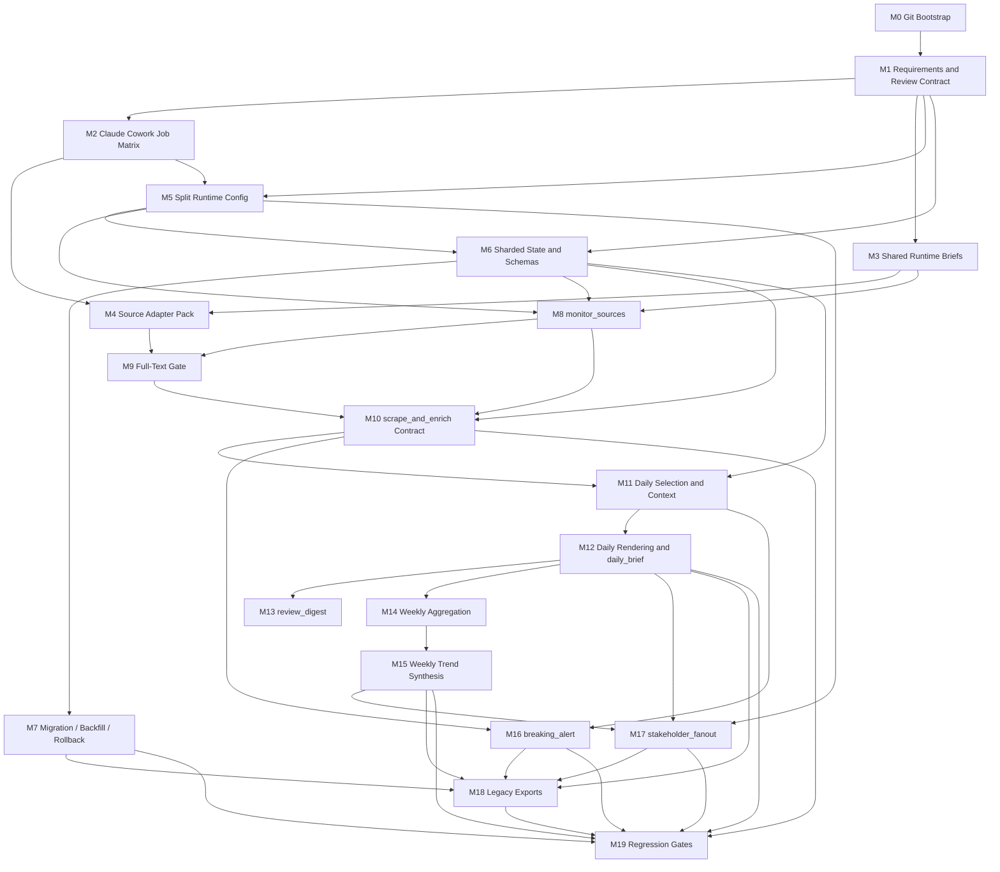

# Execution Plan: Claude Cowork Agent Refactor

## Summary

Этот план переводит архитектурный рефакторинг агента в исполнимую программу работ для `Claude Cowork`.

Цели плана:

- включить git как обязательный механизм milestone-scoped изменений, review и rollback;
- сократить runtime-context каждого запуска;
- разделить агент на узкие режимы с явными handoff-артефактами;
- изолировать работу с полными текстами статей в одном режиме;
- убрать монолитные `.state/dedupe.json` и `.state/delivery-log.json` из критического пути;
- сохранить проверяемость каждого этапа и снизить риск частично внедрённого состояния.

Принцип разбиения: каждый milestone рассчитан на `1-3 часа`, имеет отдельный review scope, явные acceptance criteria, тесты и non-goals.

## Requirements

| ID | Requirement |
| --- | --- |
| R1 | У каждого runtime-режима должен быть минимальный и явный набор входов; `README`, `docs/*`, `benchmark/*` не должны быть частью runtime-контекста. |
| R2 | Агент должен быть разложен на отдельные `Claude Cowork` jobs/режимы с явными входами, выходами и расписаниями. |
| R3 | Общее runtime-знание должно быть вынесено в компактные shared briefs, а не размазано по большим промптам и документации. |
| R4 | Полные тексты статей должны читаться и сохраняться только в `scrape_and_enrich`. |
| R5 | Рабочее состояние должно быть шардировано по run/date/type; монолиты должны быть убраны из критического пути. |
| R6 | Между режимами должны использоваться явные handoff-контракты: `raw_candidate`, `shortlisted_item`, `enriched_item`, `story_brief`, `daily_brief`, `weekly_brief`, `run_manifest`. |
| R7 | Source-specific knowledge для нестандартных источников должно жить в небольших adapter-файлах и подмешиваться только по необходимости. |
| R8 | `monitor_sources` должен делать discovery, первичный triage и shortlist без full text. |
| R9 | `build_daily_digest` должен работать только по compact artifacts: enriched items, story briefs, recent daily briefs. |
| R10 | `build_weekly_digest` должен работать по daily/weekly briefs, без чтения полного архива и без full text. |
| R11 | Должен существовать отдельный `review_digest` QA-режим после daily/weekly. |
| R12 | `breaking_alert` должен быть отдельным режимом и поддерживать high-signal items из `weekly_context`. |
| R13 | Персонализация должна быть вынесена в downstream `stakeholder_fanout`, а не оставаться в критическом пути базового daily/weekly. |
| R14 | Должен существовать безопасный migration/backfill/rollback path из текущего состояния в новое. |
| R15 | Должны быть заданы regression gates и benchmark/smoke checks до cutover. |
| R16 | Проект должен использовать git для milestone-scoped изменений, review, rollback и безопасного cutover; в репозитории должны быть базовые git hygiene rules. |

## Program-Level Acceptance Criteria

- Каждый runtime-режим запускается без чтения `README`, `docs/*` и `benchmark/*`.
- `scrape_and_enrich` является единственным режимом, которому разрешено читать или сохранять full article body.
- `build_daily_digest`, `build_weekly_digest`, `review_digest`, `breaking_alert` и `stakeholder_fanout` работают только по compact artifacts.
- `dedupe.json` и `delivery-log.json` больше не являются обязательными входами для базовых режимов.
- Проект инициализирован как git-репозиторий; локальные секреты и runtime state исключены из version control базовой настройкой.
- Есть документированный migration/backfill/rollback path.
- Есть regression gates для JTBD-06, JTBD-07, JTBD-08, JTBD-09 и smoke parity window на реальных данных проекта.

## Global Non-Goals

- Не менять бизнес-линзы Авито, веса скоринга и editorial policy без отдельного решения.
- Не добавлять новые источники и не изобретать новые fetch strategies в рамках этого рефакторинга.
- Не переделывать Telegram delivery UX.
- Не решать внешние ограничения среды: blocked domains, sandbox/network restrictions, login walls.
- Не включать stakeholder personalization в базовый daily/weekly critical path.

## Review Protocol

Каждый milestone считается independently reviewable только если в PR или review package есть все четыре артефакта:

1. Явный deliverable.
2. Acceptance criteria в проверяемой форме.
3. Тест или fixture-based verification.
4. Явно зафиксированные non-goals, чтобы не оценивать milestone по лишним ожиданиям.

## Milestone Progress

| Milestone | Status |
| --- | --- |
| M0 | completed |
| M1 | completed |
| M2 | completed |
| M3 | completed |
| M4 | completed |
| M5 | completed |
| M6 | completed |
| M7 | completed |
| M8 | completed |
| M9 | completed |
| M10 | completed |
| M11 | completed |
| M12 | completed |
| M13 | completed |
| M14 | completed |
| M15 | completed |
| M16 | completed |
| M17 | completed |
| M18 | completed |
| M19 | completed |

## Shared Milestone Review Template

Каждый implementation step начиная с `M2` должен использовать один и тот же шаблон review package или milestone report:

- Milestone ID
- Goal
- Scope
- Likely files or artifacts to change
- Dependencies
- Risks
- Deliverable
- Acceptance criteria
- Tests or verification steps
- Explicit non-goals
- Progress status: `pending` / `in_progress` / `blocked` / `completed`

## Definition of Done for an Independently Reviewable Milestone

Milestone считается independently reviewable только если выполнены все условия ниже:

- diff ограничен текущим milestone или явно объяснено отклонение;
- deliverable текущего milestone создан или обновлён;
- по каждому acceptance criterion есть явный статус;
- выполнены заявленные tests или явно объяснено, почему они не запускались;
- non-goals соблюдены или отклонение явно задокументировано;
- при скрытом расширении scope обновлён `PLANS.md`;
- reviewer может оценить milestone без необходимости сначала реализовать следующий milestone.

## Git Usage Rules

- Все substantial changes выполняются в git-репозитории.
- Предпочтительный темп работы: одна milestone или логически цельный подэтап на один commit или небольшой stack commits.
- Перед началом implementation milestone должна существовать понятная точка rollback через git history.
- `.env`, `.state/`, системные и machine-local файлы не должны попадать в version control по умолчанию.
- Если milestone меняет state shape, prompt contracts или runtime config, это должно быть видно в diff как отдельный reviewable change set.

## Claude Cowork Job Matrix

| Job | Trigger / Schedule | Planned Entry Instruction | Allowed Inputs | Forbidden Inputs | Outputs | Downstream Handoff |
| --- | --- | --- | --- | --- | --- | --- |
| `monitor_sources` | Start of `weekday_digest`, `weekly_digest`, `breaking_alert`; also manual source checks | `cowork/modes/monitor_sources.md` | source-group config, runtime thresholds, last checkpoint, recent story index, shared mission/taxonomy brief | `README`, `docs/*`, `benchmark/*`, full article bodies, stakeholder profiles, whole digest archive | raw candidate shard, shortlist shard, run manifest | feeds `scrape_and_enrich` |
| `scrape_and_enrich` | Immediately after `monitor_sources` for shortlisted items in the same run | `cowork/modes/scrape_and_enrich.md` | shortlist shard, required source adapters, shared mission/taxonomy/contracts brief | `README`, `docs/*`, `benchmark/*`, full raw source universe beyond shortlist, digest archive, stakeholder profiles | article files, enriched item shard, updated story briefs, run manifest | feeds `build_daily_digest`, `build_weekly_digest`, `breaking_alert` |
| `build_daily_digest` | Weekdays at `09:00 Europe/Moscow`; manual daily reruns | `cowork/modes/build_daily_digest.md` | enriched items for daily window, recent story briefs, recent daily briefs, shared mission/taxonomy brief | raw candidates, full article bodies, `README`, `docs/*`, `benchmark/*`, stakeholder profiles, weekly archive beyond compact refs | daily digest markdown, daily brief, delivery payload, run manifest | feeds `review_digest`, optional `stakeholder_fanout` |
| `review_digest` | Immediately after `build_daily_digest` or `build_weekly_digest`; manual QA reruns | `cowork/modes/review_digest.md` | digest markdown, kept/dropped compact artifacts, daily or weekly brief, run manifest | raw candidates, full article bodies, source adapters, `README`, `docs/*`, `benchmark/*` | QA review report | feeds operator review and future tuning loop |
| `build_weekly_digest` | Fridays at `17:00 Europe/Moscow`; manual weekly reruns | `cowork/modes/build_weekly_digest.md` | current-week daily briefs, prior weekly briefs, shared mission/taxonomy brief | raw candidates, full article bodies, full digest archive, `README`, `docs/*`, `benchmark/*`, stakeholder profiles | weekly digest markdown, weekly brief, delivery payload, run manifest | feeds `review_digest`, optional `stakeholder_fanout` |
| `breaking_alert` | Every `60 minutes`; manual alert checks | `cowork/modes/breaking_alert.md` | recent enriched items, recent story briefs, alert thresholds, shared mission/taxonomy brief | raw candidates, full article bodies, whole daily/weekly archive, `README`, `docs/*`, `benchmark/*`, stakeholder profiles | alert payload, run manifest | terminal delivery step; optional operator follow-up |
| `stakeholder_fanout` | Downstream after daily or weekly brief generation when personalization is enabled; manual per-profile reruns | `cowork/modes/stakeholder_fanout.md` | one `daily_brief` or `weekly_brief`, one stakeholder profile, shared mission brief | raw candidates, full article bodies, source adapters, whole profile set at once, `README`, `docs/*`, `benchmark/*` | one profile-specific digest, run manifest | terminal delivery step per profile |

## Milestone Overview

| ID | Est. | Depends On | Main Output |
| --- | --- | --- | --- |
| M0 | 1h | — | Git bootstrap, `.gitignore`, branch/commit workflow |
| M1 | 1h | M0 | Lock requirements, DoD, review checklist |
| M2 | 1h | M1 | Claude Cowork job matrix and schedule map |
| M3 | 2h | M1 | Shared runtime briefs and instruction-pack split |
| M4 | 2h | M2, M3 | Source adapter pack for non-standard sources |
| M5 | 2h | M1, M2 | Split runtime config and single source of truth |
| M6 | 2h | M1, M5 | Sharded state layout and schema set |
| M7 | 2h | M6 | Migration, backfill, rollback design |
| M8 | 2h | M3, M5, M6 | `monitor_sources` mode contract and outputs |
| M9 | 1.5h | M4, M8 | Full-text gate and adapter resolution |
| M10 | 2h | M6, M8, M9 | `scrape_and_enrich` enriched output contract |
| M11 | 2h | M6, M10 | Daily selection, anti-repeat, contextualization |
| M12 | 1.5h | M11 | Daily rendering and `daily_brief` emission |
| M13 | 1.5h | M12 | `review_digest` QA mode |
| M14 | 1.5h | M12 | Weekly aggregation from daily briefs |
| M15 | 1.5h | M14 | Weekly trend synthesis |
| M16 | 1.5h | M10, M11 | `breaking_alert` mode |
| M17 | 1.5h | M12, M15, M5 | `stakeholder_fanout` mode |
| M18 | 1.5h | M7, M12, M15, M16, M17 | Legacy exports and compatibility bridge |
| M19 | 2h | M7, M10, M12, M15, M16, M17, M18 | Regression harness and rollout gates |

## Detailed Milestones

## Addendum: Codex CLI Server Launch Mode

### Summary

Этот addendum добавляет отдельный MVP launch mode для запуска агента через
`codex exec` на удалённом сервере. Он является orchestration wrapper поверх
существующих canonical schedules и runtime modes, а не новым source-facing
`Claude Cowork` mode.

Ключевой принцип: обычный запуск через `Claude Cowork` и canonical runtime layer
не меняются. Codex CLI mode живёт в отдельном `ops/` namespace, читает
`config/runtime/schedule_bindings.yaml` и mode prompts из `cowork/`, но не
становится частью `config/runtime/runtime_manifest.yaml`.

### Requirements

| ID | Requirement |
| --- | --- |
| CLI-R1 | Должен существовать отдельный launch mode для headless запуска через `codex exec` на сервере. |
| CLI-R2 | Launch mode не должен менять canonical schedules, mode contracts, source groups или `Claude Cowork` mode matrix. |
| CLI-R3 | Launch mode должен использовать существующие schedule bindings: `weekday_digest`, `weekly_digest`, optional `breaking_alert`. |
| CLI-R4 | Launch mode должен иметь prompt artifacts, пригодные для non-interactive Codex CLI запуска. |
| CLI-R5 | Launch mode должен иметь server wrapper с env loading, lock от параллельных запусков и run logging. |
| CLI-R6 | Prompt должен запрещать persistent edits в prompts/config/adapters/contracts во время scheduled run; persistent issues оформляются как `change_request`. |
| CLI-R7 | Должна быть документация по установке на сервере и systemd/cron запуску. |
| CLI-R8 | Должна быть проверка, что ordinary launch path не зависит от `ops/` artifacts. |

### Milestones

#### CLI-M1. Plan and Contract

- Goal: зафиксировать boundary Codex CLI mode до добавления runtime-adjacent
  артефактов.
- Scope: только `PLANS.md`.
- Likely files/artifacts to change: `PLANS.md`.
- Dependencies: существующие `schedule_bindings.yaml`, `docs/launch-rerun-dry-run.md`,
  `tools/README.md`.
- Risks: смешать external launch wrapper с canonical `Claude Cowork` modes.
- Acceptance criteria:
  - все исходные требования CLI-R1..CLI-R8 замаплены;
  - явно сказано, что runtime manifest не меняется;
  - explicit non-goals зафиксированы.
- Tests or verification steps:
  - manual review of this addendum.
- Explicit non-goals:
  - не добавлять новый source-processing mode;
  - не менять расписание;
  - не реализовывать production-grade deterministic runner.

#### CLI-M2. Isolated Codex CLI Artifacts

- Goal: добавить отдельный `ops/codex-cli/` launch pack для server-side
  `codex exec`.
- Scope: prompt artifacts, wrapper script, output/log directory conventions.
- Likely files/artifacts to change:
  - `ops/codex-cli/README.md`
  - `ops/codex-cli/prompts/weekday_digest.md`
  - `ops/codex-cli/prompts/weekly_digest.md`
  - `ops/codex-cli/prompts/breaking_alert.md`
  - `ops/codex-cli/run_schedule.sh`
- Dependencies: `codex exec`, Python venv, `.env`, Telegram helper scripts.
- Risks:
  - scheduled agent may edit source-of-truth files unless prompt boundaries are explicit;
  - concurrent runs may corrupt `.state/` if no lock is used.
- Acceptance criteria:
  - launch pack lives outside `cowork/` and `config/runtime/`;
  - wrapper accepts only known schedule IDs;
  - wrapper loads `.env`, activates `.venv` when present, creates `.state/codex-runs/`,
    and uses a lock directory;
  - prompts instruct Codex to follow canonical schedules without changing runtime source files.
- Tests or verification steps:
  - `bash -n ops/codex-cli/run_schedule.sh`;
  - static check that `runtime_manifest.yaml` does not reference `ops/codex-cli`;
  - prompt review for persistent edit guardrails.
- Explicit non-goals:
  - не запускать реальный network fetch или Telegram delivery during implementation;
  - не добавлять secrets или machine-local config;
  - не менять `tools/rss_fetch.py` or `tools/telegram_send.py`.

#### CLI-M3. Operator Documentation

- Goal: документировать server deployment MVP без изменения обычного запуска.
- Scope: server setup, auth, env, systemd/cron examples, operational notes.
- Likely files/artifacts to change:
  - `docs/codex-cli-server-launch.md`
  - optionally `docs/launch-rerun-dry-run.md`
- Dependencies: CLI-M2 artifacts.
- Risks: оператор может принять Codex CLI mode за canonical runtime source of truth.
- Acceptance criteria:
  - документация объясняет, где живёт mode и почему он isolated;
  - есть команды установки, smoke checks and scheduling examples;
  - явно указаны ограничения MVP и rollback/disable path.
- Tests or verification steps:
  - static link/path review;
  - shell snippet sanity review where applicable.
- Explicit non-goals:
  - не описывать full production orchestrator;
  - не менять onboarding для обычной Cowork-сессии как обязательный путь.

### Coverage Matrix

| Requirement | Covered by |
| --- | --- |
| CLI-R1 | CLI-M1, CLI-M2, CLI-M3 |
| CLI-R2 | CLI-M1, CLI-M2, CLI-M3 |
| CLI-R3 | CLI-M2, CLI-M3 |
| CLI-R4 | CLI-M2 |
| CLI-R5 | CLI-M2, CLI-M3 |
| CLI-R6 | CLI-M2 |
| CLI-R7 | CLI-M3 |
| CLI-R8 | CLI-M2, CLI-M3 |

### Current Implementation Status

| Milestone | Status |
| --- | --- |
| CLI-M1 | completed |
| CLI-M2 | completed |
| CLI-M3 | completed |

## Addendum: Stakeholder Request Deployment Setup

### Summary

Этот addendum добавляет план для первичной настройки мониторинга под конкретного
стейкхолдера при deployment.

Текущие stakeholder profiles в `config/runtime/stakeholder-profiles/*.yaml`
описывают функцию или аудиторию, но не отделяют свободный тематический запрос
стейкхолдера от runtime config. Новая схема должна позволить нескольким
стейкхолдерам с разными business-unit интересами использовать тот же monitoring
source universe, но получать разную post-scrape selection, scoring and delivery.

Ключевой boundary: список источников и первичный source monitoring остаются
общими. Stakeholder request начинает влиять после первичного scraping/enrichment:
на reranking, selection, scoring adjustments, daily/weekly output emphasis and
stakeholder-specific delivery. Full-text policy не меняется.

### Decisions Already Made

| Topic | Decision |
| --- | --- |
| Stakeholder cardinality | Deployment may support multiple stakeholders, not only functional profiles like product/strategy. |
| Example target | A stakeholder can represent a real-estate business unit such as long-term rentals. |
| Source universe | Monitoring resources remain the same across stakeholders. |
| Request format | Stakeholder thematic request is free-form Markdown text. |
| Request location | Use a directory of Markdown request files, proposed as `config/runtime/stakeholder-requests/`. |
| Guide example | Include only one guide/example request based on the current default Avito monitor request. Do not include alternate examples in the guide. |
| Setup workflow | Initial deployment setup is manual: create a request file from the guide/template. |
| Runtime default | Server launch has a default stakeholder ID. |
| Runtime override | Server launch can run with an alternative stakeholder ID. |
| Delivery | Stakeholders may need separate Telegram chats or forum topics. |
| Same-instance multiple dailies | One server instance must be able to run multiple daily digests sequentially for different stakeholders. |
| Shared scrape optimization | Sequential stakeholder daily runs should reuse source discovery/scrape/enrichment artifacts and avoid duplicate scraping; later runs may perform only an incremental update check for new source changes before stakeholder-specific selection/rendering. |
| Weekly stream isolation | Weekly digests must not aggregate all stakeholder daily digests together; each weekly run must use one selected stakeholder stream, or the default stream, explicitly. |

### Requirements

| ID | Requirement |
| --- | --- |
| SR-R1 | Stakeholder thematic requests must live in standalone Markdown files, one file per stakeholder/request profile. |
| SR-R2 | The same source groups and source adapters must remain reusable across stakeholders. |
| SR-R3 | Stakeholder request must influence post-scrape selection and scoring, not only downstream copy personalization. |
| SR-R4 | Stakeholder request must not expand full article body usage beyond `scrape_and_enrich`. |
| SR-R5 | There must be a default stakeholder ID for server launch. |
| SR-R6 | Server launch must support overriding the stakeholder ID per run. |
| SR-R7 | Stakeholder delivery must allow separate Telegram chat and/or topic bindings. |
| SR-R8 | Initial deployment setup must be manual and documented, using a guide/template plus one default example request. |
| SR-R9 | Runtime contracts must make clear which modes may read stakeholder profile/request files and which modes may not. |
| SR-R10 | Existing ordinary/default monitoring should remain backward compatible when no alternative stakeholder is selected. |
| SR-R11 | One instance must support sequential daily runs for two or more stakeholder IDs without requiring separate deployments. |
| SR-R12 | Sequential stakeholder daily runs must reuse existing source-facing artifacts and avoid duplicate scraping when the source window has already been checked. |
| SR-R13 | Weekly digests must aggregate only the selected stakeholder's daily/brief stream, or the default stream, and must never mix daily briefs from all stakeholders by default. |

### Proposed Runtime Model

The recommended MVP model is:

- `config/runtime/stakeholder-requests/{stakeholder_id}.md`
  - free-form thematic request written for the stakeholder;
  - default request is based on the current global Avito monitor mission;
  - alternative requests are created manually by operators and referenced by profile ID.
- `config/runtime/stakeholder-profiles/{stakeholder_id}.yaml`
  - keeps structured controls: thresholds, max items, lens weights, format, delivery;
  - gains `request_path` pointing to exactly one Markdown request file;
  - can represent either a function (`product`) or a business unit (`long_term_rentals`).
- server launch config/prompt
  - has a default stakeholder ID;
  - accepts a per-run override;
  - passes only the selected profile and selected request to stakeholder-aware stages;
  - supports sequential runs for different stakeholder IDs on the same instance.

The selection architecture should become two-layer:

1. Base source-facing pipeline remains shared:
   `monitor_sources -> scrape_and_enrich`.
2. Stakeholder-aware post-scrape pipeline applies selected profile/request:
   selection, scoring adjustment, daily/weekly rendering emphasis and optional
   stakeholder fanout/delivery.

For same-instance multi-stakeholder daily usage, the optimized path should be:

1. Run or reuse a shared source-facing window check for the target digest date.
2. If new or changed source candidates exist, run `scrape_and_enrich` only for
   the new shortlist delta.
3. For each requested stakeholder ID, run stakeholder-aware selection/scoring and
   rendering from the compact enriched/story artifacts.
4. Record each stakeholder output separately while preserving shared run
   provenance, so reviewers can see whether two digests came from the same
   source-facing check.

Weekly aggregation should be stream-isolated:

- `build_weekly_digest` receives an explicit selected stakeholder ID or defaults
  to the default stakeholder stream.
- It includes only daily briefs/output refs matching that stakeholder stream and
  target ISO week.
- It must not scan `digests/profiles/` or `.state/briefs/daily/` and aggregate
  every stakeholder's daily output together.
- If a selected stakeholder has missing daily briefs for the week, weekly should
  report missing days for that stakeholder rather than filling gaps from another
  stakeholder.

### Open Design Assumptions To Validate During Implementation

| Assumption | Default for MVP |
| --- | --- |
| Default stakeholder ID location | Add an explicit field in Codex CLI launch config or prompt pack rather than hard-coding only in shell. |
| Existing `default` profile | Preserve it and attach the default Avito request file. |
| Alternative stakeholder output path | Include stakeholder ID in digest/state paths only when a non-default stakeholder is selected, or document any path change before implementation. |
| Daily/weekly base compatibility | Existing `telegram_digest` daily/weekly paths remain available for default runs. |
| Stakeholder-aware scoring | Implement as bounded reranking/score adjustment over enriched compact artifacts, not as source refetch. |
| Telegram overrides | Support env-var based overrides first; consider profile-level explicit delivery fields if needed. |
| Shared scrape cache key | Use digest date/window plus source group scope as the shared source-facing reuse key; include stakeholder ID only in downstream output keys. |
| Incremental second run | A second stakeholder daily run on the same instance should check whether source-facing artifacts for the window are fresh enough before doing any fetch, then reuse them if valid. |
| Weekly stream key | Use week ID plus selected stakeholder ID plus delivery profile as the weekly aggregation key; default weekly remains compatible with the existing default stream. |

### Milestones

#### SR-M1. Plan and Contract Boundary

- Goal: lock requirements, assumptions, and behavioral boundaries before
  changing runtime artifacts.
- Scope: `PLANS.md` only.
- Likely files/artifacts to change: `PLANS.md`.
- Dependencies:
  - existing stakeholder profiles;
  - `build_daily_digest` selection contract;
  - `build_weekly_digest` contracts;
  - Codex CLI launch pack.
- Risks:
  - accidentally turning stakeholder requests into source discovery inputs;
  - breaking default daily/weekly outputs by introducing stakeholder-specific paths too early.
- Acceptance criteria:
  - SR-R1..SR-R13 are captured;
  - user decisions are recorded explicitly;
  - milestones map every requirement;
  - non-goals are explicit.
- Tests or verification steps:
  - manual review of this plan addendum.
  - acceptance test:
    `rg -n "SR-R1|SR-R13|Coverage Matrix|Weak Spot Audit|Final Integration Test" PLANS.md`
- Explicit non-goals:
  - no runtime prompt/config edits beyond the plan;
  - no new source groups or source adapters;
  - no implementation of server CLI flags in this milestone.

#### SR-M2. Stakeholder Request Artifact Contract

- Goal: add the file contract for standalone Markdown stakeholder requests.
- Scope:
  - define request directory;
  - add default request example based on the current Avito monitor mission;
  - link profiles to request files.
- Likely files/artifacts to change:
  - `config/runtime/stakeholder-requests/default.md`
  - `config/runtime/stakeholder-profiles/default.yaml`
  - `config/runtime/stakeholder-profiles/index.yaml`
  - `config/runtime/runtime_manifest.yaml`
  - documentation for request file structure.
- Dependencies: SR-M1.
- Risks:
  - making long narrative request files required in every runtime mode;
  - duplicating mission brief content in a way that drifts.
- Acceptance criteria:
  - a default Markdown request file exists;
  - stakeholder profile points to exactly one request path;
  - runtime manifest lists the request directory or index as config source;
  - only the default example request is included in docs/guide.
- Tests or verification steps:
  - static path resolution check for profile `request_path`;
  - review that request files are not referenced by source-facing modes.
  - acceptance test:
    `python3 tools/validate_stakeholder_setup.py --check request-paths`
- Explicit non-goals:
  - no long-term rentals request example in the guide yet;
  - no scoring behavior change yet;
  - no Telegram delivery changes yet.

#### SR-M3. Stakeholder-Aware Selection and Scoring Contract

- Goal: define how selected stakeholder request/profile influences post-scrape
  selection and scoring.
- Scope:
  - update daily selection contract;
  - update weekly aggregation/trend contracts if stakeholder-specific weekly
    output is in scope;
  - define allowed request/profile inputs and forbidden raw/full-text inputs.
- Likely files/artifacts to change:
  - `config/runtime/mode-contracts/build_daily_digest_selection.yaml`
  - `config/runtime/mode-contracts/build_weekly_digest_aggregation.yaml`
  - `config/runtime/mode-contracts/build_weekly_digest_trends.yaml`
  - `cowork/modes/build_daily_digest.md`
  - `cowork/modes/build_weekly_digest.md`
  - mode fixtures for stakeholder-aware selection.
- Dependencies: SR-M2.
- Risks:
  - breaking R13-era separation where stakeholder personalization was downstream-only;
  - letting stakeholder requests alter upstream scraping or source lists;
  - producing incomparable scores without recording adjusted-vs-base score provenance;
  - recomputing enrichment for every stakeholder instead of reusing shared enriched artifacts.
- Acceptance criteria:
  - stakeholder request/profile is allowed only after enrichment;
  - source discovery and scraping contracts remain stakeholder-agnostic;
  - score adjustment provenance is explicit, e.g. base score plus stakeholder relevance note/adjustment;
  - default stakeholder produces behavior compatible with current default monitor;
  - stakeholder-specific scoring works from compact enriched artifacts and does not require a second scrape for a second stakeholder;
  - weekly aggregation contract explicitly filters daily briefs by selected stakeholder stream and forbids all-stakeholder aggregation.
- Tests or verification steps:
  - fixture with default request should preserve current-style selection;
  - fixture with a rentals-oriented request should promote rentals-relevant enriched items without changing source inputs;
  - fixture or dry-run review should show two stakeholder selections from the same enriched input set;
  - weekly fixture should prove that default and alternative stakeholder daily briefs are not mixed in one weekly digest;
  - contract review that full article bodies remain forbidden outside `scrape_and_enrich`.
  - acceptance test:
    `python3 tools/validate_stakeholder_setup.py --check selection-fixtures`
- Explicit non-goals:
  - no source-list personalization;
  - no full-text expansion;
  - no automatic generation of stakeholder requests from free text.

#### SR-M4. Deployment and Server Launch Integration

- Goal: allow server launch to use a default stakeholder ID and per-run override.
- Scope:
  - update Codex CLI launch docs and prompts;
  - update wrapper interface if needed;
  - define default stakeholder ID configuration;
  - define sequential same-instance daily runs for one or more stakeholder IDs.
- Likely files/artifacts to change:
  - `ops/codex-cli/run_schedule.sh`
  - `ops/codex-cli/prompts/*.md`
  - `ops/codex-cli/README.md`
  - `docs/codex-cli-server-launch.md`
  - optional `ops/codex-cli/config.example.env` or documented env vars.
- Dependencies: SR-M2, SR-M3.
- Risks:
  - hidden default stakeholder assumptions in shell script;
  - accidental fanout for all stakeholders instead of one selected stakeholder;
  - path collisions between default and non-default outputs;
  - second stakeholder run triggering duplicate source scraping.
- Acceptance criteria:
  - server launch has a documented default stakeholder ID;
  - server launch can run one alternative stakeholder ID explicitly;
  - server launch can run two stakeholder daily outputs sequentially on the same instance;
  - server launch can run weekly for one selected stakeholder stream without aggregating other stakeholder daily outputs;
  - prompts require reuse of a fresh shared source-facing window before scraping again;
  - prompts instruct Codex to load only selected stakeholder profile/request;
  - ordinary no-override run remains valid.
- Tests or verification steps:
  - `bash -n ops/codex-cli/run_schedule.sh`;
  - dry-run/static invocation check for default and override argument parsing if implemented;
  - dry-run/static invocation check for sequential stakeholder IDs if implemented;
  - dry-run/static invocation check for weekly selected stakeholder stream if implemented;
  - prompt review for selected-stakeholder-only loading.
  - acceptance test:
    `ops/codex-cli/run_schedule.sh --dry-run weekday_digest --stakeholder default --stakeholder product`
- Explicit non-goals:
  - no multi-stakeholder batch fanout by default unless explicitly requested in the server launch command;
  - no production secret manager integration.

#### SR-M5. Stakeholder Delivery Binding

- Goal: support stakeholder-specific Telegram chat/topic routing.
- Scope:
  - define delivery override fields or env-var mapping;
  - document fallback behavior to existing delivery profile.
- Likely files/artifacts to change:
  - `config/runtime/stakeholder-profiles/*.yaml`
  - `config/runtime/schedule_bindings.yaml` only if a shared delivery contract change is needed;
  - `tools/README.md` or delivery docs;
  - Codex CLI launch docs.
- Dependencies: SR-M4.
- Risks:
  - leaking secrets into git-managed profile files;
  - making delivery profile resolution ambiguous.
- Acceptance criteria:
  - profile can select default schedule delivery or override chat/topic through env-var names;
  - no Telegram tokens or chat IDs are committed;
  - fallback path is explicit when stakeholder-specific env vars are absent.
- Tests or verification steps:
  - dry-run Telegram delivery profile resolution review;
  - static review that no secrets are present.
  - acceptance test:
    `python3 tools/validate_stakeholder_setup.py --check delivery-routing`
- Explicit non-goals:
  - no change to Telegram message formatting unless required by routing;
  - no non-Telegram delivery channel.

#### SR-M6. Validation and Completion Audit

- Goal: verify the full stakeholder request MVP and document compatibility.
- Scope:
  - mode fixtures;
  - path/schema checks;
  - final audit.
- Likely files/artifacts to change:
  - `config/runtime/mode-fixtures/*stakeholder*`
  - `COMPLETION_AUDIT.md` or structured final report.
- Dependencies: SR-M2, SR-M3, SR-M4, SR-M5.
- Risks:
  - fixture coverage proves only default behavior and misses alternative stakeholder behavior.
- Acceptance criteria:
  - every stakeholder profile request path resolves;
  - default stakeholder path preserves ordinary launch behavior;
  - alternative stakeholder run path is documented and fixture-covered;
  - two sequential stakeholder daily outputs can be produced from one shared enriched input set;
  - weekly integration fixture proves one selected stakeholder stream is aggregated and other stakeholder streams are ignored;
  - delivery fallback behavior is documented;
  - completion audit compares SR-R1..SR-R13 to implementation.
- Tests or verification steps:
  - fixture-based stakeholder-aware selection review;
  - config path validation;
  - shell syntax checks for launch scripts;
  - markdown/doc link review.
  - acceptance test:
    `python3 tools/validate_stakeholder_setup.py --check all`
  - final integration test:
    `python3 tools/validate_stakeholder_setup.py --check integration`
- Explicit non-goals:
  - no real Telegram send required for completion;
  - no live source fetch required for contract validation.

### Coverage Matrix

| Requirement | Covered by |
| --- | --- |
| SR-R1 | SR-M2 |
| SR-R2 | SR-M1, SR-M3 |
| SR-R3 | SR-M3 |
| SR-R4 | SR-M3, SR-M6 |
| SR-R5 | SR-M4 |
| SR-R6 | SR-M4 |
| SR-R7 | SR-M5 |
| SR-R8 | SR-M2, SR-M4 |
| SR-R9 | SR-M3, SR-M6 |
| SR-R10 | SR-M2, SR-M3, SR-M4, SR-M6 |
| SR-R11 | SR-M4, SR-M6 |
| SR-R12 | SR-M3, SR-M4, SR-M6 |
| SR-R13 | SR-M3, SR-M4, SR-M6 |

### Milestone Acceptance Test Matrix

Each milestone must leave a runnable acceptance test behind. Tests should be
static, fixture-based, or dry-run only unless the milestone explicitly says
otherwise. No milestone acceptance test should require live source fetch,
Telegram delivery, or secrets.

| Milestone | Acceptance Test Command | What It Proves |
| --- | --- | --- |
| SR-M1 | `rg -n "SR-R1|SR-R13|Coverage Matrix|Weak Spot Audit|Final Integration Test" PLANS.md` | The plan captures the stakeholder request requirements, coverage, weak-spot review, and final integration test. |
| SR-M2 | `python3 tools/validate_stakeholder_setup.py --check request-paths` | Every indexed stakeholder profile has exactly one `request_path`, every path exists, and `runtime_manifest.yaml` exposes the request config source. |
| SR-M3 | `python3 tools/validate_stakeholder_setup.py --check selection-fixtures` | Stakeholder-aware selection fixtures run from compact enriched/story artifacts, preserve default behavior, promote an alternative stakeholder-relevant item, isolate weekly streams, and do not require raw/full-text inputs. |
| SR-M4 | `ops/codex-cli/run_schedule.sh --dry-run weekday_digest --stakeholder default --stakeholder product` | Server launch can resolve a default plus an alternative stakeholder sequentially, reuse one source-facing window, avoid duplicate scrape/enrich steps, and keep weekly stream selection explicit in dry-run mode. |
| SR-M5 | `python3 tools/validate_stakeholder_setup.py --check delivery-routing` | Stakeholder delivery routing resolves Telegram env-var names for chat/topic overrides, falls back to schedule delivery, and contains no committed secrets. |
| SR-M6 | `python3 tools/validate_stakeholder_setup.py --check all` | Full static/fixture validation is green across request paths, selection/scoring contracts, server launch dry-run expectations, delivery routing, and compatibility guards. |

Acceptance test implementation expectations:

- SR-M2 should introduce `tools/validate_stakeholder_setup.py` with at least the
  `request-paths` check.
- Later milestones should extend the same validator rather than adding unrelated
  one-off scripts.
- `ops/codex-cli/run_schedule.sh --dry-run` must not call `codex exec`, fetch
  sources, or send Telegram messages. It should print the resolved schedule,
  selected stakeholder IDs, source-facing reuse key, prompt path, and expected
  output/delivery bindings.
- Fixture tests must use small deterministic fixture files under
  `config/runtime/mode-fixtures/` and must not read `.state/articles/`.

### Weak Spot Audit

| Weak Spot | Requirements At Risk | How The Plan Guards It | Milestone That Must Prove It |
| --- | --- | --- | --- |
| Stakeholder request accidentally becomes an input to `monitor_sources` or source adapters. | SR-R2, SR-R4, SR-R9, SR-R12 | Source-facing contracts remain stakeholder-agnostic; request/profile inputs are allowed only after enrichment. | SR-M3, SR-M6 |
| A second stakeholder daily run repeats scraping instead of reusing enriched artifacts. | SR-R11, SR-R12 | Shared source-facing reuse key excludes stakeholder ID; dry-run must show one source-facing check and multiple downstream selections. | SR-M4, SR-M6 |
| Default stakeholder path changes existing digest filenames or delivery behavior unexpectedly. | SR-R10 | Default profile gets a request file but existing default daily/weekly behavior remains compatible; path changes must be explicitly documented before implementation. | SR-M2, SR-M3, SR-M6 |
| Free-text request becomes too large and turns into a broad runtime dependency. | SR-R1, SR-R8, SR-R9 | Request files are loaded only for selected stakeholder-aware stages; source-facing modes do not read the request directory. | SR-M2, SR-M3 |
| Alternative stakeholder scoring overwrites base score, making decisions hard to audit. | SR-R3 | Scoring provenance must preserve base score plus stakeholder adjustment/relevance rationale. | SR-M3, SR-M6 |
| Long-term rentals or another business-unit stakeholder changes source groups by implication. | SR-R2, SR-R12 | Stakeholder request affects post-scrape selection/scoring only; source groups stay in schedule bindings. | SR-M3, SR-M4 |
| Delivery override commits chat IDs or secrets into git-managed profile files. | SR-R7 | Profiles may reference env-var names, not secret values; validator checks for likely committed secrets. | SR-M5 |
| Server launch accidentally fans out to every stakeholder profile. | SR-R6, SR-R11 | Server launch loads only selected stakeholder IDs; multi-stakeholder run is explicit via repeated `--stakeholder`. | SR-M4 |
| Weekly behavior is underspecified after daily becomes stakeholder-aware. | SR-R3, SR-R10, SR-R13 | SR-M3 must decide whether weekly is stakeholder-specific in MVP and update weekly contracts or explicitly defer with compatibility notes. | SR-M3 |
| Weekly digest mixes all stakeholder daily briefs in one aggregate. | SR-R10, SR-R13 | Weekly aggregation key includes selected stakeholder ID; weekly fixtures must include another stakeholder's daily brief and prove it is ignored. | SR-M3, SR-M6 |
| Completion audit misses new requirements because only SR-R1..SR-R10 were checked. | SR-R11, SR-R12, SR-R13 | Audit scope is SR-R1..SR-R13 and final integration test includes sequential daily reuse and weekly stream isolation. | SR-M6 |

### Final Integration Test

The final integration test must be added by SR-M6 and must be runnable without
network, secrets, or Telegram delivery.

Recommended command:

```bash
python3 tools/validate_stakeholder_setup.py --check integration
```

The integration fixture should model one digest date, one shared source group
scope, and two stakeholder IDs: `default` and one alternative business-unit
stakeholder such as `long_term_rentals`.

Required setup:

- a shared source-facing fixture with raw/shortlist/enriched compact artifacts;
- a default stakeholder request based on the current Avito monitor mission;
- an alternative stakeholder request fixture that emphasizes long-term rentals;
- two stakeholder profiles pointing to exactly one request file each;
- daily brief fixtures for both stakeholders in the same ISO week;
- delivery routing fixture with default delivery and one chat/topic override via
  env-var names only.

Required assertions:

- only one source-facing window/reuse key is produced for the fixture date and
  source group scope;
- both stakeholder daily outputs reference the same source-facing run or reuse
  key;
- no second scrape/enrich step is planned for the second stakeholder when the
  shared artifacts are fresh;
- default stakeholder selection remains compatible with current default monitor
  expectations;
- alternative stakeholder selection promotes at least one rentals-relevant item
  that the default output does not promote as strongly;
- both outputs preserve base score plus stakeholder-specific score/rationale;
- full article bodies and `.state/articles/` are not used by selection,
  rendering, delivery, or validation;
- Telegram routing resolves env-var names without requiring or exposing token,
  chat ID, or topic ID values;
- output paths do not collide across stakeholders;
- weekly aggregation for the default stakeholder ignores alternative stakeholder
  daily briefs;
- weekly aggregation for the alternative stakeholder ignores default stakeholder
  daily briefs;
- missing daily briefs for one stakeholder are reported as missing for that
  stakeholder, not backfilled from another stakeholder;
- completion audit maps SR-R1..SR-R13 to pass/fail status.

### Current Implementation Status

| Milestone | Status |
| --- | --- |
| SR-M1 | completed |
| SR-M2 | pending |
| SR-M3 | pending |
| SR-M4 | pending |
| SR-M5 | pending |
| SR-M6 | pending |

## Addendum: Minimal Codex Runner Scraping Tooling

### Summary

Этот addendum фиксирует минимально необходимый набор инструментов для
source-facing scraping/fetching, если фактическим runtime runner является Codex,
а source-specific поведение остаётся в `cowork/adapters`.

Цель не в том, чтобы построить универсальный crawler. Цель — дать Codex ровно
достаточно I/O-инструментов, чтобы исполнять существующие mode contracts:
`monitor_sources` открывает только discovery/snippet surfaces, а
`scrape_and_enrich` получает full text только для shortlisted items.

### Decisions Already Made

| Topic | Decision |
| --- | --- |
| Runner | Codex is the active runner and can perform adapter-aware reasoning. |
| Source knowledge | Source-specific behavior remains in `cowork/adapters`, resolved through `cowork/adapters/source_map.md`. |
| Default fetch path | Prefer static RSS/HTTP/API fetch over browser automation whenever an adapter permits it. |
| Browser scope | Browser automation is a narrow fallback for `chrome_scrape`/UI-driven pages, not the default fetch method. |
| Full text | Full article body remains allowed only in `scrape_and_enrich` and only for shortlisted items. |
| Blocked sources | No CAPTCHA, login, paywall bypass, or proxy rotation in the MVP; emit `change_request` or manual reminders according to adapter policy. |
| State writes | Tools may return JSON, but the runner/mode layer owns `.state/` artifact writing and schema validation. |
| Inman coverage | Inman must be treated as a regular scraping-analysis source, covered by the same runner tooling and validation as other recurring sources. |
| Plan context hygiene | `PLANS.md` should not become a large runtime context dependency for Codex or `Claude Cowork`; old/completed plan blocks should be indexed or archived before implementation work depends on this plan. |

### Minimal Tool Set

| Tool | Purpose | Required For |
| --- | --- | --- |
| HTTP/RSS/API fetcher | Fetch RSS/Atom, static HTML, and simple JSON API responses with timeouts, retries, soft-fail labels, and response metadata. | `rss`, `html_scrape`, `itunes_api`; already mostly covered by `tools/rss_fetch.py`. |
| Browser fallback | Read JS/UI-driven public pages when static fetch is insufficient. | `similarweb_*`, Google Play app pages, OnlineMarketplaces/Property Portal Watch if static extraction is insufficient. |
| PDF text extractor | Extract title/date/body text from downloaded public PDFs. | Rightmove PLC RNS PDF enrichment. |
| Artifact/schema validator | Validate compact runtime artifacts, source adapter resolution, full-text boundaries, and change-request shape. | All source-facing modes and dry-run acceptance checks. |

Everything else is intentionally out of scope for the MVP unless a later
adapter-backed `change_request` proves it is necessary.

### Requirements

| ID | Requirement |
| --- | --- |
| RT-R1 | The runner must support RSS/Atom feed fetch and static HTTP page fetch through one JSON-in/JSON-out interface. |
| RT-R2 | The same fetch interface must support iTunes lookup JSON endpoints without introducing a separate API client. |
| RT-R3 | Static fetch results must include HTTP metadata, final URL, soft-fail labels, and enough raw body/item data for Codex to apply adapter rules. |
| RT-R4 | Browser automation must be available only as a bounded fallback for sources whose configured strategy or adapter requires UI-driven access. |
| RT-R5 | Browser automation must not be used to automate login, CAPTCHA, paywall bypass, or manual-only sources. |
| RT-R6 | PDF extraction must be available for shortlisted/enrichment cases such as Rightmove RNS PDFs. |
| RT-R7 | The runner must resolve source adapters from `source_map.md` and load only adapters relevant to the current source group or shortlist. |
| RT-R8 | `monitor_sources` must not fetch or consume full article bodies, even if HTTP/browser tools could do so. |
| RT-R9 | `scrape_and_enrich` must fetch full text only from current-run shortlisted items and normalize outcomes to `full`, `snippet_fallback`, or `paywall_stub`. |
| RT-R10 | Tool failures that require persistent changes must become `change_request` artifacts rather than silent runtime workarounds. |
| RT-R11 | Acceptance checks must be runnable without live source fetch, Telegram delivery, secrets, proxy services, or CAPTCHA-solving. |
| RT-R12 | Inman must remain in the regular source coverage for scraping analysis, with explicit dry-run or fixture validation of its RSS/feed-based discovery path. |
| RT-R13 | After RT-M2..RT-M6 are implemented, Codex must run a bounded live test scraping pass, record what works and fails per source/tool path, and propose follow-up changes or change requests. |
| RT-R14 | Before implementing the scraping tooling milestones, reduce active plan context load by making the current runner scraping plan easy to load independently from old/completed tasks while preserving reviewable history. |

### Source Strategy Fit

| Source family | Minimal tool path | Notes |
| --- | --- | --- |
| Baseline RSS sources | HTTP/RSS fetcher | AIM, Zillow Mediaroom, CoStar, Redfin. |
| Inman regular scraping-analysis source | HTTP/RSS fetcher | Inman must be covered as a recurring source in scraping-analysis validation, using feed-based discovery and preserving paywall/snippet fallback behavior for downstream enrichment. |
| Static HTML discovery | HTTP fetcher + Codex adapter reasoning | Mike DelPrete articles index, Rightmove PLC homepage. |
| Listing-style HTML | HTTP fetcher first, browser fallback if needed | OnlineMarketplaces and Property Portal Watch. |
| Similarweb overview pages | Browser fallback | Public overview pages only; no gated category ranking scrape. |
| App Store | HTTP fetcher as JSON/API fetch | iTunes lookup API for iOS release metadata. |
| Google Play | Browser fallback | UI-driven app page extraction; no unofficial API in MVP. |
| Rightmove RNS PDFs | HTTP fetcher + PDF extractor | Discovery can remain static; PDF text only during enrichment when needed. |
| Manual/blocked sources | No fetch | Follow `blocked_manual_access` policy. |

### Milestones

Recommended implementation order: RT-M1 -> RT-M8 -> RT-M2 -> RT-M3 -> RT-M4
-> RT-M5 -> RT-M6 -> RT-M7. RT-M8 is listed later because it was added after
the initial plan, but it is a pre-implementation hygiene milestone.

#### RT-M1. Plan and Boundary

- Goal: lock the reduced tool set and runtime boundaries before changing any
  scripts, prompts, adapters, or contracts.
- Scope: `PLANS.md` only.
- Likely files/artifacts to change: `PLANS.md`.
- Dependencies:
  - `cowork/adapters/source_map.md`
  - `cowork/modes/monitor_sources.md`
  - `cowork/modes/scrape_and_enrich.md`
  - `config/runtime/mode-contracts/monitor_sources.yaml`
  - `config/runtime/mode-contracts/scrape_and_enrich_gate.yaml`
  - `config/runtime/mode-contracts/scrape_and_enrich_output.yaml`
- Risks:
  - overbuilding a crawler instead of honoring adapter-scoped source access;
  - accidentally expanding full-text usage into discovery mode.
- Acceptance criteria:
  - RT-R1..RT-R14 are recorded;
  - the minimal tool set is exactly four tool classes;
  - Inman is explicitly covered as a regular scraping-analysis source;
  - plan context hygiene is recorded as a required pre-implementation step;
  - browser fallback and blocked-source boundaries are explicit;
  - coverage matrix maps every requirement.
- Tests or verification steps:
  - manual review of this addendum;
  - acceptance test:
    `rg -n "RT-R1|RT-R14|Inman regular scraping-analysis source|Plan Context Hygiene|Minimal Tool Set|Coverage Matrix" PLANS.md`
- Explicit non-goals:
  - no implementation in this milestone;
  - no source config, adapter, prompt, or state schema edits;
  - no live network fetch.

#### RT-M2. Fetcher Contract Consolidation

- Goal: make the existing HTTP/RSS fetcher the single minimal interface for
  RSS, static HTML, and simple JSON/API fetches.
- Scope:
  - document or adjust fetcher invocation for `rss`, `html_scrape`, and
    `itunes_api`;
  - preserve JSON stdout and no-state-write contract.
- Likely files/artifacts to change:
  - `tools/rss_fetch.py`
  - `tools/README.md`
  - `tools/requirements.txt` only if a required parser dependency is missing
  - fixture or smoke docs under `config/runtime/mode-fixtures/` if needed
- Dependencies: RT-M1, RT-M8.
- Risks:
  - adding source-specific parsing into the generic fetcher;
  - making the fetcher write `.state/` directly;
  - changing exit-code semantics used by existing docs.
- Acceptance criteria:
  - one fetcher interface supports `kind=rss` and `kind=http`;
  - iTunes lookup URLs can be handled through the HTTP path and parsed by Codex
    or a narrow adapter-aware normalization step;
  - Inman feed discovery is represented by an offline fixture or dry-run sample
    as a regular recurring source, not an optional one-off check;
  - soft-fail labels remain explicit for blocked/paywall/rate-limited/timeout
    outcomes;
  - fetcher still writes no runtime state.
- Tests or verification steps:
  - syntax/import check for `tools/rss_fetch.py`;
  - fixture-based unit tests using local saved RSS, HTML, and JSON bodies if
    live network is not appropriate;
  - no test should require external network access.
- Explicit non-goals:
  - no browser automation;
  - no source-specific selector library inside `rss_fetch.py`;
  - no proxy or CAPTCHA handling.

#### RT-M3. Browser Fallback Interface

- Goal: define the narrow browser fallback path for Codex-run scraping without
  turning it into the default fetch method.
- Scope:
  - choose the operational browser interface for runner use;
  - document when browser fallback is allowed;
  - define output shape equivalent to HTTP fetch results where practical.
- Likely files/artifacts to change:
  - `tools/chrome_notes.md` or a successor browser runner note
  - `tools/README.md`
  - optional browser helper script only if needed for repeatable headless runs
- Dependencies: RT-M1, RT-M8.
- Risks:
  - browser fallback becomes a hidden bypass for blocked/manual sources;
  - browser output lacks enough provenance to review extraction failures;
  - cron/server runner depends on an interactive browser session.
- Acceptance criteria:
  - browser fallback is allowed only for configured `chrome_scrape` sources or
    explicit adapter fallback cases;
  - manual-only sources still skip fetch and follow blocked-source policy;
  - output includes URL, final URL when available, page text or relevant HTML,
    timing/status-like metadata when available, and soft-fail reason when blocked;
  - docs distinguish interactive Codex/browser use from headless server use.
- Tests or verification steps:
  - static review of source strategy table against `config/runtime/source-groups/`;
  - fixture or dry-run output sample for one browser-backed source;
  - no test should automate login, CAPTCHA, or paywall flows.
- Explicit non-goals:
  - no proxy rotation;
  - no broad web crawling;
  - no replacement of RSS/static fetch where static fetch is sufficient.

#### RT-M4. PDF Extraction Helper

- Goal: add or document a tiny PDF-to-text path for enrichment-only PDF cases.
- Scope:
  - support public PDF download/text extraction for shortlisted items;
  - return compact text plus metadata for Codex classification.
- Likely files/artifacts to change:
  - `tools/pdf_extract.py` or equivalent documented helper
  - `tools/requirements.txt`
  - `tools/README.md`
  - fixture PDF or small text fixture if storing a binary fixture is unsuitable
- Dependencies: RT-M1, RT-M2, RT-M8.
- Risks:
  - PDF extraction leaks into `monitor_sources`;
  - large PDF text becomes downstream digest context instead of enrichment input;
  - binary fixtures add unnecessary repo weight.
- Acceptance criteria:
  - helper can extract text from a local PDF fixture or downloaded public PDF
    passed by the runner;
  - helper does not write `.state/`;
  - `monitor_sources` remains discovery-only and does not call PDF text
    extraction;
  - extracted text can be normalized by `scrape_and_enrich` into existing
    `body_status` policy.
- Tests or verification steps:
  - local fixture test or dry-run extraction sample;
  - contract review that PDF helper is referenced only for enrichment paths.
- Explicit non-goals:
  - no OCR requirement in MVP;
  - no PDF table reconstruction;
  - no bulk archive download.

#### RT-M5. Artifact and Schema Validation

- Goal: provide validation so Codex-run outputs are reviewable from artifacts,
  not just from runner narration.
- Scope:
  - validate adapter resolution;
  - validate mode artifact shape;
  - validate full-text boundary and change-request rules.
- Likely files/artifacts to change:
  - `tools/validate_runtime_artifacts.py` or extend an existing validator if one
    exists by then
  - `config/runtime/mode-fixtures/*`
  - `tools/README.md`
- Dependencies: RT-M1, RT-M8.
- Risks:
  - validator becomes too broad and reimplements runtime logic;
  - validation silently accepts missing fields needed by downstream modes.
- Acceptance criteria:
  - validator can check that every configured `source_id` resolves through
    `source_map.md` or `none`;
  - validator can check sample `raw_candidate`, `shortlisted_item`,
    `enriched_item`, `run_manifest`, and `change_request` fixtures against
    required fields;
  - validator detects full-text/body fields in forbidden mode fixtures;
  - validator can run offline.
- Tests or verification steps:
  - `python3 tools/validate_runtime_artifacts.py --check adapters`
  - `python3 tools/validate_runtime_artifacts.py --check fixtures`
  - `python3 tools/validate_runtime_artifacts.py --check full-text-boundary`
- Explicit non-goals:
  - no live source fetch;
  - no digest editorial scoring validation;
  - no Telegram send validation.

#### RT-M6. Dry-Run Integration and Completion Audit

- Goal: prove the reduced tool set can cover current adapters and document any
  remaining offline-contract gaps before live testing.
- Scope:
  - offline dry-run plan for current daily and weekly source groups;
  - fixture coverage for each fetch strategy family;
  - completion audit.
- Likely files/artifacts to change:
  - `config/runtime/mode-fixtures/*runner*`
  - `COMPLETION_AUDIT.md` or structured final milestone report
  - optional docs update if the runner footprint changes
- Dependencies: RT-M2, RT-M3, RT-M4, RT-M5.
- Risks:
  - dry-run passes but live sources still fail due to remote changes;
  - unsupported sources are hidden instead of recorded as known gaps.
- Acceptance criteria:
  - dry-run source plan covers `daily_core` and `weekly_context`;
  - Inman is listed in the runner integration map as a regular source with
    primary tool path `HTTP/RSS fetcher`;
  - each source is mapped to exactly one primary minimal tool path and optional
    fallback;
  - manual/blocked sources are represented explicitly and not fetched;
  - completion audit compares RT-R1..RT-R12 against implemented behavior;
  - any live-fetch risk is documented as residual risk, not silently ignored.
- Tests or verification steps:
  - offline dry-run source strategy validation;
  - validator checks from RT-M5;
  - syntax checks for touched scripts;
  - no Telegram delivery, secrets, CAPTCHA, or proxy required.
- Explicit non-goals:
  - no promise that every external website is reachable on every future run;
  - no permanent adapter fixes during scheduled runner execution;
  - no broad crawler launch.

#### RT-M7. Live Test Scraping and Follow-Up Proposal

- Goal: after the minimal tooling is implemented and offline checks pass, run a
  bounded live scraping test to see what works, what fails, and what should be
  changed next.
- Scope:
  - one controlled test pass across current `daily_core` and `weekly_context`
    source groups;
  - at least one representative fetch per source or landing/feed URL, respecting
    adapter policies;
  - no Telegram delivery;
  - no automated login, CAPTCHA, paywall bypass, or proxy rotation;
  - produce a structured scraping test report with follow-up recommendations.
- Likely files/artifacts to change:
  - `docs/runner-live-scrape-test-report.md` or dated report under an agreed
    docs/ops location
  - optional `./.state/runs/{run_date}/{run_id}.json` test run manifest if the
    runner execution path is already writing state artifacts
  - optional `./.state/change-requests/{request_date}/{request_id}.json` for
    persistent adapter/config/tooling gaps discovered during the test
- Dependencies: RT-M2, RT-M3, RT-M4, RT-M5, RT-M6.
- Risks:
  - live source behavior changes between test and production runs;
  - a test accidentally fetches full article bodies during `monitor_sources`;
  - failures get described informally but not converted into actionable follow-up
    changes;
  - blocked/manual sources are retried despite explicit policy.
- Acceptance criteria:
  - every configured `daily_core` and `weekly_context` source is listed with
    status `pass`, `soft_fail`, `blocked_manual`, `adapter_gap`, or `not_tested`
    with reason;
  - Inman is included in the live test report as a regular scraping-analysis
    source, not optional context;
  - each tested source records primary tool path, URL used, outcome, soft-fail
    label if any, and whether discovery/snippet extraction was sufficient;
  - no full article body is fetched during discovery-mode checks;
  - enrichment/full-text checks, if any are included, are limited to an explicit
    tiny shortlist sample and record `body_status`;
  - report separates transient source/network failures from persistent changes
    that require adapter/config/tool updates;
  - persistent gaps produce either concrete proposed plan updates or
    `change_request` artifacts with suggested target files and tests to add.
- Tests or verification steps:
  - run the live scrape test command or manual runner procedure defined by
    RT-M6 tooling;
  - run offline validator after the live test to confirm any written artifacts
    still satisfy contracts;
  - manually review report for source coverage, full-text boundary, and
    actionable follow-up recommendations.
- Explicit non-goals:
  - no delivery to Telegram;
  - no permanent fixes inside the live scraping milestone unless explicitly
    opened as a separate implementation milestone;
  - no attempt to bypass blocked/manual/paywalled/login-protected access;
  - no claim that live pass guarantees future source availability.

#### RT-M8. Plan Context Hygiene and Active-Plan Index

- Goal: keep this plan usable as runner input by separating the active scraping
  tooling plan from old or completed task blocks without losing review history.
- Scope:
  - make the active `Minimal Codex Runner Scraping Tooling` addendum directly
    findable and loadable without reading the whole `PLANS.md`;
  - either archive old/completed large plan blocks under a stable docs location
    or add a compact active-plan index that points to them;
  - preserve requirement traceability for archived plans.
- Likely files/artifacts to change:
  - `PLANS.md`
  - optional `docs/plans/archive/*.md` if old plan bodies are moved out of
    `PLANS.md`
- Dependencies: RT-M1.
- Risks:
  - losing historical traceability while reducing context load;
  - moving old plan text in a way that obscures prior user changes;
  - making `Claude Cowork` depend on a long human planning file.
- Acceptance criteria:
  - the active scraping tooling plan can be located by one stable heading or
    index entry;
  - old/completed plan blocks are not required context for implementing RT-M2
    through RT-M7;
  - archived or indexed plans retain enough title/status/path information for
    review;
  - any pre-existing uncommitted user changes in `PLANS.md` are preserved.
- Tests or verification steps:
  - `rg -n "Minimal Codex Runner Scraping Tooling|RT-M2|RT-M8|docs/plans/archive" PLANS.md`
  - manual review that active milestones RT-M2..RT-M7 remain intact after any
    archive/index change;
  - `git diff -- PLANS.md docs/plans/archive` review before reporting
    completion.
- Explicit non-goals:
  - no implementation of scraping tools in this milestone;
  - no deletion of historical planning content;
  - no runtime prompt/config/adapter changes.

### Coverage Matrix

| Requirement | Covered by |
| --- | --- |
| RT-R1 | RT-M2, RT-M6 |
| RT-R2 | RT-M2, RT-M6 |
| RT-R3 | RT-M2, RT-M5 |
| RT-R4 | RT-M3, RT-M6 |
| RT-R5 | RT-M3, RT-M5 |
| RT-R6 | RT-M4, RT-M6 |
| RT-R7 | RT-M5, RT-M6 |
| RT-R8 | RT-M4, RT-M5, RT-M6 |
| RT-R9 | RT-M4, RT-M5, RT-M6 |
| RT-R10 | RT-M2, RT-M3, RT-M5 |
| RT-R11 | RT-M5, RT-M6 |
| RT-R12 | RT-M2, RT-M6 |
| RT-R13 | RT-M7 |
| RT-R14 | RT-M8 |

### Milestone Acceptance Test Matrix

| Milestone | Acceptance Test Command | What It Proves |
| --- | --- | --- |
| RT-M1 | `rg -n "RT-R1|RT-R14|Inman regular scraping-analysis source|Plan Context Hygiene|Minimal Tool Set|Coverage Matrix" PLANS.md` | The plan captures the reduced tool set, Inman regular-source requirement, plan context hygiene requirement, and coverage. |
| RT-M2 | `python3 -m py_compile tools/rss_fetch.py` plus offline fetcher fixtures | The fetcher remains syntactically valid and supports RSS/HTML/JSON fixture handling without state writes. |
| RT-M3 | Browser fallback dry-run fixture or documented output sample | Browser use is bounded to configured/adapter-approved cases and does not bypass blocked/manual policy. |
| RT-M4 | Local PDF fixture extraction test | PDF text extraction exists for enrichment-only cases and does not write state. |
| RT-M5 | `python3 tools/validate_runtime_artifacts.py --check all` | Adapter resolution, artifact shapes, full-text boundary, and change-request fixtures validate offline. |
| RT-M6 | `python3 tools/validate_runtime_artifacts.py --check runner-integration` | Current source groups map onto the minimal tool set with explicit blocked/manual handling and no hidden source gaps. |
| RT-M7 | live scraping command/procedure from RT-M6 plus post-run validation | Implemented tooling has been exercised against current live sources, with pass/fail/gap results and follow-up recommendations. |
| RT-M8 | `rg -n "Minimal Codex Runner Scraping Tooling|RT-M2|RT-M8|docs/plans/archive" PLANS.md` plus manual diff review | The active scraping plan is findable without loading old/completed plan bodies, while archived history remains reviewable. |

### Weak Spot Audit

| Weak Spot | Requirements At Risk | How The Plan Guards It | Milestone That Must Prove It |
| --- | --- | --- | --- |
| Codex convenience leads to browser use for every source. | RT-R1, RT-R4 | Static RSS/HTTP/API is primary; browser fallback has explicit eligibility rules. | RT-M3, RT-M6 |
| Full text leaks into `monitor_sources`. | RT-R8, RT-R9 | PDF/body extraction is enrichment-only; validator checks forbidden body fields. | RT-M4, RT-M5 |
| iTunes support grows into a separate app-store subsystem. | RT-R2 | iTunes lookup stays under the HTTP/JSON fetch path. | RT-M2 |
| Blocked/manual sources get retried every run. | RT-R5, RT-R10 | Blocked policy is enforced by strategy validation and change-request/manual reminder handling. | RT-M3, RT-M5 |
| Generic fetcher starts embedding source-specific selectors. | RT-R3, RT-R7 | Fetcher returns raw compact data; Codex applies adapter rules after source_map resolution. | RT-M2, RT-M5 |
| PDF extraction becomes a bulk document pipeline. | RT-R6, RT-R8 | PDF helper is narrow, enrichment-only, and no-OCR in MVP. | RT-M4 |
| Offline validation hides live-source risk. | RT-R11, RT-R13 | Completion audit must list live-fetch residual risks, and RT-M7 performs a bounded live scraping pass after offline checks. | RT-M6, RT-M7 |
| Inman is accidentally treated as ad-hoc context rather than a recurring scraping-analysis source. | RT-R12 | Inman gets its own source strategy row and must appear in offline runner integration mapping. | RT-M2, RT-M6 |
| Live failures produce vague notes instead of actionable next changes. | RT-R10, RT-R13 | Live report must classify transient vs persistent failures and emit proposed plan updates or `change_request` artifacts for persistent gaps. | RT-M7 |
| Old tasks in `PLANS.md` inflate runner context and hide the active plan. | RT-R14 | Plan hygiene milestone must make the active scraping tooling plan loadable independently from old/completed plan bodies while preserving archive traceability. | RT-M8 |

### Current Implementation Status

| Milestone | Status |
| --- | --- |
| RT-M1 | completed |
| RT-M8 | pending |
| RT-M2 | pending |
| RT-M3 | pending |
| RT-M4 | pending |
| RT-M5 | pending |
| RT-M6 | pending |
| RT-M7 | pending |

### M0. Git Bootstrap and Repo Hygiene

- Estimate: `1h`
- Depends on: `—`
- Deliverable:
  - initialized git repository
  - root `.gitignore`
  - documented branch/commit expectations for milestone work
- Acceptance criteria:
  - проект инициализирован как git-репозиторий;
  - `.gitignore` исключает как минимум локальные секреты, runtime state и machine-local мусор;
  - milestone work предполагает reviewable git history и rollback path.
- Tests:
  - `git status` работает в корне проекта;
  - проверка `.gitignore` на исключение `.env`, `.state/`, `.DS_Store`.
- Non-goals:
  - не выполнять initial commit автоматически;
  - не навязывать удалённый remote или хостинг-платформу.

### M1. Lock Requirements and Review Contract

- Estimate: `1h`
- Depends on: `M0`
- Deliverable:
  - frozen requirement list `R1-R16`
  - shared milestone template for implementation PRs/reviews
  - definition of done for “independently reviewable”
- Acceptance criteria:
  - каждый requirement имеет стабильный ID и короткое описание;
  - для каждого будущего milestone задан единый review template;
  - definition of done включает deliverable, acceptance, tests, non-goals.
- Tests:
  - manual checklist review: нет milestone без template fields;
  - matrix sanity check: каждый requirement имеет минимум одно место покрытия.
- Non-goals:
  - не менять структуру файлов;
  - не проектировать runtime prompts.

### M2. Claude Cowork Job Matrix

- Estimate: `1h`
- Depends on: `M1`
- Deliverable:
  - таблица `job name -> trigger -> entry instructions -> inputs -> outputs -> downstream handoff`
- Acceptance criteria:
  - перечислены все базовые jobs: `monitor_sources`, `scrape_and_enrich`, `build_daily_digest`, `review_digest`, `build_weekly_digest`, `breaking_alert`, `stakeholder_fanout`;
  - для каждого job указан trigger/schedule;
  - для каждого job указан запрет на лишние inputs.
- Tests:
  - static review: у каждого job есть хотя бы один producer input и один output;
  - dependency sanity check: нет job без понятного upstream/downstream.
- Non-goals:
  - не писать сами job prompts;
  - не менять текущее расписание запуска.

### M3. Shared Runtime Briefs and Instruction-Pack Split

- Estimate: `2h`
- Depends on: `M1`
- Deliverable:
  - структура `cowork/shared/*` и `cowork/modes/*`
  - состав shared briefs и mode-specific prompts
- Acceptance criteria:
  - shared knowledge разделено минимум на `mission_brief`, `taxonomy_and_scoring`, `contracts`;
  - mode prompts не содержат дублирующих длинных общих блоков;
  - runtime pack не ссылается на `README`, `docs/*`, `benchmark/*`.
- Tests:
  - static reference check: forbidden runtime references отсутствуют;
  - size-budget check: у каждого режима есть список файлов, которые можно грузить.
- Non-goals:
  - не переносить source-specific hacks;
  - не проектировать состояние `.state`.

### M4. Source Adapter Pack

- Estimate: `2h`
- Depends on: `M2`, `M3`
- Deliverable:
  - `cowork/adapters/*` для нестандартных источников
  - mapping `source_id -> adapter file`
- Acceptance criteria:
  - все нестандартные источники из текущего проекта покрыты adapter-слоем;
  - adapter knowledge извлечён из больших docs в компактный runtime-safe вид;
  - режимы грузят только нужные adapters, а не весь набор.
- Tests:
  - adapter coverage review against current non-standard source list;
  - sample resolution test: по `source_id` определяется ровно один adapter или отсутствие adapter.
- Non-goals:
  - не менять fetch logic;
  - не добавлять новые источники.

### M5. Split Runtime Config

- Estimate: `2h`
- Depends on: `M1`, `M2`
- Deliverable:
  - runtime config model: source groups, thresholds, profile configs
  - правило “one runtime source of truth”
- Acceptance criteria:
  - можно восстановить текущие `daily_core`, `weekly_context`, alert thresholds и delivery profile bindings из split config;
  - `monitor-list.json` объявлен human-readable catalog/export, а не runtime source of truth;
  - profile configs отделены от базового runtime config.
- Tests:
  - fixture diff: source membership and thresholds match current config;
  - review check: нет дублирования одного и того же runtime-параметра в двух источниках истины.
- Non-goals:
  - не менять пороги;
  - не активировать personalization.

### M6. Sharded State Layout and Schemas

- Estimate: `2h`
- Depends on: `M1`, `M5`
- Deliverable:
  - layout for `runs`, `raw`, `shortlists`, `enriched`, `stories`, `briefs/daily`, `briefs/weekly`, `reviews`, `articles`
  - schema set for `raw_candidate`, `shortlisted_item`, `enriched_item`, `story_brief`, `daily_brief`, `weekly_brief`, `run_manifest`
- Acceptance criteria:
  - для каждого artifact определены required fields, optional fields, producer, consumer;
  - naming/sharding rules однозначны по run/date/type;
  - `story_brief` и `run_manifest` не зависят от legacy monolith files.
- Tests:
  - schema validation fixtures for all artifact types;
  - path-resolution fixtures for shard lookup by run/date.
- Non-goals:
  - не делать backfill;
  - не писать export в старые форматы.

### M7. Migration, Backfill, and Rollback Design

- Estimate: `2h`
- Depends on: `M6`
- Deliverable:
  - documented migration path from current `.state/*` to shard-based layout
  - partial backfill algorithm for recent data
  - rollback contract
- Acceptance criteria:
  - описано, как получить минимально рабочие `story_brief`, `daily_brief`, `weekly_brief` из текущих данных;
  - rollback path позволяет временно вернуться на legacy flow без потери новых run artifacts;
  - явно указано, какие данные backfill required, а какие optional.
- Tests:
  - sample migration walkthrough on 1-2 recent runs;
  - rollback rehearsal checklist on fixture data.
- Non-goals:
  - не прогонять полный исторический backfill;
  - не выполнять cutover.

### M8. `monitor_sources` Mode

- Estimate: `2h`
- Depends on: `M3`, `M5`, `M6`
- Deliverable:
  - mode contract for discovery, primary triage, shortlist emission
  - outputs: raw shard, shortlist shard, manifest
- Acceptance criteria:
  - режим использует только source-group config, checkpoints и recent story index;
  - режим не читает и не создаёт full article bodies;
  - на выходе есть `raw_candidate[]`, `shortlisted_item[]`, `run_manifest`.
- Tests:
  - shortlist fixture from sample sources;
  - duplicate-known-story fixture is filtered or linked via `story_hint`;
  - guard test: article archive path is not part of allowed inputs.
- Non-goals:
  - не обогащать article semantics;
  - не собирать digest.

### M9. Full-Text Gate and Adapter Resolution

- Estimate: `1.5h`
- Depends on: `M4`, `M8`
- Deliverable:
  - explicit rule: full text fetch only after shortlist
  - adapter selection logic for `scrape_and_enrich`
- Acceptance criteria:
  - full text fetch инициируется только из shortlist;
  - adapter resolution зависит от реально встреченных `source_id`;
  - noisy/irrelevant candidates не тянут article body.
- Tests:
  - guard fixture: non-shortlisted item never reaches fetch stage;
  - source fixture: correct adapter is selected for a non-standard source.
- Non-goals:
  - не выполнять enrichment;
  - не сохранять final article markdown format.

### M10. `scrape_and_enrich` Output Contract

- Estimate: `2h`
- Depends on: `M6`, `M8`, `M9`
- Deliverable:
  - mode contract for article body fetch, extraction, enrichment, evidence capture
  - enriched output model with `body_status`, `article_file`, `evidence_points`, `source_quality`
- Acceptance criteria:
  - режим является единственным consumer full text;
  - `enriched_item` содержит всё, что нужно daily/weekly/review downstream;
  - fallback cases (`snippet_fallback`, `paywall_stub`) нормализованы, а confidence policy описана.
- Tests:
  - full-body fixture;
  - paywall fixture;
  - snippet fallback fixture;
  - validation of `evidence_points` presence/absence rules.
- Non-goals:
  - не делать final story selection;
  - не делать digest rendering.

### M11. Daily Selection, Anti-Repeat, Contextualization

- Estimate: `2h`
- Depends on: `M6`, `M10`
- Deliverable:
  - selection rules for daily digest
  - contextualization logic folded into daily mode
- Acceptance criteria:
  - режим работает по enriched items, story briefs и recent daily briefs;
  - anti-repeat policy работает без чтения full text;
  - contextualization строится по `story_brief` и compact archive refs, а не по полному архиву markdown файлов.
- Tests:
  - fixture with repeated story across days;
  - fixture with contextual continuation;
  - guard test: `/.state/articles/*` не входит в разрешённые inputs режима.
- Non-goals:
  - не рендерить markdown digest;
  - не собирать weekly trends.

### M12. Daily Rendering and `daily_brief`

- Estimate: `1.5h`
- Depends on: `M11`
- Deliverable:
  - markdown daily digest contract
  - structured `daily_brief`
- Acceptance criteria:
  - из compact inputs строятся и human-readable digest, и machine-readable `daily_brief`;
  - `daily_brief` содержит достаточно сигналов для weekly synthesis и stakeholder fanout;
  - daily mode не требует raw shards и article bodies на этапе rendering.
- Tests:
  - fixture render test for top items + weak signals;
  - `daily_brief` schema validation;
  - parity check on one recent digest window.
- Non-goals:
  - не генерировать stakeholder variants;
  - не делать QA-review.

### M13. `review_digest` QA Mode

- Estimate: `1.5h`
- Depends on: `M12`
- Deliverable:
  - separate review mode output: `missed_signals`, `duplication_risk`, `weak_reasoning`, `source_gaps`, `next_run_recommendations`
- Acceptance criteria:
  - review mode не переписывает digest, а выдаёт QA findings;
  - режим читает digest + kept/dropped compact artifacts, без full text;
  - findings сгруппированы по actionable категориям.
- Tests:
  - seeded omission fixture is flagged;
  - seeded duplication fixture is flagged;
  - clean fixture produces no critical findings.
- Non-goals:
  - не генерировать новый digest;
  - не доставлять ничего в Telegram.

### M14. Weekly Aggregation from Daily Briefs

- Estimate: `1.5h`
- Depends on: `M12`
- Deliverable:
  - weekly input contract built from current-week `daily_brief` + prior `weekly_brief`
- Acceptance criteria:
  - weekly mode не читает raw shards и article bodies;
  - используется только ограниченная weekly history;
  - есть deterministic rule, какие daily briefs входят в weekly window.
- Tests:
  - fixture week with 5 daily briefs;
  - short-history fixture with fewer than expected daily briefs.
- Non-goals:
  - не синтезировать trends;
  - не делать profile fanout.

### M15. Weekly Trend Synthesis

- Estimate: `1.5h`
- Depends on: `M14`
- Deliverable:
  - trend synthesis logic inside weekly mode
  - `weekly_brief` contract
- Acceptance criteria:
  - weekly trends строятся по daily/weekly briefs, а не по полному архиву;
  - limited-history behavior описан явно;
  - `weekly_brief` содержит достаточно данных для downstream review/personalization.
- Tests:
  - fixture with 2-3 real trend clusters;
  - limited-history fixture degrades gracefully to reduced trend count;
  - `weekly_brief` schema validation.
- Non-goals:
  - не использовать full text;
  - не генерировать stakeholder-specific versions.

### M16. `breaking_alert` Mode

- Estimate: `1.5h`
- Depends on: `M10`, `M11`
- Deliverable:
  - standalone alert mode for recent enriched items
- Acceptance criteria:
  - режим может поднять high-signal item из `weekly_context`;
  - suppresses obvious same-story follow-up noise;
  - не зависит от daily/weekly digest generation.
- Tests:
  - true-positive high-signal fixture;
  - false-positive high-score but not-breaking fixture;
  - duplicate follow-up suppression fixture.
- Non-goals:
  - не собирать full digest;
  - не читать weekly archive.

### M17. `stakeholder_fanout` Mode

- Estimate: `1.5h`
- Depends on: `M12`, `M15`, `M5`
- Deliverable:
  - one-profile-per-run downstream mode for personalization
- Acceptance criteria:
  - режим работает по одному `daily_brief` или `weekly_brief` и одному profile config;
  - personalization убрана из base daily/weekly critical path;
  - режим не читает raw shards и article bodies.
- Tests:
  - product vs strategy fixture produces different output focus;
  - guard test: no full-text and no raw inputs;
  - one-profile-per-run validation.
- Non-goals:
  - не активировать profiles в базовом pipeline;
  - не менять thresholds профилей.

### M18. Legacy Exports and Compatibility Bridge

- Estimate: `1.5h`
- Depends on: `M7`, `M12`, `M15`, `M16`, `M17`
- Deliverable:
  - optional exports to legacy `dedupe.json` and `delivery-log.json`
  - compatibility notes for external readers of old files
- Acceptance criteria:
  - legacy exports строятся из новых shards, а не наоборот;
  - backward-compatibility scope и ограничения описаны явно;
  - можно временно поддерживать старые consumers без возврата к old critical path.
- Tests:
  - fixture export parity for one daily and one weekly window;
  - schema spot-check on generated legacy exports.
- Non-goals:
  - не делать old files source of truth;
  - не поддерживать полную историческую идеальную совместимость.

### M19. Regression Harness and Rollout Gates

- Estimate: `2h`
- Depends on: `M7`, `M10`, `M12`, `M15`, `M16`, `M17`, `M18`
- Deliverable:
  - regression gate set
  - benchmark/smoke checklist
  - cutover checklist
- Acceptance criteria:
  - зафиксированы smoke subsets для JTBD-06/07/08/09;
  - описан parity window на реальных данных и ожидаемая tolerance;
  - есть explicit go/no-go criteria для cutover.
- Tests:
  - smoke benchmark run definition for JTBD-06/07/08/09;
  - parity comparison procedure on recent week;
  - rollout dry-run checklist.
- Non-goals:
  - не создавать новые benchmark datasets;
  - не выполнять production cutover в этом milestone.

## Requirement-to-Milestone Coverage Matrix

| Requirement | Covered By |
| --- | --- |
| R1 | M1, M3, M8, M11, M12, M13, M14, M15, M16, M17 |
| R2 | M2, M8, M10, M12, M13, M15, M16, M17 |
| R3 | M3 |
| R4 | M9, M10 |
| R5 | M6, M7, M8, M10, M11, M12, M13, M14, M15, M16, M17, M18 |
| R6 | M6, M8, M10, M12, M15 |
| R7 | M4, M9 |
| R8 | M8 |
| R9 | M11, M12 |
| R10 | M14, M15 |
| R11 | M13 |
| R12 | M16 |
| R13 | M17 |
| R14 | M7, M18 |
| R15 | M19 |
| R16 | M0, M7, M18, M19 |

## Dependency Graph



## Likely Failure Points and Guardrails

| Failure Point | Why It Is Risky | Guardrail |
| --- | --- | --- |
| Adapter knowledge stays in big docs | `scrape_and_enrich` looks complete but fails on real sources | M4 required before M9/M10 |
| State is sharded without backfill path | new modes work only for fresh runs; historical context degrades | M7 before cutover, with sample migration walkthrough |
| `story_brief` is too thin | daily/weekly modes start reading full text or legacy digests again | M6 and M11 require explicit downstream sufficiency review |
| `daily_brief` lacks evidence | weekly trends and review mode become weak | M12 acceptance requires downstream sufficiency |
| Regression gates are added too late | behavior drift is discovered near cutover | M19 is mandatory before rollout |
| Legacy exports are skipped | hidden external readers break during rollout | M18 required before cutover if any old-file consumers remain |

## Cutover Readiness Checklist

- All milestones `M1-M19` accepted.
- Smoke subsets for JTBD-06/07/08/09 reviewed.
- One recent daily window and one weekly window pass parity review.
- `build_daily_digest`, `build_weekly_digest`, `review_digest`, `breaking_alert`, `stakeholder_fanout` verified to run without full text.
- Migration and rollback procedure rehearsed on sample data.
- Any remaining legacy-file consumers identified and covered by compatibility bridge.

---

## CR Fix: cr_telegram_formatting__20260422

**Source:** `.state/change-requests/2026-04-22/cr_telegram_formatting__20260422.json`
**Severity:** medium | **Scope:** adapter + mode prompt + delivery contract + tests

### Root cause

The digest template is written in GFM, but Telegram MarkdownV2 does not support
`#`-headings, `---` dividers, or `**double-star**` bold. The existing
`auto_escape=True` in `telegram_send.py` conflicts with intentional markdown syntax.
Operator-only content (`.state/` path refs, full `run_id`) leaks into Telegram messages.
The digest file was written via `Edit` instead of `Write`, leaving stale content in the tail.

**Decision:** switch `telegram_digest` and `telegram_weekly_digest` to HTML parse_mode.
`telegram_alert` stays on MarkdownV2.

### CR-M1 — tools/telegram_send.py

- Switch `telegram_digest` / `telegram_weekly_digest` profiles to `parse_mode: HTML`
- Add `convert_md_to_html(body)`: `## H` → `<b>H</b>`, `**t**`/`*t*` → `<b>t</b>`,
  `[t](u)` → `<a href="u">t</a>`, `` `c` `` → `<code>c</code>`, `---` → blank line,
  plain-text HTML escaping (`&`, `<`, `>`)
- Add `strip_operator_content(body)`: remove blockquote lines containing `.state/` paths
- Add `strip_run_id_from_footer(body)`: replace full run_id in footer with date + mode only
- Keep `escape_body_for_markdown_v2` for `telegram_alert`

### CR-M4 — tools/test_telegram_send.py (3 fixtures from CR)

1. `test_telegram_format_html` — `convert_md_to_html` unit test
2. `test_telegram_no_internal_notes` — `strip_operator_content` unit test
3. `test_digest_file_full_overwrite` — Write-not-Edit regression

### CR-M2 — cowork/modes/build_daily_digest.md

Add **"Delivery constraints"** section:
- Operator metadata (`.state/` paths, full `run_id`) → only in `run_manifest`, not in body
- Digest file → always `Write` (full overwrite), never `Edit`
- Body formatting: adapter normalises GFM to HTML; standard GFM is acceptable in .md

### CR-M3 — cowork/adapters/telegram_format.md (new) + contracts.md

- Document parse_mode = HTML rationale and GFM-to-HTML mapping
- Define "operator content" and strip rule
- Note `telegram_alert` stays on MarkdownV2
- Add reference in `contracts.md`

### CR Acceptance criteria

- [ ] Dry-run on `digests/2026-04-22-daily-digest.md` produces HTML with no `#`-headings,
      no `---`, no `.state/` paths, no full run_id
- [ ] All three fixture tests pass (`python3 -m pytest tools/test_telegram_send.py -v`)
- [ ] `telegram_alert` profile behaviour unchanged
- [ ] `contracts.md` references the new adapter doc
- [ ] CR status updated to `resolved`
