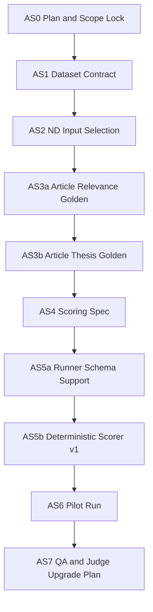

# Request Article Synthesis Benchmark Plan

## Purpose

Add a separate benchmark for article-level, request-specific synthesis.

The existing `request-synthesis` dataset stays intact and continues to evaluate
whole-set, job-level synthesis across a selected article bundle. This benchmark
evaluates a different skill: for each supplied article, decide how relevant it
is to the user request and produce a concise thesis-oriented summary only in
the context of that request.

## Scope Lock

- Benchmark name: `request-article-synthesis`.
- Pilot scope: one New Developments case based on the existing ND request.
- Input expectation: all selected articles are provided to the model.
- Output expectation: one entry for every input article.
- Irrelevant or distractor articles must be labeled as such and must not be
  turned into substantive supporting theses.
- The current `request-synthesis` dataset and scoring remain unchanged.

## Milestones

### AS0 — Plan and Scope Lock

Status: completed

Goal: save the execution plan and lock the benchmark boundary.

Scope:

- Create this planning artifact.
- Define the benchmark as separate from `request-synthesis`.
- Record the one-case ND pilot assumption.

Likely files/artifacts:

- `benchmark/ARTICLE-SYNTHESIS-PLANS.md`

Dependencies:

- Existing `request-synthesis` ND case and article set.

Risks:

- Accidentally blending article-level summarization with whole-set synthesis.

Acceptance criteria:

- Benchmark name is `request-article-synthesis`.
- Pilot is ND only, one case.
- Current `request-synthesis` is explicitly untouched.
- Output is expected for all input articles, with irrelevant articles labeled
  rather than silently omitted.

Tests/verification:

- Plan file exists.
- Markdown renders as plain Markdown.
- No dataset or runner files are created in AS0.

Non-goals:

- No dataset contract yet.
- No input generation.
- No golden labels.
- No runner changes.

### AS1 — Dataset Contract

Status: completed

Goal: define `inputs.jsonl`, `golden.jsonl`, `metadata.json`, and
`output_schema.json` for article-level synthesis.

Scope:

- Add dataset directory and contract artifacts.
- Define model output fields and enums.
- Include one mock output example in metadata.

Likely files/artifacts:

- `benchmark/datasets/request-article-synthesis/metadata.json`
- `benchmark/datasets/request-article-synthesis/output_schema.json`

Dependencies:

- AS0.

Risks:

- Schema may allow generic article summaries that are not request-specific.

Acceptance criteria:

- Article output schema has `article_id`, `relevance`, `support_type`,
  `request_specific_summary`, `theses`, `avito_implication`, and `caveats`.
- Relevance enum is `high | medium | low | irrelevant`.
- Support type enum is `direct_evidence | analogue | risk | background | distractor`.
- Rules for irrelevant articles are explicit.
- Current `request-synthesis` files are unchanged.

Tests/verification:

- JSON files parse.
- Mock output validates against the schema with local validation logic.

Non-goals:

- No real inputs.
- No golden labels.
- No runner changes.

### AS2 — ND Input Selection

Status: completed

Goal: build one ND input case.

Scope:

- Create `inputs.jsonl` for one case: `art-syn-nd-001`.
- Use 12 articles from the current ND synthesis pilot, with enough relevance
  spread to test article-level gating.

Likely files/artifacts:

- `benchmark/datasets/request-article-synthesis/inputs.jsonl`
- optional small build script under `benchmark/scripts/`

Dependencies:

- AS1.

Risks:

- Reusing the exact `request-synthesis` article set may under-supply strong
  distractors for article-level gating.

Acceptance criteria:

- One case exists: `art-syn-nd-001`.
- Input contains 12 unique article IDs.
- At least 3 core/direct or high-relevance articles are present.
- At least 3 analogue/nuance articles are present.
- At least 2 low-relevance or distractor articles are present.
- Full text is included.
- No `Fetch failed`, paywall, or warning markers are present.

Tests/verification:

- JSONL parses.
- Article IDs are unique.
- Full-text fields are non-empty.
- Marker scan passes.

Non-goals:

- No golden labels.
- No model runs.

### AS3a — Article Relevance Golden

Status: planned

Goal: label article relevance, article role, and support type.

Scope:

- Create the first pass of `golden.jsonl`.
- For every article, define relevance and why it is or is not relevant.

Likely files/artifacts:

- `benchmark/datasets/request-article-synthesis/golden.jsonl`

Dependencies:

- AS2.

Risks:

- Ambiguous analogues may be mislabeled as direct evidence.

Acceptance criteria:

- Every input article has a golden relevance label.
- Every input article has an article role and support type.
- Distractors are explicitly marked.
- Each article has `why_relevant_or_not`.

Tests/verification:

- Golden article IDs exactly match input article IDs.
- Enum values are valid.
- Every distractor has support type `distractor`.

Non-goals:

- No per-article thesis points yet.
- No scoring implementation.

### AS3b — Article Thesis Golden

Status: planned

Goal: add expected article-level thesis points and overstatement guards.

Scope:

- Extend golden labels with must-cover and optional points.
- Add `must_not_claim` where overstatement risk is high.

Likely files/artifacts:

- `benchmark/datasets/request-article-synthesis/golden.jsonl`

Dependencies:

- AS3a.

Risks:

- Golden can become too subjective if direct evidence and analogue evidence are
  not separated.

Acceptance criteria:

- High/medium relevance articles have 1-3 must-cover points.
- Low relevance articles have optional points only.
- Irrelevant/distractor articles have `must_not_claim`.
- Every must-cover point distinguishes direct evidence from analogue, risk, or
  background.

Tests/verification:

- Must-cover point counts satisfy the relevance rules.
- Each must-cover point has expected support type.
- `must_not_claim` exists for every distractor.

Non-goals:

- No model runs.
- No LLM judge.

### AS4 — Scoring Spec

Status: planned

Goal: define a scoring contract before implementation.

Scope:

- Document deterministic v1 metrics.
- Document semantic/LLM judge v2 as future work.
- Define pass/fail policy.

Likely files/artifacts:

- `benchmark/datasets/request-article-synthesis/metadata.json`

Dependencies:

- AS3b.

Risks:

- Deterministic scoring may over-credit outputs that cite the right IDs but
  write weak summaries.

Acceptance criteria:

- Metrics include relevance accuracy, must-point recall, grounding,
  overstatement penalty, distractor handling, and implication quality.
- Pass/fail policy is written.
- Deterministic v1 and LLM-judge v2 boundaries are explicit.

Tests/verification:

- Metadata parses.
- Scoring dimensions map to output schema fields.

Non-goals:

- No scorer implementation.
- No LLM judge implementation.

### AS5a — Runner Schema Support

Status: planned

Goal: allow the benchmark runner to call and validate
`request-article-synthesis`.

Scope:

- Add benchmark type to `benchmark/scripts/run_request_benchmarks.py`.
- Validate output shape, article coverage, article IDs, and enum values.

Likely files/artifacts:

- `benchmark/scripts/run_request_benchmarks.py`

Dependencies:

- AS4.

Risks:

- Runner changes could regress existing retrieval or synthesis benchmarks.

Acceptance criteria:

- `--benchmark request-article-synthesis` is accepted.
- Missing article summary fails.
- Duplicate or unknown article IDs fail.
- Invalid enum values fail.
- Dry-run passes.

Tests/verification:

- Existing dry-runs for `request-synthesis` and `request-article-retrieval`
  still pass.
- New dry-run for `request-article-synthesis` passes.
- Bad fixture checks fail as expected where practical.

Non-goals:

- No semantic scoring.
- No production runtime changes.

### AS5b — Deterministic Scorer v1

Status: planned

Goal: add baseline scoring for the new benchmark.

Scope:

- Compute article-level deterministic metrics.
- Keep warnings explicit where semantic judging is still required.

Likely files/artifacts:

- `benchmark/scripts/run_request_benchmarks.py`

Dependencies:

- AS5a.

Risks:

- Keyword or overlap scoring can under-measure summary quality.

Acceptance criteria:

- Relevance accuracy is counted.
- Must-cover point overlap is counted where deterministic matching is possible.
- High relevance on distractors is penalized.
- Forbidden exact or near-exact claims are checked where practical.

Tests/verification:

- Dry-run produces scores.
- Synthetic bad output with high-relevance distractor fails/punishes score.
- Existing benchmark dry-runs still pass.

Non-goals:

- No LLM judge.
- No model run.

### AS6 — Pilot Run

Status: planned

Goal: run one ND case on four `.env` models.

Scope:

- Execute the new benchmark on `art-syn-nd-001`.
- Save raw and summary reports.

Likely files/artifacts:

- `benchmark/results/` ignored local outputs.

Dependencies:

- AS5b.

Risks:

- OpenRouter output can be invalid JSON or exceed completion limits.

Acceptance criteria:

- Four model slugs are resolved from `.env`.
- Raw/report artifacts are generated.
- Parse/API errors are visible.
- Per-article scores are visible.
- Known limitation is documented: deterministic scoring is not a full semantic
  expert review.

Tests/verification:

- Actual OpenRouter run when external sharing is approved.
- Report JSON and markdown parse/render.

Non-goals:

- No expansion to other cases.
- No expert review.

### AS7 — QA and Judge Upgrade Plan

Status: planned

Goal: review the pilot run and decide whether LLM-as-judge is needed before
expanding.

Scope:

- Compare model outputs against golden labels.
- Identify deterministic scorer blind spots.
- Plan calibration examples for judge development.

Likely files/artifacts:

- Optional QA notes under `benchmark/datasets/request-article-synthesis/`.

Dependencies:

- AS6.

Risks:

- Expanding before scorer calibration may bake in misleading metrics.

Acceptance criteria:

- Deterministic scorer over/under-scoring cases are identified.
- 3-5 synthetic calibration output types are proposed.
- Expansion to other cases is explicitly deferred until this review.

Tests/verification:

- QA notes reference concrete model outputs or report files.

Non-goals:

- No implementation of LLM-as-judge.
- No additional cases.

## Requirement Coverage Matrix

| Requirement | Milestones |
|---|---|
| Save the plan | AS0 |
| Implement milestones one by one | AS0-AS7 |
| Do not work on later milestones | AS0-AS7 |
| Keep diffs minimal and focused | AS0-AS7 |
| Run relevant tests/checks | AS0-AS7 |
| Update plan progress status | AS0-AS7 |
| New dataset for per-article, request-specific summaries | AS0-AS3b |
| Keep existing `request-synthesis` dataset | AS0-AS1 |
| Start with one ND case | AS0-AS2 |
| Output covers every input article | AS0-AS1 |
| Irrelevant articles handled explicitly | AS0-AS3b |
| Full text included | AS2 |
| Runner support | AS5a-AS5b |
| Pilot run on four models | AS6 |
| QA before expansion | AS7 |

## Dependency Graph

