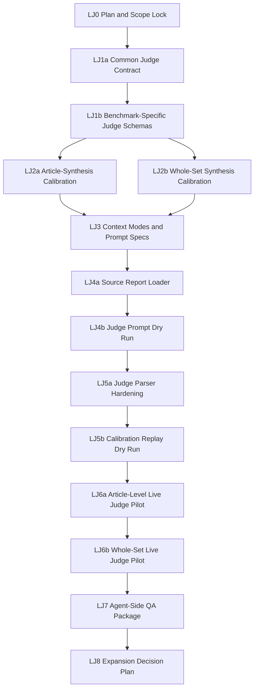

# LLM Judge Benchmark Plan

## Purpose

Create an LLM-as-judge evaluation layer for the request-driven benchmark suite.

The current runner already validates output schemas and computes deterministic
proxy scores. That is useful for smoke tests, but it is not enough for semantic
quality: it can over-credit keyword overlap, under-credit valid paraphrases,
miss weak grounding, and fail to distinguish analogues from direct evidence.

This plan defines a reviewable path to add a calibrated judge without changing
the underlying benchmark datasets or production monitoring behavior.

## Scope Lock

- Initial judge scope: benchmark evaluation only.
- Initial pilot cases:
  - `request-synthesis`: `syn-nd-001`.
  - `request-article-synthesis`: `art-syn-nd-001`.
- Initial retrieval scope: no LLM judge for `request-article-retrieval` scoring;
  retrieval keeps deterministic ID-based recall/precision. Judge support for
  retrieval annotation QA can be planned later if needed.
- Judge inputs are existing benchmark artifacts plus stored model outputs.
- Judge outputs are stored as separate review artifacts and must not overwrite
  raw model responses or golden labels.
- Full article text is allowed only for synthesis judge tasks that already use
  full text in the corresponding benchmark input.
- External LLM judge runs require explicit approval because benchmark prompts
  include Avito-specific request text and article content.

## Resolved v1 Decisions

- Judge model policy: start with one strong judge model in v1, while keeping the
  report schema compatible with future multi-judge or arbiter setups.
- Candidate outputs that use `thesis.supports=analogue` should not be discarded
  before semantic judging. The judge should treat this as a schema/rubric issue
  and separately evaluate whether analogue evidence was overstated as direct
  proof.
- Judge context mode is a run-time choice:
  - `full_golden`: judge receives full golden labels and expected points; use
    for calibration and debugging.
  - `reduced_rubric`: judge receives the user request, article context,
    candidate output, and scoring rubric without detailed answer-key labels;
    use for more independent review.
  - `hybrid`: judge receives rubric, key must-cover themes, forbidden claims,
    and article IDs, but not ideal answer wording; use as the default pilot
    mode.
- Result storage policy: keep raw judge outputs and full reports under ignored
  `benchmark/results/`, and commit only compact QA/review summaries when they
  are needed for traceability.

## Judge Principles

- Separate model-under-test from model-as-judge where practical.
- Prefer structured JSON judge outputs over prose-only reviews.
- Score by dimensions, not only one aggregate number.
- Require short rationales and cited article IDs for every failing or partial
  score.
- Keep deterministic metrics visible alongside judge metrics.
- Treat the judge as an aid to expert review, not as a replacement for project
  team adjudication.
- Calibrate the judge on known good, weak, and bad outputs before using it to
  rank models.
- Make judge context strategy explicit at run time, so results are comparable
  across `full_golden`, `reduced_rubric`, and `hybrid` modes.
- Preserve reproducibility fields: judge schema version, judge model, judge
  context mode, prompt hash, source report path, and source raw path.

## Score Scale

All semantic dimensions use the same 0-4 scale:

- `0`: absent, unsupported, or seriously wrong.
- `1`: weak; mentions the right area but misses the substantive requirement.
- `2`: partial; captures some correct meaning but misses important nuance or
  evidence support.
- `3`: good; materially correct, grounded, and useful.
- `4`: excellent; complete, precise, well-grounded, and appropriately caveated.

Critical hallucinations, unsupported external claims, or severe overstatement
can fail a judged output regardless of the average score.

## Target Judge Dimensions

### Whole-Set Synthesis

- `semantic_thesis_coverage`: whether must-cover thesis ideas are present, even
  when phrased differently.
- `evidence_grounding`: whether cited article IDs actually support the thesis,
  risk, or implication.
- `risk_coverage`: whether important limitations and counter-signals are
  represented.
- `avito_implication_quality`: whether implications are specific to the Avito
  New Developments investment question.
- `overstatement_detection`: whether analogues are incorrectly framed as direct
  proof, or evidence is generalized too far.
- `hallucination_or_external_claims`: whether the answer uses unsupported facts.

### Article-Level Synthesis

- `article_relevance_judgment`: whether each article is labeled with the right
  relevance level.
- `semantic_must_point_coverage`: whether request-specific must-cover points
  are covered per article.
- `request_specificity`: whether the summary explains contribution to the
  request rather than merely recapping the article.
- `analogue_vs_direct_handling`: whether analogue evidence is not overstated as
  direct validation.
- `distractor_handling`: whether weak or irrelevant articles are not promoted
  into supporting theses.
- `forbidden_claim_detection`: whether `must_not_claim` guards are violated.

## Milestones

### LJ0 — Plan and Scope Lock

Status: completed

Goal: save the LLM judge plan and tighten it after hidden-gap review.

Scope:

- Create this plan artifact.
- Define which benchmarks are in v1 and which are deferred.
- Record data-sharing and full-text constraints.
- Split oversized milestones found in plan review.
- Map resolved decisions and known hidden gaps into milestones.

Likely files/artifacts:

- `benchmark/LLM-JUDGE-PLANS.md`

Dependencies:

- Existing benchmark datasets and runner outputs.

Risks:

- Accidentally treating judge output as expert truth.
- Expanding judge scope into retrieval before synthesis judging is stable.

Acceptance criteria:

- Plan states that LLM judge is benchmark-only.
- Plan includes `request-synthesis` and `request-article-synthesis` pilot scope.
- Plan explicitly defers retrieval LLM judging.
- Plan records full-text and external API constraints.
- Plan includes resolved v1 decisions.
- Plan includes requirement matrix and dependency graph.

Tests/verification:

- Plan file exists.
- Markdown renders as plain Markdown.
- No runner, dataset, or result files are changed in LJ0.
- `git diff --check` passes.

Non-goals:

- No judge prompt implementation.
- No runner changes.
- No model calls.

### LJ1a — Common Judge Contract

Status: completed

Goal: define common judge metadata, score scale, statuses, and reproducibility
fields.

Scope:

- Add shared judge contract metadata to both synthesis benchmark metadata files.
- Define the 0-4 scale, confidence values, pass/fail statuses, and blocking
  failure categories.
- Define common fields: `benchmark_id`, `case_id`, `candidate_model`,
  `judge_model`, `judge_context_mode`, `source_report`, `source_raw_path`,
  `source_run_id`, `judge_schema_version`, `judge_prompt_hash`, and
  `self_judged`.
- Define candidate row handling statuses for parse/schema errors.

Likely files/artifacts:

- `benchmark/datasets/request-synthesis/metadata.json`
- `benchmark/datasets/request-article-synthesis/metadata.json`

Dependencies:

- LJ0.

Risks:

- Contract could be too abstract to validate later.

Acceptance criteria:

- Both metadata files define the same common judge fields.
- Score scale is explicitly `0-4` with label anchors.
- Candidate parse/schema error handling is explicit and separate from semantic
  failure.
- `thesis.supports=analogue` tolerance is documented as judge-side handling,
  not a formal output schema change.
- Existing benchmark output schemas are unchanged.

Tests/verification:

- Metadata JSON parses.
- Common judge field lists match between both metadata files.
- Existing benchmark output schemas are unchanged.

Non-goals:

- No judge schema files yet.
- No prompt or runner changes.
- No model calls.

### LJ1b — Benchmark-Specific Judge Schemas

Status: completed

Goal: add structured judge output schemas for whole-set and article-level
synthesis.

Scope:

- Create separate judge schema files for both pilot benchmarks.
- Define benchmark-specific dimensions, thresholds, aggregation, and rationale
  requirements.
- Include one mock judge output per schema.

Likely files/artifacts:

- `benchmark/datasets/request-synthesis/judge_schema.json`
- `benchmark/datasets/request-article-synthesis/judge_schema.json`
- Metadata references to the schema files.

Dependencies:

- LJ1a.

Risks:

- Schemas can accept vague rationales unless the required fields are concrete.

Acceptance criteria:

- Judge schema files parse as JSON.
- Each dimension has score anchors and pass/fail threshold.
- Judge output contains common metadata plus dimension scores, rationales,
  cited article IDs, disagreement flags, and final recommendation.
- Whole-set and article-level judge outputs are separate but share common
  metadata fields.
- Mock outputs validate by documented local checks.

Tests/verification:

- JSON parse checks pass.
- Local validation confirms required fields exist in mock outputs.
- Schema fields map to existing golden/output fields.

Non-goals:

- No judge prompt.
- No runner integration.
- No model calls.

### LJ2a — Article-Synthesis Calibration Set

Status: planned

Goal: create calibration examples for `request-article-synthesis`.

Scope:

- Build 3-5 calibration candidate outputs for `art-syn-nd-001`.
- Include known-good, generic recap, analogue-overstated, weakly grounded, and
  distractor-promoting examples where practical.
- Define expected judge behavior per example.

Likely files/artifacts:

- `benchmark/datasets/request-article-synthesis/judge_calibration.json`

Dependencies:

- LJ1b.

Risks:

- Examples may be too artificial and fail to represent real model mistakes.

Acceptance criteria:

- At least 3 calibration examples exist.
- At least one example should pass, and at least two should fail for different
  reasons.
- Examples reference existing `art-syn-nd-001` article IDs only.
- Expected outcomes include dimension-level scores and rationales.
- `expert_review_pending` remains explicit.

Tests/verification:

- JSON parses.
- Referenced article IDs exist in `inputs.jsonl`.
- Expected failing examples cover overstatement and distractor promotion.

Non-goals:

- No whole-set calibration.
- No automated judge execution.
- No changes to golden labels.

### LJ2b — Whole-Set Synthesis Calibration Set

Status: planned

Goal: create calibration examples for `request-synthesis`.

Scope:

- Build 3-5 calibration candidate outputs for `syn-nd-001`.
- Include known-good, generic synthesis, weak evidence grounding,
  overclaiming, and risk-missing examples where practical.
- Define expected judge behavior per example.

Likely files/artifacts:

- `benchmark/datasets/request-synthesis/judge_calibration.json`

Dependencies:

- LJ1b.

Risks:

- Whole-set examples can become long and expensive to inspect.

Acceptance criteria:

- At least 3 calibration examples exist.
- At least one example should pass, and at least two should fail for different
  reasons.
- Examples reference existing `syn-nd-001` article IDs only.
- Expected outcomes include dimension-level scores and rationales.
- `expert_review_pending` remains explicit.

Tests/verification:

- JSON parses.
- Referenced article IDs exist in `inputs.jsonl`.
- Expected failing examples cover overstatement and weak grounding.

Non-goals:

- No article-level calibration changes.
- No automated judge execution.
- No changes to golden labels.

### LJ3 — Context Modes and Judge Prompt Specs

Status: planned

Goal: write prompt specifications for the three judge context modes.

Scope:

- Define exact inclusion/exclusion rules for `full_golden`, `hybrid`, and
  `reduced_rubric`.
- Add prompt templates or prompt builder specs for whole-set and article-level
  synthesis judging.
- Include rubric, score anchors, JSON-only instruction, citation requirements,
  self-judging marker, and external-knowledge prohibition.
- Include refusal behavior for missing or malformed candidate outputs.

Likely files/artifacts:

- `benchmark/datasets/request-synthesis/judge_prompt_spec.json`
- `benchmark/datasets/request-article-synthesis/judge_prompt_spec.json`

Dependencies:

- LJ1b.
- LJ2a.
- LJ2b.

Risks:

- Full-golden mode can become checklist matching.
- Reduced-rubric mode can miss business-specific must-cover points.

Acceptance criteria:

- Prompt specs parse as JSON.
- `full_golden` includes expected points and forbidden claims.
- `hybrid` includes rubric, key must-cover themes, forbidden claims, and
  article IDs, but not ideal answer wording.
- `reduced_rubric` excludes detailed answer-key labels.
- Full-text inclusion is documented and limited to synthesis judge tasks.

Tests/verification:

- JSON parse checks pass.
- Inclusion/exclusion checks pass by inspecting prompt spec fields.
- Existing benchmark output schemas are unchanged.

Non-goals:

- No runner prompt builder implementation.
- No live LLM judge calls.
- No aggregation/reporting changes.

### LJ4a — Source Report Loader and Candidate Normalization

Status: planned

Goal: add offline loading of existing run artifacts without calling candidate
models.

Scope:

- Add CLI support for an explicit source report JSON path.
- Load candidate model rows and raw output paths from the source report.
- Normalize candidate outputs for judge input.
- Preserve candidate parse/schema error rows as non-semantic statuses.
- Allow judge-side review of `thesis.supports=analogue` outputs without
  changing the formal model output schema.

Likely files/artifacts:

- `benchmark/scripts/run_request_benchmarks.py`

Dependencies:

- LJ3.

Risks:

- Source report paths are local ignored artifacts and may be missing on another
  machine.
- Accidentally re-running candidate models would invalidate the judged artifact.

Acceptance criteria:

- CLI can point at an explicit existing report JSON path.
- Loader fails clearly when the source report or referenced raw file is missing.
- Loader does not call model-under-test.
- Candidate parse/schema errors are represented separately from semantic
  judgeable outputs.
- Existing normal benchmark runner behavior is unchanged.

Tests/verification:

- Dry-run source report loading succeeds on one local pilot report.
- Invalid source report path fails with a clear error.
- Existing dry-runs for all three benchmarks still pass.
- `python3 -m py_compile benchmark/scripts/run_request_benchmarks.py` passes.

Non-goals:

- No judge prompt execution.
- No live judge run.
- No visualization.

### LJ4b — Judge Prompt Dry Run and Reporting Skeleton

Status: planned

Goal: build judge prompts and report metadata without network calls.

Scope:

- Implement prompt builders for both pilot benchmarks.
- Support `judge_context_mode` CLI option with `hybrid` as default.
- Record prompt hashes and prompt character counts.
- Write dry-run judge reports that include deterministic score context.

Likely files/artifacts:

- `benchmark/scripts/run_request_benchmarks.py`
- Ignored local files under `benchmark/results/` during dry runs.

Dependencies:

- LJ4a.

Risks:

- Prompt size can exceed practical limits when full text and full golden are
  combined.

Acceptance criteria:

- Dry-run judge mode builds prompts for both pilot benchmarks.
- Reports include `judge_context_mode`, `judge_prompt_hash`, candidate model,
  judge model, source report path, and deterministic score context.
- Prompt budget is visible in the report.
- Existing normal benchmark runner behavior is unchanged.

Tests/verification:

- Dry-run judge mode works on one stored pilot report without network.
- Existing dry-runs for all three benchmarks still pass.
- `python3 -m py_compile benchmark/scripts/run_request_benchmarks.py` passes.
- `git diff --check` passes.

Non-goals:

- No live judge calls.
- No parser hardening beyond report shape.

### LJ5a — Judge Parser Hardening

Status: planned

Goal: validate judge responses strictly before using scores.

Scope:

- Parse judge JSON output.
- Validate score ranges, required rationales, cited article IDs, confidence,
  final recommendation, and blocking failure fields.
- Reject malformed or incomplete judge responses.

Likely files/artifacts:

- `benchmark/scripts/run_request_benchmarks.py`

Dependencies:

- LJ4b.

Risks:

- Parser may accept vague or non-actionable judge reviews.

Acceptance criteria:

- Valid mock judge outputs parse.
- Invalid score ranges fail.
- Unknown article IDs fail.
- Missing required rationales fail.
- Malformed JSON fails with a clear error.

Tests/verification:

- Parser negative checks are run locally.
- Existing benchmark dry-runs still pass.
- `git diff --check` passes.

Non-goals:

- No live OpenRouter judge call.
- No dataset expansion.

### LJ5b — Calibration Replay Dry Run

Status: planned

Goal: prove the judge pipeline can replay calibration expectations without
external model calls.

Scope:

- Feed mock judge outputs or expected calibration judgments through the parser
  and aggregator.
- Compare reproduced pass/fail outcomes with calibration expectations.
- Record calibration replay results in dry-run reports.

Likely files/artifacts:

- `benchmark/scripts/run_request_benchmarks.py`
- Ignored local files under `benchmark/results/` during dry runs.

Dependencies:

- LJ5a.

Risks:

- Calibration can pass mechanically while live judge behavior still differs.

Acceptance criteria:

- Calibration expected pass/fail outcomes can be reproduced in dry-run mode.
- Report lists calibration examples and pass/fail agreement.
- Existing benchmark dry-runs still pass.

Tests/verification:

- Calibration dry run passes for article-level synthesis.
- Calibration dry run passes for whole-set synthesis.
- `git diff --check` passes.

Non-goals:

- No live OpenRouter judge call.
- No new calibration examples.

### LJ6a — Live Pilot Judge Run for Article-Level Synthesis

Status: planned

Goal: run the LLM judge on existing `request-article-synthesis` ND outputs.

Scope:

- Use an explicitly selected judge model or configured default.
- Use an explicitly selected `judge_context_mode`, defaulting to `hybrid`.
- Judge an explicitly provided `request-article-synthesis` source report.
- Record parse errors, costs, and score deltas vs deterministic metrics.

Likely files/artifacts:

- Ignored result files under `benchmark/results/`.
- Optional metadata update referencing the local pilot judge report.

Dependencies:

- LJ5b.

Risks:

- External API call may fail, truncate, or return non-JSON.
- Sending full text externally has data-sharing implications.

Acceptance criteria:

- External run is performed only after explicit approval.
- Judge report exists for `request-article-synthesis`.
- Report lists candidate model, judge model, source report, judge parse status,
  judge context mode, dimension scores, and rationale summaries.
- Deterministic-vs-judge disagreements are visible.
- Any parse or API error is preserved rather than hidden.

Tests/verification:

- Report JSON parses.
- Markdown report renders.
- Raw judge JSONL exists.
- Costs and token usage are recorded when provider returns them.

Non-goals:

- No whole-set synthesis judge run.
- No claim that judge is final expert review.
- No benchmark expansion.

### LJ6b — Live Pilot Judge Run for Whole-Set Synthesis

Status: planned

Goal: run the LLM judge on existing `request-synthesis` ND outputs.

Scope:

- Use an explicitly selected judge model or configured default.
- Use an explicitly selected `judge_context_mode`, defaulting to `hybrid`.
- Judge an explicitly provided `request-synthesis` source report.
- Record parse errors, costs, and score deltas vs deterministic metrics.

Likely files/artifacts:

- Ignored result files under `benchmark/results/`.
- Optional metadata update referencing the local pilot judge report.

Dependencies:

- LJ6a.

Risks:

- Whole-set full-text prompt may be larger than article-level prompt.
- External API call may fail, truncate, or return non-JSON.

Acceptance criteria:

- External run is performed only after explicit approval.
- Judge report exists for `request-synthesis`.
- Report lists candidate model, judge model, source report, judge parse status,
  judge context mode, dimension scores, and rationale summaries.
- Deterministic-vs-judge disagreements are visible.
- Any parse or API error is preserved rather than hidden.

Tests/verification:

- Report JSON parses.
- Markdown report renders.
- Raw judge JSONL exists.
- Costs and token usage are recorded when provider returns them.

Non-goals:

- No article-level judge changes.
- No claim that judge is final expert review.
- No benchmark expansion.

### LJ7 — Agent-Side QA and Expert Review Package

Status: planned

Goal: decide whether the judge is reliable enough for broader benchmark use.

Scope:

- Compare judge scores with deterministic scores and calibration expectations.
- Identify judge false positives and false negatives.
- Produce compact review packages for human expert review.
- Keep final status as `expert_review_pending` until project-team review.

Likely files/artifacts:

- `benchmark/datasets/request-synthesis/judge_qa_review_notes.json`
- `benchmark/datasets/request-article-synthesis/judge_qa_review_notes.json`
- Optional metadata updates.

Dependencies:

- LJ6b.

Risks:

- Judge may appear precise while missing business-specific nuance.
- One judge model may be unstable across runs.

Acceptance criteria:

- QA notes cite concrete judged outputs and report paths.
- At least 3 judge disagreements or confirmations are documented.
- Known judge limitations and recommended rubric changes are recorded.
- Metadata keeps `expert_review_pending`.
- Expansion decision is explicit: proceed, revise judge, or block.

Tests/verification:

- QA JSON parses.
- Referenced result files exist locally or are clearly marked ignored/local.

Non-goals:

- No expansion to all cases unless explicitly approved.
- No production integration.

### LJ8 — Expansion Decision Plan

Status: planned

Goal: plan use of the calibrated judge across remaining benchmark cases.

Scope:

- Decide which benchmark families get judge coverage next.
- Estimate cost, prompt size, and review effort.
- Define batching and model selection rules.

Likely files/artifacts:

- Update this plan or create a follow-on expansion plan.

Dependencies:

- LJ7.

Risks:

- Scaling before calibration can create misleading leaderboards.

Acceptance criteria:

- Expansion scope is written and reviewable.
- Cost/risk estimate is included.
- Any changes to full-text footprint are explicit.
- Human expert review remains the gate before claiming benchmark validity.

Tests/verification:

- Plan update reviewed as Markdown.

Non-goals:

- No implementation in LJ8.

## Requirement Coverage Matrix

| Requirement | Milestones |
|---|---|
| Create and tighten LLM judge plan | LJ0 |
| Keep changes benchmark-only | LJ0, LJ1a, LJ1b, LJ4a, LJ4b, LJ7 |
| Cover `request-synthesis` | LJ0, LJ1a-LJ1b, LJ2b, LJ3-LJ7 |
| Cover `request-article-synthesis` | LJ0, LJ1a-LJ1b, LJ2a, LJ3-LJ7 |
| Avoid changing retrieval scoring in v1 | LJ0 |
| Use one strong judge model in v1 | LJ0, LJ1a, LJ4b, LJ6a-LJ6b |
| Define common judge output contract | LJ1a |
| Define benchmark-specific schemas and thresholds | LJ1b |
| Support full-golden/reduced-rubric/hybrid judge modes | LJ1a, LJ3, LJ4b, LJ6a-LJ6b |
| Handle `thesis.supports=analogue` tolerance | LJ1a, LJ4a, LJ7 |
| Calibrate before ranking models | LJ2a-LJ2b, LJ5b, LJ7 |
| Use existing model outputs, not rerun candidates | LJ4a, LJ4b, LJ6a-LJ6b |
| Preserve deterministic scores beside judge scores | LJ4b, LJ6a-LJ7 |
| Handle candidate parse/schema errors separately | LJ1a, LJ4a, LJ5a |
| Handle full-text footprint explicitly | LJ0, LJ3, LJ4b, LJ6a-LJ8 |
| Require explicit approval for external judge calls | LJ0, LJ6a-LJ6b |
| Store raw reports ignored and compact QA tracked | LJ0, LJ6a-LJ7 |
| Preserve reproducibility fields | LJ1a, LJ4b, LJ6a-LJ7 |
| Add tests and validation | LJ1a-LJ7 |
| Keep expert review pending until human adjudication | LJ2a-LJ2b, LJ7-LJ8 |

## Dependency Graph

## Open Decisions

- Exact default judge model for the first pilot run.
- Whether future judge runs should require two-judge agreement after v1
  calibration.
- Whether `analogue` should later be added to the formal
  `thesis.supports` enum, beyond judge-side tolerance.
