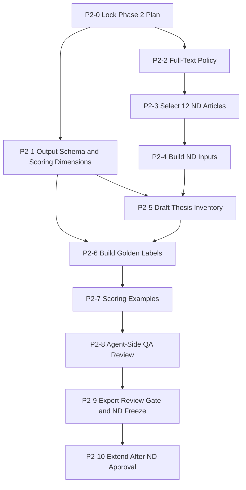

# Phase 2 Synthesis Benchmark Plan

## Summary

Phase 2 evaluates synthesis quality after retrieval. The agent receives a
single Avito Real Estate product research request and a fixed retrieved article
set, then produces a job-level synthesis: key theses, supporting evidence,
risks, caveats, and implications for the original investment hypothesis.

The first implementation target is one pilot case:

- `syn-nd-001` - New Developments / data-driven CPA, based on Phase 1
  `reqret-001`.
- Corpus size: 12 articles.
- Status: `planned`.

The other product cases are intentionally deferred until the ND pilot is built,
reviewed, and accepted:

- Owner monetization in secondary sales, from `reqret-002`.
- RRE TRX / Comfortable Deal, from `reqret-003`.
- LTR / Rent Plus, from `reqret-004`.

## Benchmark Principles

- Phase 2 starts from a fixed article set; it does not evaluate retrieval.
- The first version uses 12 articles for one case to keep expert review cheap
  and high-quality.
- Phase 2 model inputs include full article text in addition to
  `body_excerpt`. This intentionally increases the runtime context footprint
  versus Phase 1 and is kept bounded by the 12-article pilot size.
- Golden answers are job-level theses, not per-article summaries.
- Every expected thesis must map to supporting `article_id` values.
- The benchmark should reward useful synthesis for the Avito investment
  question, not long generic market summaries.
- Evidence must be grounded in the supplied articles. Unsupported claims are
  penalized even if plausible.
- The model-facing `body_excerpt` text must not contain source/provenance
  prefixes such as `Local NML analogue`.
- Full text is sourced from local article artifacts such as `.state/articles`
  and `.state/raw`; private DOCX contents are not used as article text.
- Private DOCX contents remain out of the repo. Only derived request text,
  benchmark inputs, and benchmark labels are stored.

## First Case

### `syn-nd-001` - New Developments / Data-Driven CPA

Source request: Phase 1 `reqret-001`.

Target question:

Can Avito New Developments grow data-driven CPA by reducing dependence on
external paid traffic through internal data, buyer intent models, lead-to-lot
matching, better new-build inventory data, operator/CRM automation, and
quality-based developer monetization?

The 12-article set should cover:

1. Internal data, buyer intent, real-time triggers, or lead scoring.
2. Matching between buyer, development, lot, operator, agent, or developer.
3. Developer/new homes monetization: CPA, lead quality, promoted exposure,
   budget allocation, premium listing products, or quality guarantees.
4. New development inventory data: lot availability, pricing, timelines,
   floorplans, attributes, digital twins, or project-level content.
5. Operational automation: call center, CRM, follow-up, chat, sales agent, or
   lead routing.
6. Risks and limits: weak lead quality, operator dependency, organic
   cannibalization, poor supply data, vendor/data dependency, or developer
   demand risk.

Recommended mix for the 12 articles:

| Article Type | Count | Purpose |
| --- | ---: | --- |
| Core evidence | 7-8 | Directly supports expected theses. |
| Nuance / risk / counterevidence | 2-3 | Adds caveats and prevents one-sided answers. |
| Close distractor | 1-2 | Similar topic but should not drive a core thesis. |

## Dataset Contract

Planned dataset directory:

```text
benchmark/datasets/request-synthesis/
```

Planned files:

| File | Purpose |
| --- | --- |
| `inputs.jsonl` | Model-facing synthesis inputs. One record per case. |
| `golden.jsonl` | Expected theses, evidence mapping, risks, and forbidden claims. |
| `metadata.json` | Dataset status, scoring policy, thresholds, and review status. |
| `selection_notes.json` | Review-only notes explaining why each article was selected. |
| `output_schema.json` | Expected model response shape and scoring-facing fields. |
| `agent_qa_review_notes.json` | Agent-side QA notes before expert review. |

### `inputs.jsonl`

Each record:

| Field | Status | Notes |
| --- | --- | --- |
| `id` | required | Stable synthesis case id, starting with `syn-nd-001`. |
| `source_retrieval_case_id` | required | Phase 1 case id, for ND this is `reqret-001`. |
| `user_request` | required | Full product research request. |
| `article_set_size` | required | Must be `12` for the ND pilot. |
| `articles` | required | Array of 12 model-facing article cards with excerpt and full text. |

Article-card fields:

| Field | Status | Notes |
| --- | --- | --- |
| `article_id` | required | Stable id from Phase 1 inventory. |
| `title` | required, nullable | Best available local title. |
| `published` | required, nullable | Published date or timestamp. |
| `normalized_url` | required | Normalized URL. |
| `body_excerpt` | required | Clean excerpt or compact summary, with no provenance prefix. |
| `body_full_text` | required | Clean full article text or the richest available local article text. Selected articles should be replaced if usable full text cannot be assembled. |

Non-model-facing labels, relevance notes, and provenance stay out of
`inputs.jsonl`. Full-text source paths and quality notes belong in
`selection_notes.json`, not in model-facing article cards.

### `selection_notes.json`

Each selected article should have review-only selection metadata:

| Field | Status | Notes |
| --- | --- | --- |
| `article_id` | required | Stable id used in `inputs.jsonl`. |
| `selection_role` | required | `core`, `nuance`, `distractor`, or `background`. |
| `covered_topic_codes` | required | Topic codes from the six ND coverage areas. |
| `selection_rationale` | required | Short explanation of why the article is in the 12-article set. |
| `full_text_source_path` | required | Local source path used for `body_full_text`. |
| `full_text_quality` | required | One of `exact`, `near_exact`, `local_summary`, `analogue`, or `unusable`. |
| `full_text_quality_notes` | required | Short explanation of text quality, source fit, and any limitations. |
| `full_text_char_count` | required | Character count after cleaning. |
| `cleaning_notes` | optional | Boilerplate stripping, truncation, or source caveats. |

Core evidence articles should use `exact` or `near_exact` full text. `analogue`
or `local_summary` articles may be used as nuance or distractors, but should
not carry a `must_cover` thesis unless expert review explicitly approves it.
`unusable` means the article must be replaced before `inputs.jsonl` is built.

### `golden.jsonl`

Each record:

| Field | Status | Notes |
| --- | --- | --- |
| `id` | required | Same id as `inputs.jsonl`. |
| `expected_theses` | required | Array of job-level expected theses. |
| `required_risks` | required | Risks that should appear in a good synthesis. |
| `forbidden_claims` | required | Claims that should fail or be penalized. |
| `article_roles` | required | Per-article role: `core`, `nuance`, `distractor`, or `background`. |
| `scoring_notes` | required | Case-specific interpretation notes. |
| `review_status` | required | Starts as `agent_draft`, later `expert_review_pending`, then `expert_reviewed`. |

Each expected thesis:

| Field | Status | Notes |
| --- | --- | --- |
| `thesis_id` | required | Stable id, for example `nd-t01`. |
| `statement` | required | Expected claim in natural language. |
| `priority` | required | `must_cover` or `nice_to_have`. |
| `supporting_article_ids` | required | Article ids that support the thesis. |
| `acceptable_paraphrases` | required | Short list of acceptable ways to express the thesis. |
| `must_not_overstate` | optional | Boundaries to prevent overclaiming. |

### `output_schema.json`

The expected model output shape must be locked before drafting golden labels.
The first ND pilot should require:

| Field | Status | Notes |
| --- | --- | --- |
| `case_id` | required | Must match `syn-nd-001`. |
| `answer_summary` | required | Short answer to the original investment question. |
| `theses` | required | Array of synthesized theses. |
| `risks` | required | Array of risks, limits, or counter-signals. |
| `avito_implications` | required | Practical implications for the Avito ND hypothesis. |
| `caveats` | required | Scope limitations and uncertainty. |

Each output thesis should include:

| Field | Status | Notes |
| --- | --- | --- |
| `statement` | required | Synthesized claim. |
| `evidence_article_ids` | required | Article ids grounding the claim. |
| `strength` | required | `strong`, `moderate`, or `weak`. |
| `reasoning` | required | Short explanation connecting evidence to the claim. |

Each risk and Avito implication should also include `evidence_article_ids`.
This makes grounding scoreable and prevents a generic synthesis from passing.

## Scoring Draft

The first executable scorer is not required for the initial ND dataset, but the
golden labels should support these checks:

- Thesis recall: percentage of `must_cover` theses present.
- Evidence grounding: each major thesis cites or clearly uses supplied article
  evidence.
- Risk coverage: required risks are mentioned without dominating the answer.
- Precision / hallucination control: unsupported or forbidden claims are
  penalized.
- Usefulness for Avito: synthesis connects evidence back to the ND investment
  hypothesis.

Recommended pass bar for first expert-reviewed version:

- `must_cover_thesis_recall >= 0.80`.
- No high-severity forbidden claim.
- At least one required risk covered.
- At least 70% of cited article IDs are actually relevant to the claim they
  support.

## Milestones

### P2-0 - Lock Phase 2 Plan

Estimate: 1 hour.
Status: completed.

Goal: create this plan and align Phase 2 scope around the ND pilot.

Likely files:

- `benchmark/PHASE2-PLANS.md`

Acceptance criteria:

- Plan states Phase 2 evaluates synthesis, not retrieval.
- Plan starts with one ND case and 12 articles.
- Plan defers the other three cases until ND review is complete.
- Plan defines planned dataset artifacts and field contracts.
- Plan explicitly includes full article text in addition to `body_excerpt`.
- Plan includes milestones, tests, non-goals, coverage matrix, and dependency
  graph.

Tests / verification:

- Markdown file exists.
- Markdown renders as plain GitHub-flavored Markdown.
- No dataset files are created in this milestone.

Non-goals:

- No article selection.
- No golden thesis writing.
- No scorer implementation.

### P2-1 - Define Output Schema and Scoring Dimensions

Estimate: 1-2 hours.
Status: completed.

Goal: lock the response shape before golden labels are drafted.

Likely files:

- `benchmark/datasets/request-synthesis/output_schema.json`
- `benchmark/datasets/request-synthesis/metadata.json`

Acceptance criteria:

- Defines required output fields: `case_id`, `answer_summary`, `theses`,
  `risks`, `avito_implications`, and `caveats`.
- Each thesis requires `statement`, `evidence_article_ids`, `strength`, and
  `reasoning`.
- Each risk and Avito implication requires `evidence_article_ids`.
- Defines scoring dimensions before golden writing: thesis recall, evidence
  grounding, risk coverage, forbidden claims, and usefulness for Avito.
- States that unsupported generic claims cannot pass even if they sound
  plausible.

Tests / verification:

- JSON parse check for `output_schema.json`.
- Manual schema check against one good synthetic output and one bad synthetic
  output.
- Confirm every scoring dimension is represented by an output field.

Non-goals:

- No article selection.
- No golden labels.
- No executable scorer.

### P2-2 - Define Full-Text Policy and Extraction Contract

Estimate: 1-2 hours.
Status: completed.

Goal: make full-text usage safe, reviewable, and bounded before selecting the
ND article set.

Likely files:

- `benchmark/datasets/request-synthesis/metadata.json`
- `benchmark/datasets/request-synthesis/selection_notes.json`

Acceptance criteria:

- Defines `full_text_quality`: `exact`, `near_exact`, `local_summary`,
  `analogue`, or `unusable`.
- Requires `full_text_source_path`, `full_text_char_count`, and quality notes
  in `selection_notes.json`.
- Sets an initial full-text quality rule: core evidence articles must be
  `exact` or `near_exact`; `local_summary` or `analogue` can be used only for
  nuance or distractors unless expert review approves otherwise.
- Sets an initial minimum for `body_full_text`: at least 1,500 characters, or a
  documented exception when the source artifact is shorter.
- Sets an initial soft cap for `body_full_text`: target no more than 20,000
  characters per article after boilerplate cleanup. Any exception must be noted
  in `selection_notes.json`.
- Defines boilerplate cleanup rules for navigation text, repeated source
  labels, warning markers, and provenance prefixes.

Tests / verification:

- Selection-note schema example parses.
- Full-text quality enum check.
- Manual review of one exact, one near-exact, and one unusable example.

Non-goals:

- No final article selection.
- No mutation of Phase 1 datasets.
- No model runs.

### P2-3 - Select 12 ND Articles

Estimate: 1-2 hours.
Status: completed.

Goal: choose the 12-article ND synthesis set from Phase 1 artifacts.

Likely files:

- `benchmark/datasets/request-synthesis/selection_notes.json`

Acceptance criteria:

- Exactly 12 articles are selected for `syn-nd-001`.
- The set includes 7-8 core evidence articles.
- The set includes 2-3 nuance/risk/counterevidence articles.
- The set includes 1-2 close distractors.
- Close distractors match a related company, topic, or mechanism but should not
  support a `must_cover` thesis.
- All selected `article_id` values exist in Phase 1 `reqret-001` corpus or
  candidate inventory.
- The set covers all six ND topic areas listed in this plan.
- Every selected article has acceptable `full_text_quality` under P2-2 rules.

Tests / verification:

- Article count check.
- Duplicate `article_id` and duplicate normalized URL check.
- Coverage checklist for the six ND topic areas.
- Full-text availability check against local artifacts.
- Manual review that distractors are close enough to be useful but not core
  evidence.

Non-goals:

- No final expected theses.
- No scoring harness.
- No work on non-ND cases.

### P2-4 - Build ND Synthesis Inputs

Estimate: 1-2 hours.
Status: completed.

Goal: create model-facing `inputs.jsonl` for the ND pilot.

Likely files:

- `benchmark/datasets/request-synthesis/inputs.jsonl`
- `benchmark/datasets/request-synthesis/metadata.json`
- optional script in `benchmark/scripts/`

Acceptance criteria:

- `inputs.jsonl` contains exactly one record: `syn-nd-001`.
- The record contains exactly 12 article cards.
- Article cards use only the fields in the dataset contract.
- `body_excerpt` and `body_full_text` contain no warning markers or provenance
  prefixes.
- `body_full_text` is present for every selected article and passes P2-2
  minimum length, soft cap, and quality rules.
- `metadata.json` marks the benchmark as Phase 2 synthesis and ND-only pilot.
- `metadata.json` documents that full-text inputs are enabled and bounded to 12
  articles for the ND pilot.

Tests / verification:

- JSONL parse check.
- Field whitelist check.
- Article count check.
- `body_full_text` presence, length, and quality checks.
- No `Local NML`, `Fetch failed`, `Paywall`, or warning-symbol markers in
  model-facing excerpt or full-text fields.
- Source ID consistency check between `inputs.jsonl` and `selection_notes.json`.

Non-goals:

- No golden labels.
- No Phase 1 corpus mutation unless a blocking data-quality issue is found and
  explicitly planned.

### P2-5 - Draft ND Thesis Inventory

Estimate: 1-2 hours.
Status: completed.

Goal: create a reviewable thesis inventory before committing to final golden
labels.

Likely files:

- `benchmark/datasets/request-synthesis/thesis_inventory.json`

Acceptance criteria:

- Contains 7-10 candidate theses derived only from the 12 supplied articles.
- Each candidate thesis lists preliminary supporting `article_id` values.
- Each candidate thesis is tagged as `likely_must_cover`, `possible`,
  `risk_or_caveat`, or `reject`.
- Candidate theses identify where evidence is weak, conflicting, or based only
  on analogue material.

Tests / verification:

- JSON parse check.
- Every supporting `article_id` exists in `inputs.jsonl`.
- Manual check that no thesis requires external knowledge.

Non-goals:

- No final golden labels.
- No expert sign-off.
- No non-ND thesis inventory.

### P2-6 - Build ND Golden Labels

Estimate: 2-3 hours.
Status: planned.

Goal: convert the thesis inventory into `golden.jsonl` for `syn-nd-001`.

Likely files:

- `benchmark/datasets/request-synthesis/golden.jsonl`

Acceptance criteria:

- Golden record contains 5-7 expected theses.
- At least 4 theses are `must_cover`.
- Every thesis has supporting `article_id` values and acceptable paraphrases.
- Required risks are listed separately.
- Forbidden claims include at least 3 high-risk overclaims.
- Every selected article has an `article_roles` label.
- No `must_cover` thesis depends only on a `local_summary` or `analogue`
  article unless explicitly justified.

Tests / verification:

- Golden JSONL parse check.
- Supporting IDs exist in `inputs.jsonl`.
- Every `must_cover` thesis has at least one supporting article.
- No article is simultaneously labelled as both `core` and `distractor`.
- Check that forbidden claims are tied to plausible failure modes in this case.

Non-goals:

- No expert sign-off.
- No executable scorer.
- No non-ND golden labels.

### P2-7 - Scoring Examples and Manual Rubric

Estimate: 1-2 hours.
Status: planned.

Goal: make the scoring rules concrete before QA and expert review.

Likely files:

- `benchmark/datasets/request-synthesis/metadata.json`
- `benchmark/datasets/request-synthesis/scoring_examples.json`

Acceptance criteria:

- Defines manual scoring for thesis recall, grounding, risk coverage,
  forbidden claims, and Avito usefulness.
- Includes at least 3 dry-run examples: good, incomplete, and hallucinated.
- Each dry-run example states expected pass/fail and the reason.
- Scoring can be applied manually even without an executable harness.

Tests / verification:

- Good example should pass.
- Incomplete example should fail thesis recall.
- Hallucinated example should fail forbidden-claim or grounding checks.

Non-goals:

- No automated scorer unless separately requested.
- No model benchmarking.

### P2-8 - Agent-Side QA Review for ND

Estimate: 1-2 hours.
Status: planned.

Goal: review ND inputs, golden labels, and scoring examples before expert
review.

Likely files:

- `benchmark/datasets/request-synthesis/agent_qa_review_notes.json`
- `benchmark/datasets/request-synthesis/metadata.json`

Acceptance criteria:

- Review checks whether expected theses are answerable from supplied full text.
- Review flags weak, ambiguous, redundant, or overfit theses.
- Review checks whether distractors are not accidentally core evidence.
- Review checks that no `must_cover` thesis relies on unusable or analogue-only
  evidence.
- `metadata.json` marks `expert_review_status` as `expert_review_pending`.

Tests / verification:

- Sample dry-run synthesis by reading only `inputs.jsonl`.
- Confirm each `must_cover` thesis can be supported from supplied full text
  without external knowledge.
- Confirm at least one risk/caveat is supported by the article set.
- Confirm scoring examples still match the final golden labels.

Non-goals:

- No expert edits unless provided by the user/team.
- No scoring automation.

### P2-9 - Expert Review Gate and ND Freeze

Estimate: external review gate; local incorporation should be 1-2 hours once
feedback is available.
Status: planned.

Goal: incorporate project-team expert review and freeze the first Phase 2 case.

Likely files:

- `benchmark/datasets/request-synthesis/golden.jsonl`
- `benchmark/datasets/request-synthesis/metadata.json`
- `benchmark/datasets/request-synthesis/agent_qa_review_notes.json`

Acceptance criteria:

- Expert review decisions are reflected in golden labels.
- Ambiguous theses are rewritten, downgraded, or removed.
- Article set remains exactly 12 unless expert review explicitly changes it.
- `metadata.json` marks the ND case as `expert_reviewed`.

Tests / verification:

- JSONL and schema checks still pass.
- All golden supporting IDs still exist.
- Manual diff review of expert changes.

Non-goals:

- No expansion to other cases before ND is accepted.

### P2-10 - Extend After ND Approval

Estimate: 2-3 hours per next case for selection and inputs; 2-3 hours per case
for golden labels.
Status: deferred.

Goal: repeat the ND workflow for the remaining cases only after the ND pilot is
accepted.

Case order:

1. `syn-owner-001` from `reqret-002`.
2. `syn-trx-001` from `reqret-003`.
3. `syn-ltr-001` from `reqret-004`.

Acceptance criteria:

- Each new case uses the frozen ND contract unless a documented change is
  approved.
- Each new case has exactly 12 articles unless the team revises the global
  corpus-size decision.
- Each case passes the same QA and expert-review gates.

Tests / verification:

- Same schema and field checks as ND.
- Cross-case consistency review.

Non-goals:

- No parallel expansion before ND pilot acceptance.

## Requirement Coverage Matrix

| Requirement | Milestones |
| --- | --- |
| Build Phase 2 benchmark plan | P2-0 |
| Start with one case | P2-0, P2-3, P2-4, P2-5, P2-6, P2-8, P2-9 |
| First case is ND | P2-0, P2-3, P2-4, P2-5, P2-6 |
| Use 12 articles per case | P2-0, P2-3, P2-4 |
| Use full article text in addition to `body_excerpt` | P2-0, P2-2, P2-3, P2-4, P2-8 |
| Define full-text quality/provenance policy | P2-2, P2-3, P2-4 |
| Define model output schema before golden labels | P2-1, P2-6, P2-7 |
| Defer other cases until first case is ready | P2-0, P2-10 |
| Separate synthesis from retrieval | P2-0, P2-1, P2-4, P2-6, P2-7 |
| Define article selection approach | P2-3 |
| Define input artifact | P2-4 |
| Define golden thesis artifact | P2-5, P2-6 |
| Include review/QA before freeze | P2-8, P2-9 |
| Include tests/verification | P2-0 through P2-10 |
| Include explicit non-goals | P2-0 through P2-10 |

## Dependency Graph



## Open Questions

- Whether the initial 20,000-character soft cap for `body_full_text` should
  become a hard cap after the ND pilot dry run.
- Whether `local_summary` or `analogue` articles should ever support
  `must_cover` theses after expert review, or remain nuance/distractor only.
- Whether the manual rubric should later become an executable scorer.
