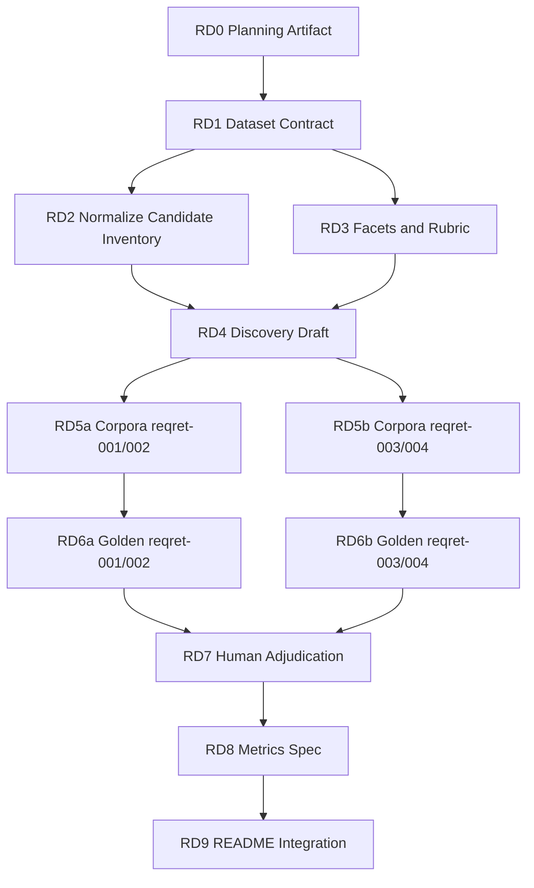

# Request-Driven Retrieval Benchmark Plan

## Summary

This plan creates a request-driven retrieval benchmark for Avito Real Estate.
Phase 1 evaluates only article retrieval: the agent receives a realistic
product research request and a fixed article corpus, then returns relevant
`article_id` values.

The benchmark has four product-specific requests:

1. `reqret-001` - New developments / data-driven CPA.
2. `reqret-002` - Owner monetization in secondary sales.
3. `reqret-003` - RRE TRX / Comfortable Deal.
4. `reqret-004` - LTR / Rent Plus.

Pass rule: each case must reach `recall >= 0.85` and `precision >= 0.85`.
Recall is the higher-priority metric. Missing any `critical_miss_id` fails
that case, even if aggregate metrics pass.

This benchmark must use both `.state/articles` and `.state/raw`. Raw artifacts
are not redundant: they include candidate URLs that are not present in the
markdown article archive.

Private source DOCX contents must not be committed. This repo stores only
derived benchmark request formulations and benchmark artifacts.

## Benchmark Principles

- Use realistic Avito Real Estate investment questions, not generic market
  themes.
- Preserve the exact `reqret-001` user request and the derived request seeds
  for `reqret-002`, `reqret-003`, and `reqret-004`.
- Search better than grep: use normalized candidate cards, facet-based
  discovery, BM25/full-text ranking, LLM relevance review, and human
  adjudication.
- Build corpora with strong distractors: articles that match the same company,
  topic, or mechanic, but do not answer the investment hypothesis.
- Separate retrieval from synthesis. Phase 1 does not evaluate thesis writing,
  implications, or digest generation.
- Keep work milestone-scoped and independently reviewable.

## Request Seeds

### reqret-001 - New Developments / Data-Driven CPA

Я отвечаю за инвест-кейс Авито Новостроек по data-driven CPA: хотим расти не
только за счет закупки внешнего трафика, а через CDP-модели поиска и оценки
покупателей, более точный матчинг “лид ↔ ЖК/лот ↔ оператор”,
контент-платформу по ЖК/квартирам и гибкую монетизацию застройщиков на основе
качества лида.

Нужно найти международные новости, кейсы и продуктовые сигналы, которые
помогают понять, насколько эта ставка подтверждается рынком: как real estate
portals и proptech-компании используют first-party/external data, AI/ML lead
scoring, buyer intent signals, call-center/CRM automation, new homes inventory
data, developer lead monetization, quality-based pricing или performance-based
CPA-модели.

Особенно интересны материалы, которые дают ответ на вопросы:

1. Можно ли снижать зависимость от платного маркетингового трафика за счет
   внутренних данных, intent-моделей и real-time триггеров?
2. Есть ли рыночные аналоги матчинга покупателя с новостройкой, конкретным
   лотом, консультантом или застройщиком?
3. Как порталы монетизируют качество лида для застройщиков: CPA, повышенные
   тарифы, промо-ставки, lead quality guarantees, budget allocation,
   эксклюзивы?
4. Какие данные о ЖК, лотах, ценах, сроках сдачи и доступности критичны для
   персонализированных рекомендаций в new developments?
5. Какие риски видны у такой модели: каннибализация органики, плохое качество
   лидов, зависимость от операторов, слабый спрос застройщиков на рекламные
   форматы, сложности с вендорами данных?

Нужна не общая подборка про AI в недвижимости, а статьи, которые могут
подтвердить, опровергнуть или уточнить инвестиционную гипотезу Авито
Новостроек.

### reqret-002 - Owner Monetization in Secondary Sales

Я отвечаю за инвест-кейс монетизации частных собственников в Авито
Недвижимости: мы не хотим переходить к полной платности размещения, потому что
риск потери контента слишком высокий. Вместо этого проверяем более мягкую
freemium-модель: бесплатное размещение с ограничением ликвидности и платные
сценарии, которые помогают собственнику быстрее, безопаснее и выгоднее продать
объект.

Нужно найти международные новости, кейсы и продуктовые сигналы, которые
помогают понять, насколько эта ставка подтверждается рынком: как real estate
portals, classifieds и proptech-компании монетизируют частных продавцов
недвижимости через ограничения бесплатного размещения, visibility/contact
limits, paid boosts, listing bundles, seller analytics, AI-рекомендации,
pricing tools, visual upgrades, legal/deal-prep services или trigger-based
upsell в процессе продажи.

Особенно интересны материалы, которые дают ответ на вопросы:

1. Можно ли монетизировать частных продавцов без резкого оттока контента, если
   не делать размещение полностью платным, а ограничивать видимость, контакты
   или срок эффективной экспозиции?
2. Есть ли рыночные аналоги явной развилки на подаче: “бесплатно, но с
   ограничениями” vs “расширенное размещение / пакет продвижения / снятие
   ограничений”?
3. Какие paid bundles для продавцов работают лучше отдельных VAS: продвижение,
   визуальная упаковка, 3D/AI-дизайн, отчёты по рынку, рекомендации по цене,
   помощь с объявлением?
4. Используют ли порталы триггеры по CJM продажи: мало спроса, падение в
   выдаче, долгий срок экспозиции, исчерпание контактов, плохая цена, слабые
   фото, приближение сделки?
5. Какие риски видны у такой модели: потеря supply от собственников,
   каннибализация органики, недоверие к платным инструментам, слабая готовность
   платить за отдельные сервисы, юридические или UX-риски paywall'ов?

Нужна не общая подборка про paid listings, а статьи, которые могут подтвердить,
опровергнуть или уточнить гипотезу Авито: можно ли растить ARPPU и penetration
в платные продукты у частных продавцов через ограничение ликвидности и
сервисные бандлы, не разрушая supply.

### reqret-003 - RRE TRX / Comfortable Deal

Я отвечаю за стратегию RRE TRX в Авито Недвижимости: мы проверяем, может ли
classifieds-платформа развивать transactional capabilities в жилой недвижимости
не федеральным “big bang”, а city-by-city моделью, где в каждом городе
запускается связка Comfortable Deal, Partner Channel, MIVAS, агентская сеть,
ипотека, безопасная сделка и операционная автоматизация.

Нужно найти международные новости, кейсы и продуктовые сигналы, которые
помогают понять, насколько эта ставка подтверждается рынком: как real estate
portals, brokerages, iBuyers, mortgage/closing platforms и proptech-компании
переходят от classified/listing-модели к transaction enablement, агентским
каналам, seller concierge, mortgage/closing services, deal rooms, agent
workspaces, local market capture и commission-based monetization.

Особенно интересны материалы, которые дают ответ на вопросы:

1. Есть ли рыночные аналоги перехода portal/classifieds в транзакционную
   модель: seller concierge, managed sale, brokerage partnership, agent
   referral, mortgage, closing, legal support, safe payments?
2. Работает ли hyperlocal rollout в недвижимости лучше федерального запуска:
   захват города за городом, локальные команды, локальные агентские сети, local
   marketing, city-level market share?
3. Как платформы используют агентский канал как flywheel: агенты приводят
   собственников, платформа даёт лиды/инструменты/финансовые условия, затем
   растёт узнаваемость и прямой поток собственников?
4. Какие продукты критичны для удержания агентов и повышения take rate: deal
   room, CRM/workspace, property matching, developer inventory, mortgage,
   e-registration, safe deal, agent payments, professional profiles,
   AI-подборки?
5. Какие риски видны у такой модели: низкая маржинальность агентских лидов,
   необходимость субсидий, зависимость от локальной операционки, сложность
   повышения take rate, конфликт с classifieds-моделью, невозможность
   масштабировать качество сервиса?

Нужна не общая подборка про brokerage или mortgage, а статьи, которые могут
подтвердить, опровергнуть или уточнить гипотезу Авито: можно ли защитить
classifieds-бизнес и открыть transaction TAM через локальный TRX-флайвил, где
CD + Partner Channel + MIVAS усиливают друг друга.

### reqret-004 - LTR / Rent Plus

Я отвечаю за кейс Rent Plus в долгосрочной аренде Авито Недвижимости: мы
монетизируем арендаторов через ранний доступ и бандлы, а стратегически хотим
построить замкнутый цикл ликвидности: привлекать больше контента от
собственников, давать арендаторам приоритетный доступ к качественным объектам
без комиссии и часть выручки реинвестировать в supply, качество и новые
сервисы.

Нужно найти международные новости, кейсы и продуктовые сигналы, которые
помогают понять, насколько эта ставка подтверждается рынком: как rental
marketplaces и proptech-компании используют early access, premium renter
subscriptions, paid alerts, hidden/pre-market rental listings, verified
landlord inventory, renter bundles, landlord incentives, anti-spam tools,
listing quality controls, AI rental concierge или light transaction services.

Особенно интересны материалы, которые дают ответ на вопросы:

1. Есть ли рыночные аналоги “секретных объявлений” или раннего доступа к
   rental supply, где арендаторы платят за возможность первыми увидеть хорошие
   объекты без комиссии?
2. Можно ли через paid buyer/renter bundles одновременно растить выручку и
   привлекать больше landlord supply, если собственникам даётся
   бесплатный/пробный доступ, скидка на продвижение или снижение нецелевых
   контактов?
3. Какие дополнительные ценности повышают готовность арендаторов платить:
   мгновенные уведомления, выделение в чате, приоритетный контакт с
   собственником, скрытая информация, скидки на переезд, AI-подбор, запись на
   просмотры?
4. Какие landlord-side механики помогают снизить отток на подаче: бесплатный
   trial, тарифы для собственников, антиспам от агентов, верификация
   арендаторов, договор аренды, страховка, гарантии звонков?
5. Какие риски видны у такой модели: ухудшение бесплатного BX, влияние
   paid/hidden listings на рекомендации и ранжирование, снижение доверия,
   юридические риски персональных данных, подозрительный контент, зависимость
   выручки от одной инновационной механики?

Нужна не общая подборка про аренду, а статьи, которые могут подтвердить,
опровергнуть или уточнить гипотезу Авито LTR: можно ли построить платный
rental access product вокруг качественного supply от собственников, не ухудшив
доверие, ранжирование и общий marketplace liquidity.

## Dataset Contract

The future dataset directory is:

```text
benchmark/datasets/request-article-retrieval/
├── inputs.jsonl
├── golden.jsonl
└── metadata.json
```

Contract status conventions:

- `required` means the key must be present in every record.
- `optional` means the key may be omitted when the source artifact does not
  support it.
- `nullable` means the key must be present, but the value may be `null` when
  the source artifact does not contain a trustworthy value.
- JSONL files contain one complete JSON object per line.

### `inputs.jsonl`

Each line is one request case.

Request-case fields:

| Field | Status | Notes |
| --- | --- | --- |
| `id` | required | Stable case id, one of `reqret-001` through `reqret-004`. |
| `user_request` | required | Full request text, not a summary. |
| `corpus_window` | required | Date window used to build the corpus, for example `2026-01-01..2026-04-07`. |
| `source_scope` | required | Source ids or source groups considered. |
| `corpus` | required | Array of compact article cards. |

Article-card fields:

| Field | Status | Notes |
| --- | --- | --- |
| `article_id` | required | Deterministic id derived from normalized URL. |
| `normalized_url` | required | URL lowercased where safe and stripped of trailing slash and tracking params. |
| `title` | required, nullable | Article title from the best available local artifact. |
| `source_id` | required, nullable | Source id after normalization; nested raw children inherit it from the parent. |
| `source_name` | required, nullable | Human-readable source name after normalization. |
| `published` | required, nullable | Published date or timestamp when available. |
| `url` | required | Original URL retained for review. |
| `lead_or_summary` | required, nullable | Short summary, raw snippet, lead paragraph, or analyst summary. |
| `body_excerpt` | required, nullable | Compact article text excerpt; full article text is not required. |
| `provenance` | required | Non-empty array with one or more provenance enum values. |
| `title_slug` | optional | Display helper only; never used as a unique key. |
| `analyst_summary` | optional | From enriched raw artifacts when available. |
| `why_it_matters` | optional | From enriched raw artifacts when available. |
| `avito_implication` | optional | From enriched raw artifacts when available. |
| `topic_tags` | optional | Array of normalized topic tags when available. |
| `event_type` | optional | Source-provided or derived event type. |
| `priority_score` | optional | Source-provided priority score. |
| `companies` | optional | Companies or brands mentioned in the article card. |

Allowed provenance values:

- `article_md`
- `raw_collected_all`
- `raw_feb_collected`
- `raw_enriched`

Stable `article_id` rule:

- Build from normalized URL as `art_` plus a short deterministic hash.
- Keep `title_slug` only as a display helper, not as the unique key.
- If the same normalized URL appears in multiple artifacts, keep one
  `article_id` and merge all provenance values.

### `golden.jsonl`

Each line is one request case.

Golden-case fields:

| Field | Status | Notes |
| --- | --- | --- |
| `id` | required | Must match an `inputs.jsonl` case id. |
| `must_find` | required | Article ids directly validating, refuting, or materially refining the investment hypothesis. |
| `nice_to_have` | required | Article ids that provide useful analogues or supporting context. |
| `borderline` | required | Article ids that are related but not decisive; neutral for scoring by default. |
| `irrelevant` | required | Known distractor article ids inside the corpus. |
| `critical_miss_ids` | required | Subset of `must_find`; missing any of these fails the case. |
| `rationale` | required | Object keyed by `article_id`; required for every `must_find` and every `critical_miss_id`. |

Bucket rules:

- `must_find`: direct evidence for the product/investment mechanism.
- `nice_to_have`: strong market analogue or adjacent evidence.
- `borderline`: plausible but debatable relevance; should not drive pass/fail.
- `irrelevant`: same topic, company, or keywords but not relevant to the
  request's hypothesis.
- An `article_id` must appear in at most one bucket per case.

### `metadata.json`

Metadata fields:

| Field | Status | Notes |
| --- | --- | --- |
| `benchmark_id` | required | Stable benchmark id, expected value `request-article-retrieval`. |
| `version` | required | Dataset contract or dataset release version. |
| `phase` | required | Expected value `phase_1_retrieval`. |
| `annotation_status` | required | Draft, adjudicated, or expert-reviewed status. |
| `case_ids` | required | Ordered list of included request case ids. |
| `data_sources` | required | Local artifact groups used to build candidates and corpora. |
| `corpus_construction_rules` | required | Summary of size, dedupe, provenance, and distractor rules. |
| `metric_definitions` | required | Recall, precision, borderline, and critical-miss behavior. |
| `target_thresholds` | required | Required recall and precision thresholds. |
| `private_source_documents` | required | Notes that DOCX contents are not committed; only derived requests are stored. |
| `created_at` | optional | Dataset creation timestamp. |
| `review_notes` | optional | Human adjudication notes after RD7. |

### Mock Example

```json
{"id":"reqret-000","user_request":"Find evidence for marketplace monetization via owner paid visibility.","corpus_window":"2026-01-01..2026-04-07","source_scope":["article_md","raw_collected_all"],"corpus":[{"article_id":"art_ab12cd34","normalized_url":"https://example.com/owner-paid-visibility","title":"Portal Adds Paid Visibility for Home Sellers","source_id":"example","source_name":"Example News","published":"2026-03-01","url":"https://example.com/owner-paid-visibility","lead_or_summary":"A property portal launched optional seller paid visibility without requiring paid listing.","body_excerpt":"The product limits free exposure after initial demand and offers paid boosts.","provenance":["raw_collected_all"]}]}
```

```json
{"id":"reqret-000","must_find":["art_ab12cd34"],"nice_to_have":[],"borderline":[],"irrelevant":[],"critical_miss_ids":["art_ab12cd34"],"rationale":{"art_ab12cd34":"Directly tests owner paid visibility without full paid placement."}}
```

## Candidate Discovery Method

The candidate pool must normalize all available local artifacts:

- `.state/articles/*.md`
- `.state/raw/collected-all.json`
- `.state/raw/feb-collected.json`
- `.state/raw/enriched-march-april.json`

Raw parsing rules:

- `collected-all.json` and `feb-collected.json` contain source-level parent
  records with nested `items`.
- Nested raw child items may not carry `source_id` or `source_name`; inherit
  those fields from the parent.
- `enriched-march-april.json` is flat and already contains enriched fields.
- Deduplicate by normalized URL, but preserve all provenance values.

Discovery must not rely on grep alone. Use this pipeline:

1. Normalize all candidate cards.
2. Decompose each request into 6-10 facets.
3. Run BM25/full-text ranking over title, summary, excerpt, enriched fields,
   tags, and source metadata.
4. Run facet-based LLM relevance review on the candidate shortlist.
5. Score each reviewed candidate:
   - `3`: direct evidence.
   - `2`: strong analogue.
   - `1`: peripheral context.
   - `0`: irrelevant despite overlap.
6. Each score must include matched facets and a short rationale.
7. Human adjudication reviews top candidates, uncertain candidates, and sampled
   low-score candidates to catch false negatives.

Embeddings are explicitly out of scope for v1. Add them later only if the local
corpus grows enough that BM25 plus LLM review misses analogues.

## Milestones

| ID | Est. | Goal | Dependencies |
| --- | ---: | --- | --- |
| RD0 | 1h | Create this planning artifact | none |
| RD1 | 1-2h | Lock dataset contract | RD0 |
| RD2 | 2-3h | Normalize candidate inventory | RD1 |
| RD3 | 1-2h | Define facets and discovery rubric | RD1 |
| RD4 | 2-3h | Run candidate discovery draft | RD2, RD3 |
| RD5a | 2-3h | Build corpora for `reqret-001` and `reqret-002` | RD4 |
| RD5b | 2-3h | Build corpora for `reqret-003` and `reqret-004` | RD4 |
| RD6a | 2-3h | Draft golden labels for `reqret-001` and `reqret-002` | RD5a |
| RD6b | 2-3h | Draft golden labels for `reqret-003` and `reqret-004` | RD5b |
| RD7 | 2-3h | Human adjudication and quality review | RD6a, RD6b |
| RD8 | 1-2h | Metrics and validation spec | RD7 |
| RD9 | 1h | Benchmark README integration | RD8 |

## Progress Status

| Milestone | Status | Notes |
| --- | --- | --- |
| RD0 | complete | Planning artifact created in `benchmark/RD-PLANS.md`. |
| RD1 | complete | Dataset contract locked in this file: artifact schemas, stable ids, provenance enum, bucket rules, and mock input/golden pair. |
| RD2-RD9 | pending | Not implemented in this milestone. |

## Milestone Details

### RD0 - Create Planning Artifact

Deliverable: `benchmark/RD-PLANS.md`.

Acceptance criteria:

- Contains this tighter execution plan.
- Preserves the 4 request seeds and benchmark principles.
- States that private DOCX contents are not committed, only derived request
  formulations.
- Includes requirement coverage matrix and dependency graph.

Tests:

- File exists.
- Markdown renders.
- No dataset files are created.

Non-goals:

- No corpus selection.
- No benchmark README update.

### RD1 - Lock Dataset Contract

Deliverable: contract section in `RD-PLANS.md`; later mirrored in
`metadata.json`.

Acceptance criteria:

- Defines `inputs.jsonl`, `golden.jsonl`, and `metadata.json`.
- Defines stable `article_id`.
- Defines provenance fields: `article_md`, `raw_collected_all`,
  `raw_feb_collected`, `raw_enriched`.
- Defines bucket rules for `must_find`, `nice_to_have`, `borderline`, and
  `irrelevant`.

Tests:

- One complete mock input/golden pair is included.
- Every field has required or optional status.

Non-goals:

- No real article selection.

### RD2 - Normalize Candidate Inventory

Deliverable: candidate inventory artifact spec and, during implementation, a
generated review file.

Acceptance criteria:

- Reads `.state/articles/*.md`.
- Reads `.state/raw/collected-all.json`, `.state/raw/feb-collected.json`, and
  `.state/raw/enriched-march-april.json`.
- Inherits parent `source_id` and `source_name` for nested raw child items.
- Deduplicates by normalized URL while preserving provenance.
- Records counts by provenance.

Tests:

- JSON parses.
- URL dedupe check passes.
- Raw-only candidate count is reported.
- No repo-tracked state is changed except planned benchmark artifacts.

Non-goals:

- No final corpora.
- No web scraping.

### RD3 - Define Facets and Discovery Rubric

Deliverable: per-request facet map and LLM judge rubric.

Acceptance criteria:

- Each request has 6-10 facets.
- Judge labels are `3 direct evidence`, `2 strong analogue`, `1 peripheral`,
  and `0 irrelevant`.
- Each score requires matched facets and short rationale.
- Defines an uncertainty bucket.

Tests:

- Rubric applied to 3 sample articles manually.
- Same-keyword irrelevant example scores `0` or `1`.

Non-goals:

- No full corpus construction.

### RD4 - Run Candidate Discovery Draft

Deliverable: candidate review lists for all 4 requests.

Acceptance criteria:

- Uses BM25/full-text over normalized cards.
- Uses facet-based LLM relevance review on candidate shortlist.
- Reviews top candidates, uncertain candidates, and sampled low-score
  candidates.
- Produces candidate groups: likely relevant, possible, distractor, reject.

Tests:

- At least 80 candidates considered per request, or all available if fewer.
- Each request has raw-derived candidates considered.
- Each request has at least 10 likely distractors.

Non-goals:

- No golden annotation.

### RD5a - Build Corpora for `reqret-001` and `reqret-002`

Deliverable: draft corpus records for the first two request cases.

Acceptance criteria:

- Each case has 40-70 articles.
- At least 30% are strong distractors.
- No duplicate normalized URLs within a case.
- Corpus includes provenance and compact article text.

Tests:

- JSONL parse.
- Corpus size check.
- Duplicate URL check.
- Provenance count check.

Non-goals:

- No final golden labels.

### RD5b - Build Corpora for `reqret-003` and `reqret-004`

Deliverable: draft corpus records for the second two request cases.

Acceptance criteria:

- Each case has 40-70 articles.
- At least 30% are strong distractors.
- No duplicate normalized URLs within a case.
- Corpus includes provenance and compact article text.

Tests:

- JSONL parse.
- Corpus size check.
- Duplicate URL check.
- Provenance count check.

Non-goals:

- No final golden labels.

### RD6a - Draft Golden Labels for `reqret-001` and `reqret-002`

Deliverable: draft golden labels for the first two request cases.

Acceptance criteria:

- Each case has `must_find`, `nice_to_have`, `borderline`, `irrelevant`, and
  `critical_miss_ids`.
- Every `must_find` has rationale.
- Every case has 1-3 `critical_miss_ids`.
- No article is in conflicting buckets.

Tests:

- Golden IDs exist in corpus.
- Bucket conflict check.
- Critical miss IDs are subset of `must_find`.

Non-goals:

- No model baseline.

### RD6b - Draft Golden Labels for `reqret-003` and `reqret-004`

Deliverable: draft golden labels for the second two request cases.

Acceptance criteria:

- Each case has `must_find`, `nice_to_have`, `borderline`, `irrelevant`, and
  `critical_miss_ids`.
- Every `must_find` has rationale.
- Every case has 1-3 `critical_miss_ids`.
- No article is in conflicting buckets.

Tests:

- Golden IDs exist in corpus.
- Bucket conflict check.
- Critical miss IDs are subset of `must_find`.

Non-goals:

- No model baseline.

### RD7 - Human Adjudication and Quality Review

Deliverable: reviewed golden labels and review notes.

Acceptance criteria:

- Borderline disputes are resolved or explicitly marked.
- Raw-only candidates are reviewed for false negatives.
- Keyword-only traps are present in each corpus.
- Any corpus that is too easy is revised.

Tests:

- Sample 10 rejected candidates per request for false negatives.
- Confirm each request has same-company or same-theme distractors.
- Confirm `must_find` is not only obvious keyword matches.

Non-goals:

- No synthesis benchmark.

### RD8 - Metrics and Validation Spec

Deliverable: metric section in `metadata.json` or dataset docs.

Acceptance criteria:

- Strict recall uses `must_find`.
- Precision uses returned IDs counted relevant if in `must_find +
  nice_to_have`.
- `borderline` is neutral by default.
- Missing any `critical_miss_id` fails that case.
- Overall pass requires all 4 cases pass, not just average.

Tests:

- Perfect output dry-run scores 1.0.
- Output with all distractors scores low precision.
- Output missing critical ID fails case.

Non-goals:

- No executable harness unless separately requested.

### RD9 - Benchmark README Integration

Deliverable: `benchmark/README.md` update.

Acceptance criteria:

- Adds request-driven retrieval benchmark.
- Links to dataset directory.
- States Phase 1 is retrieval only.
- Does not imply production validation before expert review.

Tests:

- Markdown review.
- `git diff --check`.

Non-goals:

- No runtime prompt or config changes.

## Requirement Coverage Matrix

| Requirement | Milestones |
| --- | --- |
| Save execution plan as `benchmark/RD-PLANS.md` | RD0 |
| 1-3h milestones | RD0-RD9 |
| Independently reviewable milestones | RD0-RD9 |
| Acceptance criteria | RD0-RD9 |
| Tests | RD0-RD9 |
| Explicit non-goals | RD0-RD9 |
| Requirement-to-milestone matrix | This section |
| Dependency graph | Next section |
| Preserve 4 user/product requests | RD0, RD1 |
| Include key benchmark reasoning | RD0, RD3, RD7 |
| Use `.state/articles` | RD2, RD4, RD5a, RD5b |
| Use `.state/raw` | RD2, RD4, RD5a, RD5b, RD7 |
| Search better than grep | RD3, RD4 |
| Hybrid BM25 + facets + LLM judge | RD3, RD4 |
| Human adjudication | RD7 |
| Corpus with distractors | RD5a, RD5b, RD7 |
| Golden labels | RD6a, RD6b, RD7 |
| Metrics 85/85 and critical miss | RD8 |
| Small iterative execution | RD0-RD9 |
| Private DOCX contents not committed | RD0 |

## Dependency Graph



## Assumptions

- First implementation milestone is RD0.
- New scraping, embeddings, executable harness, and synthesis are excluded from
  Phase 1 unless separately planned.
- Existing untracked `assets/` remains untouched.
- This benchmark is draft until expert review validates the golden labels.
