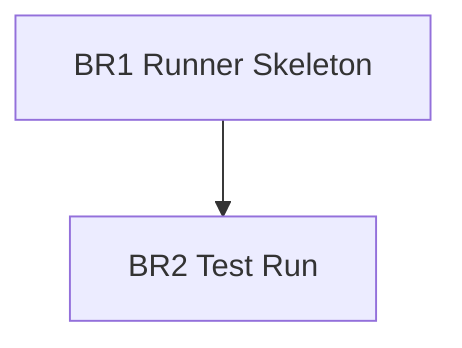

# Benchmark Runner Plan

## Scope

Build a minimal local runner for:

- `request-synthesis`
- `request-article-retrieval`

The runner should reuse the useful benchmark-pack patterns: `.env` model loading, OpenRouter chat-completions calls, raw JSONL responses, JSON summary reports, markdown summaries, retry on transient/empty responses, and JSON-only prompts.

## Milestones

### BR1 — Runner Skeleton

Status: completed

Goal: add a single self-contained runner script under `benchmark/scripts/`.

Acceptance criteria:

- Supports `--benchmark request-synthesis` and `--benchmark request-article-retrieval`.
- Reads `OPENAI_API_KEY` or `OPENROUTER_API_KEY`.
- Reads comma-separated models from `LLM_MODEL`, unless `--model` is provided.
- Uses OpenRouter endpoint `https://openrouter.ai/api/v1/chat/completions`.
- Writes raw JSONL and JSON/Markdown reports under `benchmark/results/`.

Tests:

- `python3 -m py_compile benchmark/scripts/run_request_benchmarks.py`
- `--list-models` exits cleanly even if no API key is present.
- `--dry-run --benchmark request-synthesis --limit 1` builds prompts without network.

Non-goals:

- No production runtime prompt/config changes.
- No changes to benchmark datasets.
- No LLM-as-judge scoring.

### BR2 — Test Run

Status: blocked_policy_review

Goal: run `request-synthesis` on four OpenRouter models from `.env` or explicit CLI models.

Acceptance criteria:

- Four model slugs are resolved.
- One `request-synthesis` case is run for all four models.
- Raw responses and summary reports are created.
- Parse/API errors are reported explicitly.

Tests:

- Actual OpenRouter run when API key and model list are available and external data sharing is explicitly approved.

Current blocker:

- Local sandbox run reached DNS/network restriction.
- Escalated run was rejected by policy review because `request-synthesis` sends Avito-specific user request text and full article text to OpenRouter.
- The runner is ready for explicit approved external execution or for local execution outside the sandbox.

Non-goals:

- No expert review of synthesis quality.
- No Phase 2 golden changes.

## Requirement Coverage

| Requirement | Milestone |
|---|---|
| Inspect `benchmark-pack` runner and reuse useful patterns | BR1 |
| Build runner for `request-synthesis` | BR1 |
| Build runner for `request-article-retrieval` | BR1 |
| Check models from `.env` | BR2 |
| Test-run `request-synthesis` on four OpenRouter models | BR2 |

## Dependency Graph

